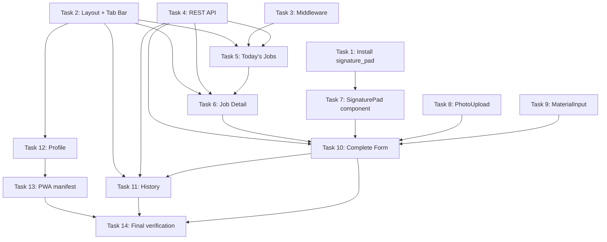

# Phase 2: Technician Mobile App — Implementation Plan

> **For agentic workers:** REQUIRED SUB-SKILL: Use superpowers:subagent-driven-development to implement this plan task-by-task.

**Goal:** Build mobile-first PWA for technicians — 5 screens (Today's Jobs, Job Detail, Complete Form, History, Profile) with photo upload, signature pad, auto-save drafts, and REST API endpoints.

**Architecture:** Route group `/technician/` with separate mobile layout (`max-w-md mx-auto`). Bottom tab bar (Today, History, Profile). REST API at `/api/technician/*` for predictable mobile consumption. Supabase Storage for photos/signatures. `signature_pad` library for customer sign-off. localStorage auto-save for draft protection.

**Tech Stack:** Next.js 15 App Router, Supabase (Auth + Storage + RLS), TanStack Query v5, signature_pad, React Hook Form + Zod, Tailwind CSS mobile-first, PWA manifest

---

## Prerequisites (Phase 0 Deliverables Already In Place)

| Deliverable | Location | Used By |
|-------------|----------|---------|
| Status mapper + types | `src/lib/order-status.ts` | Tasks 4, 5, 6 |
| `<StatusBadge />` component | `src/components/orders/status-badge.tsx` | Tasks 5, 6, 11 |
| Error boundary | `src/app/technician/error.tsx` | Already exists |
| `service_reports` table + RLS | `supabase/migrations/` | Tasks 4, 10 |
| Storage buckets `service-photos`, `signatures` | Supabase Dashboard (manual) | Tasks 8, 10 |
| API response helpers | `src/app/api/utils.ts` | Task 4 |
| Auth middleware (`verifyAuth`, `checkRole`) | `src/app/api/middleware/auth.ts` | Task 4 |
| RBAC helpers | `src/lib/rbac.ts` | Task 3 |
| Auth helpers (`getUser`, `getUserRole`) | `src/lib/auth.ts` | Tasks 3, 5, 12 |

---

## Task 1: Install signature_pad library

**Goal:** Add `signature_pad` dependency for the customer signature canvas.

**Commands:**
```bash
npm install signature_pad
```

**Verification:**
```bash
npm run type-check
```

**Files changed:** `package.json`, `package-lock.json`

**Commit message:** `feat(tech-app): install signature_pad library`

---

## Task 2: Create technician layout + bottom tab bar

**Goal:** Mobile-first layout shell for all `/technician/*` routes with bottom navigation.

### File: `src/app/technician/layout.tsx`

```tsx
import type { Metadata, Viewport } from 'next'
import { BottomTabBar } from '@/components/technician/bottom-tab-bar'

export const metadata: Metadata = {
  title: 'MSN Tech',
  description: 'MSN ERP - Aplikasi Teknisi',
  manifest: '/technician-manifest.json',
  appleWebApp: {
    capable: true,
    statusBarStyle: 'default',
    title: 'MSN Tech',
  },
}

export const viewport: Viewport = {
  width: 'device-width',
  initialScale: 1,
  maximumScale: 1,
  userScalable: false,
  themeColor: '#2563eb',
}

export default function TechnicianLayout({
  children,
}: {
  children: React.ReactNode
}) {
  return (
    <div className="flex min-h-dvh flex-col bg-background">
      {/* Main content area — scrollable, padded for bottom bar */}
      <main className="flex-1 overflow-y-auto pb-20">
        <div className="mx-auto max-w-md px-4 py-4">
          {children}
        </div>
      </main>

      {/* Fixed bottom tab bar */}
      <BottomTabBar />
    </div>
  )
}
```

### File: `src/components/technician/bottom-tab-bar.tsx`

```tsx
'use client'

import Link from 'next/link'
import { usePathname } from 'next/navigation'
import { CalendarDays, History, UserCircle } from 'lucide-react'
import { cn } from '@/lib/utils'

const tabs = [
  {
    label: 'Hari Ini',
    href: '/technician',
    icon: CalendarDays,
    matchExact: true,
  },
  {
    label: 'Riwayat',
    href: '/technician/history',
    icon: History,
    matchExact: false,
  },
  {
    label: 'Profil',
    href: '/technician/profile',
    icon: UserCircle,
    matchExact: false,
  },
] as const

export function BottomTabBar() {
  const pathname = usePathname()

  function isActive(tab: (typeof tabs)[number]) {
    if (tab.matchExact) {
      return pathname === tab.href
    }
    return pathname.startsWith(tab.href)
  }

  return (
    <nav
      className="fixed inset-x-0 bottom-0 z-50 border-t bg-background/95 backdrop-blur supports-[backdrop-filter]:bg-background/80"
      aria-label="Navigasi utama"
    >
      <div className="mx-auto flex max-w-md items-center justify-around">
        {tabs.map((tab) => {
          const active = isActive(tab)
          const Icon = tab.icon
          return (
            <Link
              key={tab.href}
              href={tab.href}
              className={cn(
                'flex flex-1 flex-col items-center gap-0.5 py-2 text-xs transition-colors',
                'min-h-[56px] justify-center', // 56px touch target
                active
                  ? 'text-primary font-medium'
                  : 'text-muted-foreground hover:text-foreground'
              )}
              aria-current={active ? 'page' : undefined}
            >
              <Icon className="h-5 w-5" aria-hidden="true" />
              <span>{tab.label}</span>
            </Link>
          )
        })}
      </div>
    </nav>
  )
}
```

**Verification:**
```bash
npm run type-check
```

**Commit message:** `feat(tech-app): add technician layout with bottom tab bar`

---

## Task 3: Technician middleware (role-based redirect)

**Goal:** Update existing `src/middleware.ts` to:
1. Add `/technician` to protected routes
2. Redirect TECHNICIAN role to `/technician` when accessing `/dashboard`
3. Redirect non-TECHNICIAN away from `/technician` to `/dashboard`

### File: `src/middleware.ts` (EDIT existing)

Replace the existing middleware with the following changes:

```typescript
import { createServerClient } from '@supabase/ssr'
import { NextResponse } from 'next/server'
import type { NextRequest } from 'next/server'
import { logger } from '@/lib/logger'

// Simple in-memory cache to reduce database queries (expires after 30 seconds)
const userCache = new Map<string, { data: unknown; expiry: number }>()
const CACHE_DURATION = 30000 // 30 seconds

function getCachedUser(userId: string) {
  const cached = userCache.get(userId)
  if (cached && cached.expiry > Date.now()) {
    return cached.data
  }
  return null
}

function setCachedUser(userId: string, data: unknown) {
  userCache.set(userId, {
    data,
    expiry: Date.now() + CACHE_DURATION,
  })

  // Clean up old entries
  if (userCache.size > 100) {
    const now = Date.now()
    userCache.forEach((value, key) => {
      if (value.expiry < now) {
        userCache.delete(key)
      }
    })
  }
}

export async function middleware(req: NextRequest) {
  let res = NextResponse.next({
    request: req,
  })

  // Skip middleware for static files and API routes to reduce rate limit usage
  const pathname = req.nextUrl.pathname
  if (
    pathname.startsWith('/_next') ||
    pathname.startsWith('/api') ||
    pathname.includes('.') // Skip files with extensions
  ) {
    return res
  }

  const supabase = createServerClient(
    process.env.NEXT_PUBLIC_SUPABASE_URL!,
    process.env.NEXT_PUBLIC_SUPABASE_ANON_KEY!,
    {
      cookies: {
        getAll() {
          return req.cookies.getAll()
        },
        setAll(cookiesToSet) {
          cookiesToSet.forEach(({ name, value, options: _options }) => req.cookies.set(name, value))
          res = NextResponse.next({
            request: req,
          })
          cookiesToSet.forEach(({ name, value, options }) =>
            res.cookies.set(name, value, options)
          )
        },
      },
    }
  )

  // Get authenticated user - more secure than getSession()
  const {
    data: { user },
  } = await supabase.auth.getUser()

  // Define protected routes (add /technician)
  const protectedRoutes = ['/dashboard', '/technician', '/konfigurasi', '/manajemen', '/operasional', '/profile']
  const isProtectedRoute = protectedRoutes.some((route) => pathname.startsWith(route))

  // Define auth routes
  const authRoutes = ['/login']
  const isAuthRoute = authRoutes.some((route) => pathname === route)

  // Redirect root path based on auth status
  if (pathname === '/') {
    if (user) {
      return NextResponse.redirect(new URL('/dashboard', req.url))
    } else {
      return NextResponse.redirect(new URL('/login', req.url))
    }
  }

  // Redirect unauthenticated users to login if accessing protected routes
  if (isProtectedRoute && !user) {
    const redirectUrl = new URL('/login', req.url)
    redirectUrl.searchParams.set('redirectTo', pathname)
    return NextResponse.redirect(redirectUrl)
  }

  // Check if user is active in user_management table
  if (isProtectedRoute && user) {
    // Check cache first
    let userData = getCachedUser(user.id) as { is_active?: boolean; role?: string } | null

    if (!userData) {
      // If not in cache, fetch from database
      const { data, error } = await supabase
        .from('user_management')
        .select('is_active, role')
        .eq('auth_user_id', user.id)
        .maybeSingle()

      // If user is not found or not active, sign out and redirect to login
      if (error || !data || !data.is_active) {
        logger.debug('Middleware check failed:', { error, data, userId: user.id })
        await supabase.auth.signOut()
        const redirectUrl = new URL('/login', req.url)
        redirectUrl.searchParams.set('error', 'Account is inactive or not found')
        return NextResponse.redirect(redirectUrl)
      }

      userData = data
      // Cache the result
      setCachedUser(user.id, userData)
    }

    const userRole = userData?.role

    // --- Role-based routing for TECHNICIAN ---
    // TECHNICIAN accessing /dashboard → redirect to /technician
    if (userRole === 'TECHNICIAN' && pathname.startsWith('/dashboard')) {
      return NextResponse.redirect(new URL('/technician', req.url))
    }

    // Non-TECHNICIAN accessing /technician → redirect to /dashboard
    if (userRole !== 'TECHNICIAN' && pathname.startsWith('/technician')) {
      return NextResponse.redirect(new URL('/dashboard', req.url))
    }

    // Role-based access control for specific routes
    if (pathname.startsWith('/dashboard/manajemen/user')) {
      // Only SUPERADMIN can access user management
      if (userRole !== 'SUPERADMIN') {
        return NextResponse.redirect(new URL('/dashboard', req.url))
      }
    }
  }

  // Redirect authenticated users based on role when accessing auth routes
  if (isAuthRoute && user) {
    // Check role to determine redirect target
    let userData = getCachedUser(user.id) as { role?: string } | null
    if (!userData) {
      const { data } = await supabase
        .from('user_management')
        .select('is_active, role')
        .eq('auth_user_id', user.id)
        .maybeSingle()
      userData = data
      if (data) setCachedUser(user.id, data)
    }

    if (userData?.role === 'TECHNICIAN') {
      return NextResponse.redirect(new URL('/technician', req.url))
    }
    return NextResponse.redirect(new URL('/dashboard', req.url))
  }

  return res
}

export const config = {
  matcher: [
    '/((?!_next/static|_next/image|favicon.ico|.*\\.(?:svg|png|jpg|jpeg|gif|webp)$).*)',
  ],
}
```

**Key changes from existing middleware:**
1. Added `/technician` to `protectedRoutes` array
2. Added TECHNICIAN → `/technician` redirect when accessing `/dashboard`
3. Added non-TECHNICIAN → `/dashboard` redirect when accessing `/technician`
4. Updated auth route redirect to check role (TECHNICIAN goes to `/technician`)

**Verification:**
```bash
npm run type-check
```

**Commit message:** `feat(tech-app): add role-based routing for technician in middleware`

---

## Task 4: REST API — technician jobs endpoints

**Goal:** Create REST API endpoints for the technician mobile app. REST (not server actions) for predictable mobile consumption and future native wrapper compatibility.

All endpoints:
- Use `verifyAuth()` from `src/app/api/middleware/auth.ts`
- Verify TECHNICIAN role via `checkRole()`
- Return standard `ApiResponse` shape from `src/app/api/utils.ts`
- Resolve `technician_id` from `auth_user_id` via `technicians` table

### File: `src/app/api/technician/helpers.ts`

```typescript
import { NextRequest } from 'next/server'
import { createClient } from '@/lib/supabase-server'
import { getUserFromRequest } from '@/app/api/middleware/auth'
import { jsonError } from '@/app/api/utils'
import { logger } from '@/lib/logger'

const log = logger.child('api-technician')

export type TechnicianContext = {
  userId: string
  technicianId: string
}

/**
 * Authenticate request and resolve technician_id.
 * Returns TechnicianContext on success, or a NextResponse error.
 */
export async function authenticateTechnician(
  request: NextRequest
): Promise<TechnicianContext | ReturnType<typeof jsonError>> {
  // 1. Get authenticated user (supports both Bearer token and cookie session)
  const authHeader = request.headers.get('authorization')
  let user = null

  if (authHeader?.startsWith('Bearer ')) {
    user = await getUserFromRequest(request)
  } else {
    // Fall back to cookie session (PWA standalone mode)
    try {
      const supabase = await createClient()
      const {
        data: { user: sessionUser },
      } = await supabase.auth.getUser()
      user = sessionUser ?? null
    } catch (error) {
      log.error('Cookie auth failed', error)
      user = null
    }
  }

  if (!user) {
    return jsonError('Unauthorized', 401)
  }

  // 2. Verify role is TECHNICIAN
  const supabase = await createClient()
  const { data: userData, error: roleError } = await supabase
    .from('user_management')
    .select('role')
    .eq('auth_user_id', user.id)
    .maybeSingle()

  if (roleError || !userData || userData.role !== 'TECHNICIAN') {
    return jsonError('Forbidden: Technician role required', 403)
  }

  // 3. Resolve technician_id
  const { data: techData, error: techError } = await supabase
    .from('technicians')
    .select('technician_id')
    .eq('auth_user_id', user.id)
    .maybeSingle()

  if (techError || !techData) {
    log.error('Technician record not found for user', { userId: user.id })
    return jsonError('Technician profile not found', 404)
  }

  return {
    userId: user.id,
    technicianId: techData.technician_id,
  }
}

/**
 * Type guard: check if result is a TechnicianContext (not an error response).
 */
export function isTechnicianContext(
  result: TechnicianContext | ReturnType<typeof jsonError>
): result is TechnicianContext {
  return 'technicianId' in result
}
```

### File: `src/app/api/technician/jobs/today/route.ts`

```typescript
import { NextRequest } from 'next/server'
import { createClient } from '@/lib/supabase-server'
import { jsonSuccess, jsonError, handleApiError } from '@/app/api/utils'
import { authenticateTechnician, isTechnicianContext } from '../../helpers'
import { toCanonical } from '@/lib/order-status'

/**
 * GET /api/technician/jobs/today
 * Returns today's assigned jobs for the authenticated technician.
 * Includes jobs in states: ASSIGNED, EN_ROUTE, IN_PROGRESS
 */
export async function GET(request: NextRequest) {
  try {
    const authResult = await authenticateTechnician(request)
    if (!isTechnicianContext(authResult)) return authResult

    const { technicianId } = authResult
    const supabase = await createClient()

    // Get today's date range (local timezone handled by client, server uses UTC)
    const today = new Date()
    const startOfDay = new Date(today.getFullYear(), today.getMonth(), today.getDate())
    const endOfDay = new Date(startOfDay)
    endOfDay.setDate(endOfDay.getDate() + 1)

    // Find orders assigned to this technician for today
    const { data: assignments, error: assignError } = await supabase
      .from('order_technicians')
      .select('order_id')
      .eq('technician_id', technicianId)
      .eq('role', 'lead')

    if (assignError) throw assignError

    if (!assignments || assignments.length === 0) {
      return jsonSuccess([])
    }

    const orderIds = assignments.map((a) => a.order_id)

    // Fetch orders with details
    const { data: orders, error: orderError } = await supabase
      .from('orders')
      .select(`
        order_id,
        status,
        scheduled_visit_date,
        notes,
        created_at,
        customers (
          customer_id,
          customer_name,
          primary_contact_person,
          phone_number
        ),
        order_items (
          order_item_id,
          service_type,
          quantity,
          estimated_price,
          locations (
            location_id,
            full_address,
            house_number,
            city
          ),
          ac_units (
            ac_unit_id,
            brand,
            model_number,
            serial_number
          )
        )
      `)
      .in('order_id', orderIds)
      .gte('scheduled_visit_date', startOfDay.toISOString())
      .lt('scheduled_visit_date', endOfDay.toISOString())
      .in('status', ['ASSIGNED', 'EN_ROUTE', 'EN ROUTE', 'IN_PROGRESS', 'ARRIVED'])
      .order('scheduled_visit_date', { ascending: true })

    if (orderError) throw orderError

    // Map to canonical statuses for the client
    const mapped = (orders || []).map((order) => ({
      ...order,
      canonical_status: toCanonical(order.status),
    }))

    return jsonSuccess(mapped)
  } catch (error) {
    return handleApiError(error)
  }
}
```

### File: `src/app/api/technician/jobs/[id]/route.ts`

```typescript
import { NextRequest } from 'next/server'
import { createClient } from '@/lib/supabase-server'
import { jsonSuccess, jsonError, handleApiError } from '@/app/api/utils'
import { authenticateTechnician, isTechnicianContext } from '../../../helpers'
import { toCanonical } from '@/lib/order-status'

/**
 * GET /api/technician/jobs/[id]
 * Returns a single job detail for the authenticated technician.
 */
export async function GET(
  request: NextRequest,
  { params }: { params: Promise<{ id: string }> }
) {
  try {
    const authResult = await authenticateTechnician(request)
    if (!isTechnicianContext(authResult)) return authResult

    const { technicianId } = authResult
    const { id: orderId } = await params
    const supabase = await createClient()

    // Verify this technician is assigned to this order
    const { data: assignment, error: assignError } = await supabase
      .from('order_technicians')
      .select('role')
      .eq('order_id', orderId)
      .eq('technician_id', technicianId)
      .maybeSingle()

    if (assignError) throw assignError
    if (!assignment) {
      return jsonError('Order not found or not assigned to you', 404)
    }

    // Fetch full order detail
    const { data: order, error: orderError } = await supabase
      .from('orders')
      .select(`
        order_id,
        status,
        scheduled_visit_date,
        notes,
        created_at,
        updated_at,
        customers (
          customer_id,
          customer_name,
          primary_contact_person,
          phone_number,
          email
        ),
        order_items (
          order_item_id,
          service_type,
          quantity,
          description,
          estimated_price,
          locations (
            location_id,
            full_address,
            house_number,
            city
          ),
          ac_units (
            ac_unit_id,
            brand,
            model_number,
            serial_number,
            installation_date
          )
        ),
        order_technicians (
          id,
          technician_id,
          role,
          assigned_at,
          technicians (
            technician_id,
            technician_name,
            contact_number
          )
        )
      `)
      .eq('order_id', orderId)
      .single()

    if (orderError) throw orderError
    if (!order) {
      return jsonError('Order not found', 404)
    }

    // Check if service report already exists
    const { data: report } = await supabase
      .from('service_reports')
      .select('report_id, submitted_at')
      .eq('order_id', orderId)
      .eq('technician_id', technicianId)
      .is('deleted_at', null)
      .maybeSingle()

    return jsonSuccess({
      ...order,
      canonical_status: toCanonical(order.status),
      has_report: !!report,
      report_id: report?.report_id ?? null,
    })
  } catch (error) {
    return handleApiError(error)
  }
}
```

### File: `src/app/api/technician/jobs/[id]/transition/route.ts`

```typescript
import { NextRequest } from 'next/server'
import { createClient } from '@/lib/supabase-server'
import { jsonSuccess, jsonError, handleApiError } from '@/app/api/utils'
import { authenticateTechnician, isTechnicianContext } from '../../../../helpers'
import { toCanonical, canTransition, type OrderStatus } from '@/lib/order-status'
import { z } from 'zod'

const transitionSchema = z.object({
  to_status: z.enum(['EN_ROUTE', 'IN_PROGRESS', 'COMPLETED']),
})

/**
 * POST /api/technician/jobs/[id]/transition
 * Transition an order to the next status.
 * Technician can only: ASSIGNED→EN_ROUTE, EN_ROUTE→IN_PROGRESS, IN_PROGRESS→COMPLETED
 */
export async function POST(
  request: NextRequest,
  { params }: { params: Promise<{ id: string }> }
) {
  try {
    const authResult = await authenticateTechnician(request)
    if (!isTechnicianContext(authResult)) return authResult

    const { technicianId, userId } = authResult
    const { id: orderId } = await params
    const body = await request.json()

    // Validate input
    const parsed = transitionSchema.safeParse(body)
    if (!parsed.success) {
      return jsonError(`Invalid input: ${parsed.error.issues[0].message}`, 400)
    }

    const { to_status } = parsed.data
    const supabase = await createClient()

    // Verify assignment
    const { data: assignment, error: assignError } = await supabase
      .from('order_technicians')
      .select('role')
      .eq('order_id', orderId)
      .eq('technician_id', technicianId)
      .eq('role', 'lead')
      .maybeSingle()

    if (assignError) throw assignError
    if (!assignment) {
      return jsonError('Not assigned as lead technician for this order', 403)
    }

    // Get current order status
    const { data: order, error: orderError } = await supabase
      .from('orders')
      .select('status')
      .eq('order_id', orderId)
      .single()

    if (orderError) throw orderError
    if (!order) {
      return jsonError('Order not found', 404)
    }

    const currentCanonical = toCanonical(order.status)

    // Validate transition
    if (!canTransition(order.status, to_status as OrderStatus, 'TECHNICIAN')) {
      return jsonError(
        `Invalid transition: cannot move from ${currentCanonical} to ${to_status}`,
        422
      )
    }

    // Perform the transition
    const updateData: Record<string, unknown> = {
      status: to_status,
      updated_at: new Date().toISOString(),
    }

    const { error: updateError } = await supabase
      .from('orders')
      .update(updateData)
      .eq('order_id', orderId)

    if (updateError) throw updateError

    // Log the transition in order_status_transitions
    await supabase.from('order_status_transitions').insert({
      order_id: orderId,
      from_status: order.status,
      to_status: to_status,
      changed_by: userId,
      changed_at: new Date().toISOString(),
      notes: `Technician transition: ${currentCanonical} → ${to_status}`,
    })

    return jsonSuccess({
      order_id: orderId,
      previous_status: currentCanonical,
      new_status: to_status,
    })
  } catch (error) {
    return handleApiError(error)
  }
}
```

### File: `src/app/api/technician/jobs/[id]/report/route.ts`

```typescript
import { NextRequest } from 'next/server'
import { createClient } from '@/lib/supabase-server'
import { jsonSuccess, jsonError, handleApiError } from '@/app/api/utils'
import { authenticateTechnician, isTechnicianContext } from '../../../../helpers'
import { toCanonical } from '@/lib/order-status'
import { z } from 'zod'

const materialSchema = z.object({
  addon_id: z.string().uuid().optional().nullable(),
  name: z.string().min(1, 'Nama material wajib diisi'),
  qty: z.number().min(1, 'Qty minimal 1'),
  unit_price: z.number().min(0, 'Harga tidak boleh negatif'),
  total: z.number().min(0),
})

const reportSchema = z.object({
  photos_before: z.array(z.string().url()).min(1, 'Minimal 1 foto sebelum'),
  photos_after: z.array(z.string().url()).min(1, 'Minimal 1 foto sesudah'),
  materials: z.array(materialSchema).default([]),
  actual_total_price: z.number().min(0, 'Harga aktual wajib diisi'),
  customer_signature_url: z.string().url('URL signature tidak valid'),
  customer_name_signed: z.string().min(1, 'Nama penandatangan wajib diisi'),
  notes: z.string().optional().default(''),
  work_started_at: z.string().datetime().optional().nullable(),
  work_completed_at: z.string().datetime().optional().nullable(),
})

/**
 * POST /api/technician/jobs/[id]/report
 * Submit a service report for a completed job.
 * Automatically transitions order to COMPLETED.
 */
export async function POST(
  request: NextRequest,
  { params }: { params: Promise<{ id: string }> }
) {
  try {
    const authResult = await authenticateTechnician(request)
    if (!isTechnicianContext(authResult)) return authResult

    const { technicianId, userId } = authResult
    const { id: orderId } = await params
    const body = await request.json()

    // Validate input
    const parsed = reportSchema.safeParse(body)
    if (!parsed.success) {
      const firstIssue = parsed.error.issues[0]
      return jsonError(`Validation: ${firstIssue.path.join('.')} - ${firstIssue.message}`, 400)
    }

    const reportData = parsed.data
    const supabase = await createClient()

    // Verify assignment (lead only)
    const { data: assignment, error: assignError } = await supabase
      .from('order_technicians')
      .select('role')
      .eq('order_id', orderId)
      .eq('technician_id', technicianId)
      .eq('role', 'lead')
      .maybeSingle()

    if (assignError) throw assignError
    if (!assignment) {
      return jsonError('Not assigned as lead technician for this order', 403)
    }

    // Verify order is IN_PROGRESS
    const { data: order, error: orderError } = await supabase
      .from('orders')
      .select('status')
      .eq('order_id', orderId)
      .single()

    if (orderError) throw orderError
    const canonical = toCanonical(order.status)

    if (canonical !== 'IN_PROGRESS') {
      return jsonError(
        `Cannot submit report: order status is ${canonical}, expected IN_PROGRESS`,
        422
      )
    }

    // Check for existing report (prevent duplicates)
    const { data: existingReport } = await supabase
      .from('service_reports')
      .select('report_id')
      .eq('order_id', orderId)
      .eq('technician_id', technicianId)
      .is('deleted_at', null)
      .maybeSingle()

    if (existingReport) {
      return jsonError('Service report already submitted for this order', 409)
    }

    // Insert service report
    const { data: report, error: reportError } = await supabase
      .from('service_reports')
      .insert({
        order_id: orderId,
        technician_id: technicianId,
        photos_before: reportData.photos_before,
        photos_after: reportData.photos_after,
        materials: reportData.materials,
        actual_total_price: reportData.actual_total_price,
        customer_signature_url: reportData.customer_signature_url,
        customer_name_signed: reportData.customer_name_signed,
        notes: reportData.notes,
        work_started_at: reportData.work_started_at,
        work_completed_at: reportData.work_completed_at || new Date().toISOString(),
        submitted_at: new Date().toISOString(),
      })
      .select('report_id')
      .single()

    if (reportError) throw reportError

    // Transition order to COMPLETED
    const { error: transitionError } = await supabase
      .from('orders')
      .update({
        status: 'COMPLETED',
        updated_at: new Date().toISOString(),
      })
      .eq('order_id', orderId)

    if (transitionError) throw transitionError

    // Log the transition
    await supabase.from('order_status_transitions').insert({
      order_id: orderId,
      from_status: order.status,
      to_status: 'COMPLETED',
      changed_by: userId,
      changed_at: new Date().toISOString(),
      notes: 'Service report submitted by technician',
    })

    return jsonSuccess(
      { report_id: report.report_id, order_status: 'COMPLETED' },
      201
    )
  } catch (error) {
    return handleApiError(error)
  }
}
```

### File: `src/app/api/technician/history/route.ts`

```typescript
import { NextRequest } from 'next/server'
import { createClient } from '@/lib/supabase-server'
import { jsonSuccess, handleApiError } from '@/app/api/utils'
import { authenticateTechnician, isTechnicianContext } from '../helpers'
import { toCanonical } from '@/lib/order-status'

/**
 * GET /api/technician/history
 * Returns past jobs for the authenticated technician (paginated).
 * Query params: ?page=1&limit=10&status=COMPLETED,CANCELLED
 */
export async function GET(request: NextRequest) {
  try {
    const authResult = await authenticateTechnician(request)
    if (!isTechnicianContext(authResult)) return authResult

    const { technicianId } = authResult
    const supabase = await createClient()

    // Parse query params
    const { searchParams } = new URL(request.url)
    const page = Math.max(1, parseInt(searchParams.get('page') || '1', 10))
    const limit = Math.min(50, Math.max(1, parseInt(searchParams.get('limit') || '10', 10)))
    const statusFilter = searchParams.get('status') // comma-separated
    const from = (page - 1) * limit
    const to = from + limit - 1

    // Get all order IDs assigned to this technician
    const { data: assignments, error: assignError } = await supabase
      .from('order_technicians')
      .select('order_id')
      .eq('technician_id', technicianId)

    if (assignError) throw assignError
    if (!assignments || assignments.length === 0) {
      return jsonSuccess([], undefined)
    }

    const orderIds = assignments.map((a) => a.order_id)

    // Build query for historical orders
    let query = supabase
      .from('orders')
      .select(
        `
        order_id,
        status,
        scheduled_visit_date,
        created_at,
        updated_at,
        customers (
          customer_id,
          customer_name
        ),
        order_items (
          service_type,
          estimated_price
        ),
        service_reports (
          report_id,
          actual_total_price,
          submitted_at
        )
      `,
        { count: 'exact' }
      )
      .in('order_id', orderIds)
      .order('scheduled_visit_date', { ascending: false })
      .range(from, to)

    // Apply status filter
    if (statusFilter) {
      const statuses = statusFilter.split(',').map((s) => s.trim())
      query = query.in('status', statuses)
    } else {
      // Default: show completed, paid, invoiced, cancelled (not active ones)
      query = query.in('status', [
        'COMPLETED',
        'DONE',
        'INVOICED',
        'PAID',
        'CLOSED',
        'CANCELLED',
      ])
    }

    const { data: orders, error: orderError, count } = await query

    if (orderError) throw orderError

    // Map canonical statuses
    const mapped = (orders || []).map((order) => ({
      ...order,
      canonical_status: toCanonical(order.status),
    }))

    return jsonSuccess(mapped, {
      total: count || 0,
      page,
      limit,
      totalPages: Math.ceil((count || 0) / limit),
    })
  } catch (error) {
    return handleApiError(error)
  }
}
```

**Verification:**
```bash
npm run type-check
```

**Commit message:** `feat(tech-app): add REST API endpoints for technician jobs`

---

## Task 5: Today's Jobs page (`/technician/page.tsx`)

**Goal:** Default landing page showing today's assigned jobs sorted by scheduled time. Active job (EN_ROUTE/IN_PROGRESS) highlighted at top.

### File: `src/app/technician/page.tsx`

```tsx
import { Suspense } from 'react'
import { TodayJobsList } from '@/components/technician/today-jobs-list'
import { TodayJobsSkeleton } from '@/components/technician/today-jobs-skeleton'

export default function TechnicianTodayPage() {
  return (
    <div className="space-y-4">
      {/* Header */}
      <div className="pt-2">
        <h1 className="text-xl font-semibold">Pekerjaan Hari Ini</h1>
        <p className="text-sm text-muted-foreground">
          {new Date().toLocaleDateString('id-ID', {
            weekday: 'long',
            day: 'numeric',
            month: 'long',
            year: 'numeric',
          })}
        </p>
      </div>

      {/* Jobs list */}
      <Suspense fallback={<TodayJobsSkeleton />}>
        <TodayJobsList />
      </Suspense>
    </div>
  )
}
```

### File: `src/components/technician/today-jobs-list.tsx`

```tsx
'use client'

import { useQuery } from '@tanstack/react-query'
import { TodayJobCard } from './today-job-card'
import { TodayJobsSkeleton } from './today-jobs-skeleton'
import { EmptyTodayJobs } from './empty-today-jobs'
import { AlertCircle, RefreshCw } from 'lucide-react'
import { Button } from '@/components/ui/button'

async function fetchTodayJobs() {
  const res = await fetch('/api/technician/jobs/today', {
    credentials: 'include',
  })
  if (!res.ok) {
    throw new Error('Gagal memuat pekerjaan hari ini')
  }
  const json = await res.json()
  if (!json.success) {
    throw new Error(json.error || 'Gagal memuat data')
  }
  return json.data
}

export function TodayJobsList() {
  const {
    data: jobs,
    isLoading,
    isError,
    error,
    refetch,
  } = useQuery({
    queryKey: ['technician', 'jobs', 'today'],
    queryFn: fetchTodayJobs,
    staleTime: 60_000, // 1 minute
    refetchInterval: 60_000, // Auto-refresh every minute
  })

  if (isLoading) {
    return <TodayJobsSkeleton />
  }

  if (isError) {
    return (
      <div className="flex flex-col items-center justify-center py-12 text-center">
        <AlertCircle className="h-10 w-10 text-destructive mb-3" />
        <p className="text-sm text-muted-foreground mb-4">
          {error instanceof Error ? error.message : 'Terjadi kesalahan'}
        </p>
        <Button variant="outline" size="sm" onClick={() => refetch()} className="h-11">
          <RefreshCw className="mr-2 h-4 w-4" />
          Coba Lagi
        </Button>
      </div>
    )
  }

  if (!jobs || jobs.length === 0) {
    return <EmptyTodayJobs />
  }

  // Sort: active jobs (EN_ROUTE, IN_PROGRESS) first, then by scheduled time
  const sorted = [...jobs].sort((a, b) => {
    const activeStates = ['EN_ROUTE', 'IN_PROGRESS']
    const aActive = activeStates.includes(a.canonical_status) ? 0 : 1
    const bActive = activeStates.includes(b.canonical_status) ? 0 : 1
    if (aActive !== bActive) return aActive - bActive
    return new Date(a.scheduled_visit_date).getTime() - new Date(b.scheduled_visit_date).getTime()
  })

  return (
    <div className="space-y-3">
      {sorted.map((job) => (
        <TodayJobCard key={job.order_id} job={job} />
      ))}
    </div>
  )
}
```

### File: `src/components/technician/today-job-card.tsx`

```tsx
'use client'

import Link from 'next/link'
import { Clock, MapPin, Wrench } from 'lucide-react'
import { cn } from '@/lib/utils'
import { StatusBadge } from '@/components/orders/status-badge'
import type { OrderStatus } from '@/lib/order-status'

interface TodayJob {
  order_id: string
  status: string
  canonical_status: OrderStatus
  scheduled_visit_date: string
  customers: {
    customer_name: string
    primary_contact_person: string | null
    phone_number: string | null
  } | null
  order_items: Array<{
    service_type: string
    locations: {
      full_address: string
      city: string | null
    } | null
  }>
}

interface TodayJobCardProps {
  job: TodayJob
}

export function TodayJobCard({ job }: TodayJobCardProps) {
  const isActive = job.canonical_status === 'EN_ROUTE' || job.canonical_status === 'IN_PROGRESS'
  const scheduledTime = new Date(job.scheduled_visit_date).toLocaleTimeString('id-ID', {
    hour: '2-digit',
    minute: '2-digit',
  })
  const serviceType = job.order_items?.[0]?.service_type ?? 'Service AC'
  const address = job.order_items?.[0]?.locations?.full_address ?? '-'
  const customerName = job.customers?.customer_name ?? 'Customer'

  return (
    <Link
      href={`/technician/job/${job.order_id}`}
      className={cn(
        'block rounded-xl border p-4 transition-colors active:bg-accent/50',
        isActive
          ? 'border-primary/50 bg-primary/5 shadow-sm'
          : 'border-border bg-card hover:bg-accent/30'
      )}
    >
      {/* Top row: time + status */}
      <div className="flex items-center justify-between mb-2">
        <div className="flex items-center gap-1.5 text-sm text-muted-foreground">
          <Clock className="h-3.5 w-3.5" aria-hidden="true" />
          <span>{scheduledTime}</span>
        </div>
        <StatusBadge status={job.status} size="sm" />
      </div>

      {/* Customer name */}
      <h3 className="font-medium text-base mb-1 truncate">{customerName}</h3>

      {/* Service type */}
      <div className="flex items-center gap-1.5 text-sm text-muted-foreground mb-1">
        <Wrench className="h-3.5 w-3.5 shrink-0" aria-hidden="true" />
        <span className="truncate">{serviceType}</span>
      </div>

      {/* Address */}
      <div className="flex items-start gap-1.5 text-sm text-muted-foreground">
        <MapPin className="h-3.5 w-3.5 shrink-0 mt-0.5" aria-hidden="true" />
        <span className="line-clamp-2">{address}</span>
      </div>

      {/* Active indicator */}
      {isActive && (
        <div className="mt-3 flex items-center gap-2 text-xs font-medium text-primary">
          <span className="relative flex h-2 w-2">
            <span className="absolute inline-flex h-full w-full animate-ping rounded-full bg-primary opacity-75" />
            <span className="relative inline-flex h-2 w-2 rounded-full bg-primary" />
          </span>
          {job.canonical_status === 'EN_ROUTE' ? 'Dalam Perjalanan' : 'Sedang Dikerjakan'}
        </div>
      )}
    </Link>
  )
}
```

### File: `src/components/technician/today-jobs-skeleton.tsx`

```tsx
export function TodayJobsSkeleton() {
  return (
    <div className="space-y-3">
      {Array.from({ length: 3 }).map((_, i) => (
        <div
          key={i}
          className="rounded-xl border border-border bg-card p-4 animate-pulse"
        >
          <div className="flex items-center justify-between mb-2">
            <div className="h-4 w-12 rounded bg-muted" />
            <div className="h-5 w-20 rounded-full bg-muted" />
          </div>
          <div className="h-5 w-40 rounded bg-muted mb-2" />
          <div className="h-4 w-32 rounded bg-muted mb-1" />
          <div className="h-4 w-56 rounded bg-muted" />
        </div>
      ))}
    </div>
  )
}
```

### File: `src/components/technician/empty-today-jobs.tsx`

```tsx
import { CalendarOff } from 'lucide-react'

export function EmptyTodayJobs() {
  return (
    <div className="flex flex-col items-center justify-center py-16 text-center">
      <div className="flex h-16 w-16 items-center justify-center rounded-full bg-muted mb-4">
        <CalendarOff className="h-7 w-7 text-muted-foreground" />
      </div>
      <h3 className="text-base font-medium mb-1">Tidak Ada Pekerjaan</h3>
      <p className="text-sm text-muted-foreground max-w-[240px]">
        Belum ada pekerjaan yang dijadwalkan untuk hari ini.
      </p>
    </div>
  )
}
```

**Verification:**
```bash
npm run type-check
```

**Commit message:** `feat(tech-app): add Today's Jobs page with job cards`

---

## Task 6: Job Detail page (`/technician/job/[id]/page.tsx`)

**Goal:** State-aware job detail page with action buttons that change based on current order status. Shows customer info, location, AC units, service type, and notes.

### File: `src/app/technician/job/[id]/page.tsx`

```tsx
import { Suspense } from 'react'
import { JobDetailContent } from '@/components/technician/job-detail-content'
import { JobDetailSkeleton } from '@/components/technician/job-detail-skeleton'

interface JobDetailPageProps {
  params: Promise<{ id: string }>
}

export default async function JobDetailPage({ params }: JobDetailPageProps) {
  const { id } = await params

  return (
    <Suspense fallback={<JobDetailSkeleton />}>
      <JobDetailContent orderId={id} />
    </Suspense>
  )
}
```

### File: `src/components/technician/job-detail-content.tsx`

```tsx
'use client'

import { useQuery, useMutation, useQueryClient } from '@tanstack/react-query'
import { useRouter } from 'next/navigation'
import { ArrowLeft, Clock, MapPin, Phone, User, Wrench, FileText, Timer } from 'lucide-react'
import Link from 'next/link'
import { Button } from '@/components/ui/button'
import { StatusBadge } from '@/components/orders/status-badge'
import { JobDetailSkeleton } from './job-detail-skeleton'
import { cn } from '@/lib/utils'
import { useState, useEffect } from 'react'
import type { OrderStatus } from '@/lib/order-status'

interface JobDetailContentProps {
  orderId: string
}

async function fetchJobDetail(orderId: string) {
  const res = await fetch(`/api/technician/jobs/${orderId}`, {
    credentials: 'include',
  })
  if (!res.ok) throw new Error('Gagal memuat detail pekerjaan')
  const json = await res.json()
  if (!json.success) throw new Error(json.error || 'Gagal memuat data')
  return json.data
}

async function transitionJob(orderId: string, toStatus: string) {
  const res = await fetch(`/api/technician/jobs/${orderId}/transition`, {
    method: 'POST',
    credentials: 'include',
    headers: { 'Content-Type': 'application/json' },
    body: JSON.stringify({ to_status: toStatus }),
  })
  if (!res.ok) {
    const json = await res.json()
    throw new Error(json.error || 'Gagal mengubah status')
  }
  return res.json()
}

export function JobDetailContent({ orderId }: JobDetailContentProps) {
  const router = useRouter()
  const queryClient = useQueryClient()
  const [workTimer, setWorkTimer] = useState<number>(0)
  const [timerInterval, setTimerInterval] = useState<NodeJS.Timeout | null>(null)

  const { data: job, isLoading, isError, error } = useQuery({
    queryKey: ['technician', 'job', orderId],
    queryFn: () => fetchJobDetail(orderId),
    staleTime: 30_000,
  })

  const transitionMutation = useMutation({
    mutationFn: (toStatus: string) => transitionJob(orderId, toStatus),
    onSuccess: () => {
      queryClient.invalidateQueries({ queryKey: ['technician', 'job', orderId] })
      queryClient.invalidateQueries({ queryKey: ['technician', 'jobs', 'today'] })
    },
  })

  // Work timer for IN_PROGRESS state
  useEffect(() => {
    if (job?.canonical_status === 'IN_PROGRESS') {
      const interval = setInterval(() => {
        setWorkTimer((prev) => prev + 1)
      }, 1000)
      setTimerInterval(interval)
      return () => clearInterval(interval)
    } else {
      if (timerInterval) clearInterval(timerInterval)
      setWorkTimer(0)
    }
    // eslint-disable-next-line react-hooks/exhaustive-deps
  }, [job?.canonical_status])

  if (isLoading) return <JobDetailSkeleton />

  if (isError) {
    return (
      <div className="flex flex-col items-center justify-center py-12 text-center">
        <p className="text-sm text-destructive mb-4">
          {error instanceof Error ? error.message : 'Terjadi kesalahan'}
        </p>
        <Button variant="outline" onClick={() => router.back()} className="h-11">
          Kembali
        </Button>
      </div>
    )
  }

  if (!job) return null

  const canonicalStatus: OrderStatus = job.canonical_status
  const customer = job.customers
  const orderItem = job.order_items?.[0]
  const location = orderItem?.locations
  const acUnit = orderItem?.ac_units
  const scheduledTime = new Date(job.scheduled_visit_date).toLocaleString('id-ID', {
    weekday: 'short',
    day: 'numeric',
    month: 'short',
    hour: '2-digit',
    minute: '2-digit',
  })

  function formatTimer(seconds: number) {
    const h = Math.floor(seconds / 3600)
    const m = Math.floor((seconds % 3600) / 60)
    const s = seconds % 60
    return `${h.toString().padStart(2, '0')}:${m.toString().padStart(2, '0')}:${s.toString().padStart(2, '0')}`
  }

  return (
    <div className="space-y-4">
      {/* Back button + status */}
      <div className="flex items-center justify-between">
        <Link
          href="/technician"
          className="flex items-center gap-1 text-sm text-muted-foreground hover:text-foreground h-11 px-1"
        >
          <ArrowLeft className="h-4 w-4" />
          <span>Kembali</span>
        </Link>
        <StatusBadge status={job.status} />
      </div>

      {/* Customer info card */}
      <div className="rounded-xl border bg-card p-4 space-y-3">
        <h2 className="font-semibold text-lg">{customer?.customer_name ?? 'Customer'}</h2>

        {customer?.primary_contact_person && (
          <div className="flex items-center gap-2 text-sm">
            <User className="h-4 w-4 text-muted-foreground shrink-0" aria-hidden="true" />
            <span>{customer.primary_contact_person}</span>
          </div>
        )}

        {customer?.phone_number && (
          <div className="flex items-center gap-2 text-sm">
            <Phone className="h-4 w-4 text-muted-foreground shrink-0" aria-hidden="true" />
            <a
              href={`tel:${customer.phone_number}`}
              className="text-primary underline-offset-2 hover:underline"
            >
              {customer.phone_number}
            </a>
          </div>
        )}

        {location && (
          <div className="flex items-start gap-2 text-sm">
            <MapPin className="h-4 w-4 text-muted-foreground shrink-0 mt-0.5" aria-hidden="true" />
            <span>{location.full_address}{location.city ? `, ${location.city}` : ''}</span>
          </div>
        )}

        <div className="flex items-center gap-2 text-sm">
          <Clock className="h-4 w-4 text-muted-foreground shrink-0" aria-hidden="true" />
          <span>{scheduledTime}</span>
        </div>
      </div>

      {/* Service info card */}
      <div className="rounded-xl border bg-card p-4 space-y-3">
        <h3 className="font-medium text-sm text-muted-foreground uppercase tracking-wide">
          Detail Layanan
        </h3>

        <div className="flex items-center gap-2 text-sm">
          <Wrench className="h-4 w-4 text-muted-foreground shrink-0" aria-hidden="true" />
          <span className="font-medium">{orderItem?.service_type ?? '-'}</span>
        </div>

        {acUnit && (
          <div className="text-sm space-y-1 pl-6">
            <p><span className="text-muted-foreground">Merk:</span> {acUnit.brand ?? '-'}</p>
            <p><span className="text-muted-foreground">Model:</span> {acUnit.model_number ?? '-'}</p>
            {acUnit.serial_number && (
              <p><span className="text-muted-foreground">S/N:</span> {acUnit.serial_number}</p>
            )}
          </div>
        )}

        {orderItem?.description && (
          <div className="flex items-start gap-2 text-sm">
            <FileText className="h-4 w-4 text-muted-foreground shrink-0 mt-0.5" aria-hidden="true" />
            <span>{orderItem.description}</span>
          </div>
        )}
      </div>

      {/* Notes */}
      {job.notes && (
        <div className="rounded-xl border bg-card p-4">
          <h3 className="font-medium text-sm text-muted-foreground uppercase tracking-wide mb-2">
            Catatan
          </h3>
          <p className="text-sm whitespace-pre-wrap">{job.notes}</p>
        </div>
      )}

      {/* Work timer (IN_PROGRESS only) */}
      {canonicalStatus === 'IN_PROGRESS' && (
        <div className="rounded-xl border border-violet-200 bg-violet-50 dark:border-violet-800 dark:bg-violet-950/30 p-4 text-center">
          <div className="flex items-center justify-center gap-2 mb-1">
            <Timer className="h-4 w-4 text-violet-600 dark:text-violet-400" aria-hidden="true" />
            <span className="text-sm font-medium text-violet-700 dark:text-violet-300">
              Waktu Kerja
            </span>
          </div>
          <p className="text-2xl font-mono font-bold text-violet-900 dark:text-violet-100">
            {formatTimer(workTimer)}
          </p>
        </div>
      )}

      {/* Action buttons — state-aware */}
      <div className="pt-2 pb-4">
        {canonicalStatus === 'ASSIGNED' && (
          <Button
            onClick={() => transitionMutation.mutate('EN_ROUTE')}
            disabled={transitionMutation.isPending}
            className="w-full h-12 text-base font-medium"
            size="lg"
          >
            {transitionMutation.isPending ? 'Memproses...' : 'Berangkat'}
          </Button>
        )}

        {canonicalStatus === 'EN_ROUTE' && (
          <Button
            onClick={() => transitionMutation.mutate('IN_PROGRESS')}
            disabled={transitionMutation.isPending}
            className="w-full h-12 text-base font-medium"
            size="lg"
          >
            {transitionMutation.isPending ? 'Memproses...' : 'Mulai Kerja'}
          </Button>
        )}

        {canonicalStatus === 'IN_PROGRESS' && (
          <Button
            onClick={() => router.push(`/technician/job/${orderId}/complete`)}
            className="w-full h-12 text-base font-medium"
            size="lg"
          >
            Selesai Kerja
          </Button>
        )}

        {canonicalStatus === 'COMPLETED' && job.has_report && (
          <div className="text-center text-sm text-muted-foreground py-2">
            Laporan sudah disubmit
          </div>
        )}

        {/* Error display */}
        {transitionMutation.isError && (
          <p className="text-sm text-destructive text-center mt-2">
            {transitionMutation.error instanceof Error
              ? transitionMutation.error.message
              : 'Gagal mengubah status'}
          </p>
        )}
      </div>
    </div>
  )
}
```

### File: `src/components/technician/job-detail-skeleton.tsx`

```tsx
export function JobDetailSkeleton() {
  return (
    <div className="space-y-4 animate-pulse">
      {/* Back + status */}
      <div className="flex items-center justify-between">
        <div className="h-5 w-20 rounded bg-muted" />
        <div className="h-6 w-24 rounded-full bg-muted" />
      </div>

      {/* Customer card */}
      <div className="rounded-xl border bg-card p-4 space-y-3">
        <div className="h-6 w-48 rounded bg-muted" />
        <div className="h-4 w-36 rounded bg-muted" />
        <div className="h-4 w-32 rounded bg-muted" />
        <div className="h-4 w-56 rounded bg-muted" />
        <div className="h-4 w-28 rounded bg-muted" />
      </div>

      {/* Service card */}
      <div className="rounded-xl border bg-card p-4 space-y-3">
        <div className="h-4 w-24 rounded bg-muted" />
        <div className="h-4 w-40 rounded bg-muted" />
        <div className="h-4 w-32 rounded bg-muted" />
      </div>

      {/* Action button */}
      <div className="pt-2">
        <div className="h-12 w-full rounded-lg bg-muted" />
      </div>
    </div>
  )
}
```

**Verification:**
```bash
npm run type-check
```

**Commit message:** `feat(tech-app): add Job Detail page with state-aware actions`

---

## Task 7: SignaturePad component (`src/components/technician/signature-pad.tsx`)

**Goal:** Wrapper around `signature_pad` library providing a touch-friendly canvas for customer sign-off. Exports base64 PNG for upload.

### File: `src/components/technician/signature-pad.tsx`

```tsx
'use client'

import { useRef, useEffect, useCallback, useState } from 'react'
import SignaturePadLib from 'signature_pad'
import { Button } from '@/components/ui/button'
import { Eraser } from 'lucide-react'
import { cn } from '@/lib/utils'

interface SignaturePadProps {
  /** Called with base64 PNG data URL when signature changes */
  onChange: (dataUrl: string | null) => void
  /** Initial value (base64 data URL) to restore from draft */
  value?: string | null
  /** Disable interaction */
  disabled?: boolean
  /** Additional className for the container */
  className?: string
}

export function SignaturePad({ onChange, value, disabled = false, className }: SignaturePadProps) {
  const canvasRef = useRef<HTMLCanvasElement>(null)
  const padRef = useRef<SignaturePadLib | null>(null)
  const [isEmpty, setIsEmpty] = useState(true)

  // Initialize signature pad
  useEffect(() => {
    const canvas = canvasRef.current
    if (!canvas) return

    // Set canvas resolution for retina displays
    const ratio = Math.max(window.devicePixelRatio || 1, 1)
    canvas.width = canvas.offsetWidth * ratio
    canvas.height = canvas.offsetHeight * ratio
    const ctx = canvas.getContext('2d')
    if (ctx) {
      ctx.scale(ratio, ratio)
    }

    const pad = new SignaturePadLib(canvas, {
      backgroundColor: 'rgb(255, 255, 255)',
      penColor: 'rgb(0, 0, 0)',
      minWidth: 1,
      maxWidth: 2.5,
    })

    padRef.current = pad

    // Restore value if provided
    if (value) {
      pad.fromDataURL(value, {
        width: canvas.offsetWidth,
        height: canvas.offsetHeight,
      })
      setIsEmpty(false)
    }

    // Listen for end of stroke
    pad.addEventListener('endStroke', () => {
      setIsEmpty(pad.isEmpty())
      if (!pad.isEmpty()) {
        onChange(pad.toDataURL('image/png'))
      }
    })

    if (disabled) {
      pad.off()
    }

    return () => {
      pad.off()
    }
    // eslint-disable-next-line react-hooks/exhaustive-deps
  }, [disabled])

  // Handle resize
  useEffect(() => {
    function handleResize() {
      const canvas = canvasRef.current
      const pad = padRef.current
      if (!canvas || !pad) return

      const data = pad.toData()
      const ratio = Math.max(window.devicePixelRatio || 1, 1)
      canvas.width = canvas.offsetWidth * ratio
      canvas.height = canvas.offsetHeight * ratio
      const ctx = canvas.getContext('2d')
      if (ctx) {
        ctx.scale(ratio, ratio)
      }
      pad.clear()
      pad.fromData(data)
    }

    window.addEventListener('resize', handleResize)
    return () => window.removeEventListener('resize', handleResize)
  }, [])

  const handleClear = useCallback(() => {
    const pad = padRef.current
    if (!pad) return
    pad.clear()
    setIsEmpty(true)
    onChange(null)
  }, [onChange])

  return (
    <div className={cn('space-y-2', className)}>
      <div className="flex items-center justify-between">
        <label className="text-sm font-medium">Tanda Tangan Customer</label>
        <Button
          type="button"
          variant="ghost"
          size="sm"
          onClick={handleClear}
          disabled={disabled || isEmpty}
          className="h-8 text-xs"
        >
          <Eraser className="mr-1 h-3.5 w-3.5" />
          Hapus
        </Button>
      </div>

      <div
        className={cn(
          'relative rounded-lg border-2 border-dashed',
          disabled ? 'opacity-50 pointer-events-none' : 'border-muted-foreground/30',
          !isEmpty && 'border-solid border-primary/30'
        )}
      >
        <canvas
          ref={canvasRef}
          className="w-full touch-none"
          style={{ height: '200px', minHeight: '200px' }}
          aria-label="Area tanda tangan customer"
        />

        {/* Placeholder text when empty */}
        {isEmpty && !disabled && (
          <div className="pointer-events-none absolute inset-0 flex items-center justify-center">
            <p className="text-sm text-muted-foreground/50">
              Tanda tangan di sini
            </p>
          </div>
        )}
      </div>

      {isEmpty && !disabled && (
        <p className="text-xs text-muted-foreground">
          Minta customer untuk menandatangani di area di atas
        </p>
      )}
    </div>
  )
}
```

**Dependencies:** `signature_pad` (installed in Task 1)

**Verification:**
```bash
npm run type-check
```

**Commit message:** `feat(tech-app): add SignaturePad component`

---

## Task 8: Photo upload component (`src/components/technician/photo-upload.tsx`)

**Goal:** Photo upload component with client-side compression, direct upload to Supabase Storage, progress indicator, and camera capture support.

### File: `src/components/technician/photo-upload.tsx`

```tsx
'use client'

import { useState, useRef, useCallback } from 'react'
import { Camera, X, Loader2, ImagePlus, AlertCircle } from 'lucide-react'
import { Button } from '@/components/ui/button'
import { cn } from '@/lib/utils'
import { createBrowserClient } from '@/lib/supabase-browser'

interface PhotoUploadProps {
  /** Label for the photo group */
  label: string
  /** Storage bucket name */
  bucket: string
  /** Path prefix in the bucket (e.g., "orders/ORDER-123/before") */
  pathPrefix: string
  /** Current photo URLs */
  value: string[]
  /** Called when photos change */
  onChange: (urls: string[]) => void
  /** Minimum required photos */
  min?: number
  /** Maximum allowed photos */
  max?: number
  /** Disable interaction */
  disabled?: boolean
}

/**
 * Compress an image file using canvas.
 * Target: JPEG quality 0.7, max dimension 1200px, ~500KB result.
 */
async function compressImage(file: File): Promise<Blob> {
  return new Promise((resolve, reject) => {
    const img = new Image()
    const url = URL.createObjectURL(file)

    img.onload = () => {
      URL.revokeObjectURL(url)

      // Calculate target dimensions (max 1200px on longest side)
      const MAX_DIM = 1200
      let { width, height } = img

      if (width > MAX_DIM || height > MAX_DIM) {
        if (width > height) {
          height = Math.round((height * MAX_DIM) / width)
          width = MAX_DIM
        } else {
          width = Math.round((width * MAX_DIM) / height)
          height = MAX_DIM
        }
      }

      const canvas = document.createElement('canvas')
      canvas.width = width
      canvas.height = height

      const ctx = canvas.getContext('2d')
      if (!ctx) {
        reject(new Error('Canvas context not available'))
        return
      }

      ctx.drawImage(img, 0, 0, width, height)

      canvas.toBlob(
        (blob) => {
          if (blob) {
            resolve(blob)
          } else {
            reject(new Error('Compression failed'))
          }
        },
        'image/jpeg',
        0.7
      )
    }

    img.onerror = () => {
      URL.revokeObjectURL(url)
      reject(new Error('Failed to load image'))
    }

    img.src = url
  })
}

export function PhotoUpload({
  label,
  bucket,
  pathPrefix,
  value,
  onChange,
  min = 1,
  max = 5,
  disabled = false,
}: PhotoUploadProps) {
  const [uploading, setUploading] = useState(false)
  const [uploadProgress, setUploadProgress] = useState<number>(0)
  const [error, setError] = useState<string | null>(null)
  const inputRef = useRef<HTMLInputElement>(null)

  const canAddMore = value.length < max

  const handleFileSelect = useCallback(
    async (e: React.ChangeEvent<HTMLInputElement>) => {
      const files = e.target.files
      if (!files || files.length === 0) return

      setError(null)
      setUploading(true)
      setUploadProgress(0)

      const supabase = createBrowserClient()
      const newUrls: string[] = []
      const totalFiles = Math.min(files.length, max - value.length)

      try {
        for (let i = 0; i < totalFiles; i++) {
          const file = files[i]

          // Validate file type
          if (!file.type.startsWith('image/')) {
            setError('Hanya file gambar yang diperbolehkan')
            continue
          }

          // Validate file size (max 10MB before compression)
          if (file.size > 10 * 1024 * 1024) {
            setError('Ukuran file maksimal 10MB')
            continue
          }

          // Compress
          const compressed = await compressImage(file)

          // Generate unique filename
          const timestamp = Date.now()
          const filename = `${pathPrefix}/${timestamp}-${i}.jpg`

          // Upload to Supabase Storage
          const { data, error: uploadError } = await supabase.storage
            .from(bucket)
            .upload(filename, compressed, {
              contentType: 'image/jpeg',
              upsert: false,
            })

          if (uploadError) {
            throw new Error(`Upload gagal: ${uploadError.message}`)
          }

          // Get public URL
          const {
            data: { publicUrl },
          } = supabase.storage.from(bucket).getPublicUrl(data.path)

          newUrls.push(publicUrl)
          setUploadProgress(Math.round(((i + 1) / totalFiles) * 100))
        }

        onChange([...value, ...newUrls])
      } catch (err) {
        setError(err instanceof Error ? err.message : 'Upload gagal')
      } finally {
        setUploading(false)
        setUploadProgress(0)
        // Reset input
        if (inputRef.current) {
          inputRef.current.value = ''
        }
      }
    },
    [bucket, max, onChange, pathPrefix, value]
  )

  const handleRemove = useCallback(
    (index: number) => {
      const updated = value.filter((_, i) => i !== index)
      onChange(updated)
    },
    [onChange, value]
  )

  return (
    <div className="space-y-2">
      <div className="flex items-center justify-between">
        <label className="text-sm font-medium">
          {label}
          <span className="text-muted-foreground ml-1">
            ({value.length}/{max})
          </span>
        </label>
        {min > 0 && value.length < min && (
          <span className="text-xs text-destructive">Min. {min} foto</span>
        )}
      </div>

      {/* Photo grid */}
      <div className="grid grid-cols-3 gap-2">
        {/* Existing photos */}
        {value.map((url, index) => (
          <div key={url} className="relative aspect-square rounded-lg overflow-hidden border">
            
            {!disabled && (
              <button
                type="button"
                onClick={() => handleRemove(index)}
                className="absolute top-1 right-1 flex h-6 w-6 items-center justify-center rounded-full bg-black/60 text-white hover:bg-black/80"
                aria-label={`Hapus foto ${index + 1}`}
              >
                <X className="h-3.5 w-3.5" />
              </button>
            )}
          </div>
        ))}

        {/* Add photo button */}
        {canAddMore && !disabled && (
          <button
            type="button"
            onClick={() => inputRef.current?.click()}
            disabled={uploading}
            className={cn(
              'flex aspect-square flex-col items-center justify-center rounded-lg border-2 border-dashed',
              'text-muted-foreground hover:border-primary hover:text-primary transition-colors',
              'min-h-[80px]',
              uploading && 'pointer-events-none opacity-50'
            )}
          >
            {uploading ? (
              <>
                <Loader2 className="h-6 w-6 animate-spin mb-1" />
                <span className="text-xs">{uploadProgress}%</span>
              </>
            ) : (
              <>
                <Camera className="h-6 w-6 mb-1" />
                <span className="text-xs">Tambah</span>
              </>
            )}
          </button>
        )}
      </div>

      {/* Error message */}
      {error && (
        <div className="flex items-center gap-1.5 text-xs text-destructive">
          <AlertCircle className="h-3.5 w-3.5 shrink-0" />
          <span>{error}</span>
        </div>
      )}

      {/* Hidden file input */}
      <input
        ref={inputRef}
        type="file"
        accept="image/*"
        capture="environment"
        multiple
        onChange={handleFileSelect}
        className="hidden"
        aria-hidden="true"
      />
    </div>
  )
}
```

### File: `src/lib/supabase-browser.ts` (if not exists — create)

```typescript
import { createBrowserClient as createSupabaseBrowserClient } from '@supabase/ssr'

/**
 * Create a Supabase client for browser/client components.
 * Uses the anon key — RLS policies apply.
 */
export function createBrowserClient() {
  return createSupabaseBrowserClient(
    process.env.NEXT_PUBLIC_SUPABASE_URL!,
    process.env.NEXT_PUBLIC_SUPABASE_ANON_KEY!
  )
}
```

> **Note:** Check if `src/lib/supabase-browser.ts` already exists. If it does, use the existing export. If not, create it.

**Verification:**
```bash
npm run type-check
```

**Commit message:** `feat(tech-app): add PhotoUpload component with compression`

---

## Task 9: Material input component (`src/components/technician/material-input.tsx`)

**Goal:** Dynamic list of materials with name (searchable from addons_catalog), qty, unit_price, and auto-calculated total. Add/remove rows with live total.

### File: `src/components/technician/material-input.tsx`

```tsx
'use client'

import { useState, useCallback } from 'react'
import { Plus, Trash2, Package } from 'lucide-react'
import { Button } from '@/components/ui/button'
import { Input } from '@/components/ui/input'
import { cn } from '@/lib/utils'

export interface MaterialItem {
  addon_id?: string | null
  name: string
  qty: number
  unit_price: number
  total: number
}

interface MaterialInputProps {
  value: MaterialItem[]
  onChange: (materials: MaterialItem[]) => void
  disabled?: boolean
}

function formatCurrency(amount: number): string {
  return new Intl.NumberFormat('id-ID', {
    style: 'currency',
    currency: 'IDR',
    minimumFractionDigits: 0,
    maximumFractionDigits: 0,
  }).format(amount)
}

export function MaterialInput({ value, onChange, disabled = false }: MaterialInputProps) {
  const grandTotal = value.reduce((sum, item) => sum + item.total, 0)

  const addRow = useCallback(() => {
    onChange([...value, { addon_id: null, name: '', qty: 1, unit_price: 0, total: 0 }])
  }, [onChange, value])

  const removeRow = useCallback(
    (index: number) => {
      onChange(value.filter((_, i) => i !== index))
    },
    [onChange, value]
  )

  const updateRow = useCallback(
    (index: number, field: keyof MaterialItem, fieldValue: string | number) => {
      const updated = [...value]
      const row = { ...updated[index] }

      if (field === 'name') {
        row.name = fieldValue as string
      } else if (field === 'qty') {
        row.qty = Math.max(1, Number(fieldValue) || 1)
      } else if (field === 'unit_price') {
        row.unit_price = Math.max(0, Number(fieldValue) || 0)
      }

      // Recalculate total
      row.total = row.qty * row.unit_price
      updated[index] = row
      onChange(updated)
    },
    [onChange, value]
  )

  return (
    <div className="space-y-3">
      <div className="flex items-center justify-between">
        <label className="text-sm font-medium">Material & Sparepart</label>
        {!disabled && (
          <Button
            type="button"
            variant="outline"
            size="sm"
            onClick={addRow}
            className="h-8 text-xs"
          >
            <Plus className="mr-1 h-3.5 w-3.5" />
            Tambah
          </Button>
        )}
      </div>

      {value.length === 0 ? (
        <div className="flex flex-col items-center justify-center py-6 text-center border rounded-lg border-dashed">
          <Package className="h-8 w-8 text-muted-foreground/50 mb-2" />
          <p className="text-sm text-muted-foreground">Belum ada material</p>
          {!disabled && (
            <Button
              type="button"
              variant="ghost"
              size="sm"
              onClick={addRow}
              className="mt-2 h-9 text-xs"
            >
              <Plus className="mr-1 h-3.5 w-3.5" />
              Tambah Material
            </Button>
          )}
        </div>
      ) : (
        <div className="space-y-2">
          {value.map((item, index) => (
            <div
              key={index}
              className="rounded-lg border bg-card p-3 space-y-2"
            >
              {/* Row 1: Name + delete */}
              <div className="flex items-center gap-2">
                <Input
                  placeholder="Nama material"
                  value={item.name}
                  onChange={(e) => updateRow(index, 'name', e.target.value)}
                  disabled={disabled}
                  className="h-10 flex-1 text-sm"
                />
                {!disabled && (
                  <Button
                    type="button"
                    variant="ghost"
                    size="icon"
                    onClick={() => removeRow(index)}
                    className="h-10 w-10 shrink-0 text-destructive hover:text-destructive"
                    aria-label={`Hapus material ${index + 1}`}
                  >
                    <Trash2 className="h-4 w-4" />
                  </Button>
                )}
              </div>

              {/* Row 2: Qty + Unit Price */}
              <div className="grid grid-cols-2 gap-2">
                <div>
                  <label className="text-xs text-muted-foreground mb-0.5 block">Qty</label>
                  <Input
                    type="number"
                    inputMode="numeric"
                    min={1}
                    value={item.qty}
                    onChange={(e) => updateRow(index, 'qty', e.target.value)}
                    disabled={disabled}
                    className="h-10 text-sm"
                  />
                </div>
                <div>
                  <label className="text-xs text-muted-foreground mb-0.5 block">Harga Satuan</label>
                  <Input
                    type="number"
                    inputMode="numeric"
                    min={0}
                    step={1000}
                    value={item.unit_price}
                    onChange={(e) => updateRow(index, 'unit_price', e.target.value)}
                    disabled={disabled}
                    className="h-10 text-sm"
                  />
                </div>
              </div>

              {/* Row 3: Subtotal */}
              <div className="text-right text-sm">
                <span className="text-muted-foreground">Subtotal: </span>
                <span className="font-medium">{formatCurrency(item.total)}</span>
              </div>
            </div>
          ))}

          {/* Grand total */}
          <div className="flex items-center justify-between rounded-lg bg-muted/50 px-3 py-2">
            <span className="text-sm font-medium">Total Material</span>
            <span className="text-sm font-bold">{formatCurrency(grandTotal)}</span>
          </div>
        </div>
      )}
    </div>
  )
}
```

**Verification:**
```bash
npm run type-check
```

**Commit message:** `feat(tech-app): add MaterialInput component with live totals`

---

## Task 10: Complete Job Form (`/technician/job/[id]/complete/page.tsx`)

**Goal:** Full service report form with photos before/after, materials, actual price, notes, customer signature, and auto-save draft to localStorage.

### File: `src/app/technician/job/[id]/complete/page.tsx`

```tsx
import { Suspense } from 'react'
import { CompleteJobForm } from '@/components/technician/complete-job-form'
import { JobDetailSkeleton } from '@/components/technician/job-detail-skeleton'

interface CompleteJobPageProps {
  params: Promise<{ id: string }>
}

export default async function CompleteJobPage({ params }: CompleteJobPageProps) {
  const { id } = await params

  return (
    <Suspense fallback={<JobDetailSkeleton />}>
      <CompleteJobForm orderId={id} />
    </Suspense>
  )
}
```

### File: `src/components/technician/complete-job-form.tsx`

```tsx
'use client'

import { useState, useEffect, useCallback, useRef } from 'react'
import { useRouter } from 'next/navigation'
import { useQueryClient } from '@tanstack/react-query'
import { ArrowLeft, Send, Loader2, WifiOff } from 'lucide-react'
import Link from 'next/link'
import { Button } from '@/components/ui/button'
import { Input } from '@/components/ui/input'
import { Textarea } from '@/components/ui/textarea'
import { PhotoUpload } from './photo-upload'
import { MaterialInput, type MaterialItem } from './material-input'
import { SignaturePad } from './signature-pad'
import { createBrowserClient } from '@/lib/supabase-browser'
import { cn } from '@/lib/utils'

interface CompleteJobFormProps {
  orderId: string
}

interface DraftData {
  photos_before: string[]
  photos_after: string[]
  materials: MaterialItem[]
  actual_total_price: number
  notes: string
  customer_signature: string | null
  customer_name_signed: string
  work_started_at: string | null
}

const DRAFT_KEY_PREFIX = 'draft-'

function getDraftKey(orderId: string) {
  return `${DRAFT_KEY_PREFIX}${orderId}`
}

function saveDraft(orderId: string, data: DraftData) {
  try {
    localStorage.setItem(getDraftKey(orderId), JSON.stringify(data))
  } catch {
    // localStorage full or unavailable — silently fail
  }
}

function loadDraft(orderId: string): DraftData | null {
  try {
    const raw = localStorage.getItem(getDraftKey(orderId))
    if (!raw) return null
    return JSON.parse(raw) as DraftData
  } catch {
    return null
  }
}

function clearDraft(orderId: string) {
  try {
    localStorage.removeItem(getDraftKey(orderId))
  } catch {
    // ignore
  }
}

export function CompleteJobForm({ orderId }: CompleteJobFormProps) {
  const router = useRouter()
  const queryClient = useQueryClient()
  const saveTimeoutRef = useRef<NodeJS.Timeout | null>(null)

  // Form state
  const [photosBefore, setPhotosBefore] = useState<string[]>([])
  const [photosAfter, setPhotosAfter] = useState<string[]>([])
  const [materials, setMaterials] = useState<MaterialItem[]>([])
  const [actualPrice, setActualPrice] = useState<number>(0)
  const [notes, setNotes] = useState('')
  const [customerSignature, setCustomerSignature] = useState<string | null>(null)
  const [customerNameSigned, setCustomerNameSigned] = useState('')
  const [workStartedAt] = useState<string | null>(new Date().toISOString())

  // UI state
  const [submitting, setSubmitting] = useState(false)
  const [submitError, setSubmitError] = useState<string | null>(null)
  const [isOnline, setIsOnline] = useState(true)
  const [draftRestored, setDraftRestored] = useState(false)

  // Restore draft on mount
  useEffect(() => {
    const draft = loadDraft(orderId)
    if (draft) {
      setPhotosBefore(draft.photos_before)
      setPhotosAfter(draft.photos_after)
      setMaterials(draft.materials)
      setActualPrice(draft.actual_total_price)
      setNotes(draft.notes)
      setCustomerSignature(draft.customer_signature)
      setCustomerNameSigned(draft.customer_name_signed)
      setDraftRestored(true)
    }
  }, [orderId])

  // Auto-save draft (debounced 500ms)
  useEffect(() => {
    if (saveTimeoutRef.current) {
      clearTimeout(saveTimeoutRef.current)
    }

    saveTimeoutRef.current = setTimeout(() => {
      const draftData: DraftData = {
        photos_before: photosBefore,
        photos_after: photosAfter,
        materials,
        actual_total_price: actualPrice,
        notes,
        customer_signature: customerSignature,
        customer_name_signed: customerNameSigned,
        work_started_at: workStartedAt,
      }
      saveDraft(orderId, draftData)
    }, 500)

    return () => {
      if (saveTimeoutRef.current) {
        clearTimeout(saveTimeoutRef.current)
      }
    }
  }, [photosBefore, photosAfter, materials, actualPrice, notes, customerSignature, customerNameSigned, orderId, workStartedAt])

  // Online/offline detection
  useEffect(() => {
    const handleOnline = () => setIsOnline(true)
    const handleOffline = () => setIsOnline(false)

    setIsOnline(navigator.onLine)
    window.addEventListener('online', handleOnline)
    window.addEventListener('offline', handleOffline)

    return () => {
      window.removeEventListener('online', handleOnline)
      window.removeEventListener('offline', handleOffline)
    }
  }, [])

  // Recalculate actual price when materials change
  useEffect(() => {
    const materialsTotal = materials.reduce((sum, m) => sum + m.total, 0)
    // Only auto-update if user hasn't manually edited (or if it's still 0)
    if (actualPrice === 0 || !draftRestored) {
      setActualPrice(materialsTotal)
    }
    // eslint-disable-next-line react-hooks/exhaustive-deps
  }, [materials])

  const handleSubmit = useCallback(async () => {
    setSubmitError(null)

    // Validation
    if (photosBefore.length < 1) {
      setSubmitError('Minimal 1 foto sebelum pengerjaan')
      return
    }
    if (photosAfter.length < 1) {
      setSubmitError('Minimal 1 foto sesudah pengerjaan')
      return
    }
    if (!customerSignature) {
      setSubmitError('Tanda tangan customer wajib diisi')
      return
    }
    if (!customerNameSigned.trim()) {
      setSubmitError('Nama penandatangan wajib diisi')
      return
    }
    if (actualPrice <= 0) {
      setSubmitError('Harga aktual wajib diisi')
      return
    }

    setSubmitting(true)

    try {
      // 1. Upload signature to Supabase Storage
      const supabase = createBrowserClient()
      const signatureBlob = await fetch(customerSignature).then((r) => r.blob())
      const signatureFilename = `orders/${orderId}/signature-${Date.now()}.png`

      const { data: sigData, error: sigError } = await supabase.storage
        .from('signatures')
        .upload(signatureFilename, signatureBlob, {
          contentType: 'image/png',
          upsert: false,
        })

      if (sigError) {
        throw new Error(`Upload signature gagal: ${sigError.message}`)
      }

      // Get signed URL for the signature (private bucket)
      const { data: signedUrlData } = await supabase.storage
        .from('signatures')
        .createSignedUrl(sigData.path, 60 * 60 * 24 * 365) // 1 year

      const signatureUrl = signedUrlData?.signedUrl || ''

      // 2. Submit report via API
      const res = await fetch(`/api/technician/jobs/${orderId}/report`, {
        method: 'POST',
        credentials: 'include',
        headers: { 'Content-Type': 'application/json' },
        body: JSON.stringify({
          photos_before: photosBefore,
          photos_after: photosAfter,
          materials: materials.filter((m) => m.name.trim() !== ''),
          actual_total_price: actualPrice,
          customer_signature_url: signatureUrl,
          customer_name_signed: customerNameSigned.trim(),
          notes: notes.trim(),
          work_started_at: workStartedAt,
          work_completed_at: new Date().toISOString(),
        }),
      })

      const json = await res.json()

      if (!res.ok || !json.success) {
        throw new Error(json.error || 'Gagal mengirim laporan')
      }

      // 3. Success — clear draft and redirect
      clearDraft(orderId)
      queryClient.invalidateQueries({ queryKey: ['technician'] })
      router.push('/technician')
    } catch (err) {
      setSubmitError(err instanceof Error ? err.message : 'Terjadi kesalahan')
    } finally {
      setSubmitting(false)
    }
  }, [
    photosBefore,
    photosAfter,
    materials,
    actualPrice,
    customerSignature,
    customerNameSigned,
    notes,
    workStartedAt,
    orderId,
    queryClient,
    router,
  ])

  return (
    <div className="space-y-6 pb-8">
      {/* Header */}
      <div className="flex items-center gap-2">
        <Link
          href={`/technician/job/${orderId}`}
          className="flex items-center gap-1 text-sm text-muted-foreground hover:text-foreground h-11 px-1"
        >
          <ArrowLeft className="h-4 w-4" />
          <span>Kembali</span>
        </Link>
      </div>

      <div>
        <h1 className="text-xl font-semibold">Laporan Pekerjaan</h1>
        <p className="text-sm text-muted-foreground">
          Lengkapi laporan untuk menyelesaikan pekerjaan ini
        </p>
      </div>

      {/* Offline banner */}
      {!isOnline && (
        <div className="flex items-center gap-2 rounded-lg border border-amber-200 bg-amber-50 p-3 text-sm text-amber-800 dark:border-amber-800 dark:bg-amber-950/30 dark:text-amber-200">
          <WifiOff className="h-4 w-4 shrink-0" />
          <span>Anda sedang offline. Data tersimpan sebagai draft.</span>
        </div>
      )}

      {/* Draft restored notice */}
      {draftRestored && (
        <div className="rounded-lg border border-blue-200 bg-blue-50 p-3 text-sm text-blue-800 dark:border-blue-800 dark:bg-blue-950/30 dark:text-blue-200">
          Draft sebelumnya berhasil dipulihkan.
        </div>
      )}

      {/* Photos Before */}
      <PhotoUpload
        label="Foto Sebelum"
        bucket="service-photos"
        pathPrefix={`orders/${orderId}/before`}
        value={photosBefore}
        onChange={setPhotosBefore}
        min={1}
        max={5}
        disabled={submitting}
      />

      {/* Photos After */}
      <PhotoUpload
        label="Foto Sesudah"
        bucket="service-photos"
        pathPrefix={`orders/${orderId}/after`}
        value={photosAfter}
        onChange={setPhotosAfter}
        min={1}
        max={5}
        disabled={submitting}
      />

      {/* Materials */}
      <MaterialInput
        value={materials}
        onChange={setMaterials}
        disabled={submitting}
      />

      {/* Actual Price */}
      <div className="space-y-2">
        <label className="text-sm font-medium" htmlFor="actual-price">
          Harga Aktual (Rp)
        </label>
        <Input
          id="actual-price"
          type="number"
          inputMode="numeric"
          min={0}
          step={1000}
          value={actualPrice}
          onChange={(e) => setActualPrice(Math.max(0, Number(e.target.value) || 0))}
          disabled={submitting}
          className="h-11 text-base"
          placeholder="0"
        />
        <p className="text-xs text-muted-foreground">
          Pre-filled dari total material. Bisa disesuaikan jika ada negosiasi di lapangan.
        </p>
      </div>

      {/* Notes */}
      <div className="space-y-2">
        <label className="text-sm font-medium" htmlFor="notes">
          Catatan (opsional)
        </label>
        <Textarea
          id="notes"
          value={notes}
          onChange={(e) => setNotes(e.target.value)}
          disabled={submitting}
          placeholder="Catatan tambahan tentang pekerjaan..."
          className="min-h-[80px] text-base"
        />
      </div>

      {/* Customer Signature */}
      <SignaturePad
        value={customerSignature}
        onChange={setCustomerSignature}
        disabled={submitting}
      />

      {/* Customer Name Signed */}
      <div className="space-y-2">
        <label className="text-sm font-medium" htmlFor="customer-name">
          Nama Penandatangan
        </label>
        <Input
          id="customer-name"
          type="text"
          value={customerNameSigned}
          onChange={(e) => setCustomerNameSigned(e.target.value)}
          disabled={submitting}
          placeholder="Nama lengkap customer"
          className="h-11 text-base"
        />
      </div>

      {/* Error message */}
      {submitError && (
        <div className="rounded-lg border border-destructive/50 bg-destructive/10 p-3 text-sm text-destructive">
          {submitError}
        </div>
      )}

      {/* Submit button */}
      <Button
        onClick={handleSubmit}
        disabled={submitting || !isOnline}
        className="w-full h-12 text-base font-medium"
        size="lg"
      >
        {submitting ? (
          <>
            <Loader2 className="mr-2 h-5 w-5 animate-spin" />
            Mengirim Laporan...
          </>
        ) : (
          <>
            <Send className="mr-2 h-5 w-5" />
            Kirim Laporan
          </>
        )}
      </Button>
    </div>
  )
}
```

**Key behaviors:**
- Auto-save draft to `localStorage` with key `draft-{orderId}` (debounced 500ms)
- Restore draft on mount if exists
- Clear draft on successful submit
- Offline banner + disabled submit when offline
- Client-side validation before submit
- Upload signature to private `signatures` bucket, get signed URL
- Submit report via POST `/api/technician/jobs/[id]/report`
- On success: invalidate queries, redirect to `/technician`

**Verification:**
```bash
npm run type-check
```

**Commit message:** `feat(tech-app): add Complete Job Form with auto-save draft`

---

## Task 11: History page (`/technician/history/page.tsx`)

**Goal:** Paginated list of past jobs with filter tabs (All, Done, Cancelled). Each card shows customer, service type, date, and actual price.

### File: `src/app/technician/history/page.tsx`

```tsx
import { Suspense } from 'react'
import { HistoryList } from '@/components/technician/history-list'
import { TodayJobsSkeleton } from '@/components/technician/today-jobs-skeleton'

export default function TechnicianHistoryPage() {
  return (
    <div className="space-y-4">
      <div className="pt-2">
        <h1 className="text-xl font-semibold">Riwayat Pekerjaan</h1>
        <p className="text-sm text-muted-foreground">
          Semua pekerjaan yang telah selesai
        </p>
      </div>

      <Suspense fallback={<TodayJobsSkeleton />}>
        <HistoryList />
      </Suspense>
    </div>
  )
}
```

### File: `src/components/technician/history-list.tsx`

```tsx
'use client'

import { useState } from 'react'
import { useInfiniteQuery } from '@tanstack/react-query'
import { HistoryJobCard } from './history-job-card'
import { TodayJobsSkeleton } from './today-jobs-skeleton'
import { Button } from '@/components/ui/button'
import { AlertCircle, RefreshCw, Loader2, History } from 'lucide-react'
import { cn } from '@/lib/utils'

type FilterTab = 'all' | 'completed' | 'cancelled'

const FILTER_TABS: { key: FilterTab; label: string; statuses: string }[] = [
  { key: 'all', label: 'Semua', statuses: '' },
  { key: 'completed', label: 'Selesai', statuses: 'COMPLETED,DONE,INVOICED,PAID,CLOSED' },
  { key: 'cancelled', label: 'Dibatalkan', statuses: 'CANCELLED' },
]

async function fetchHistory({ pageParam = 1, status }: { pageParam?: number; status: string }) {
  const params = new URLSearchParams({
    page: String(pageParam),
    limit: '10',
  })
  if (status) {
    params.set('status', status)
  }

  const res = await fetch(`/api/technician/history?${params.toString()}`, {
    credentials: 'include',
  })
  if (!res.ok) throw new Error('Gagal memuat riwayat')
  const json = await res.json()
  if (!json.success) throw new Error(json.error || 'Gagal memuat data')
  return {
    data: json.data,
    pagination: json.pagination,
  }
}

export function HistoryList() {
  const [activeTab, setActiveTab] = useState<FilterTab>('all')
  const currentFilter = FILTER_TABS.find((t) => t.key === activeTab)!

  const {
    data,
    isLoading,
    isError,
    error,
    refetch,
    fetchNextPage,
    hasNextPage,
    isFetchingNextPage,
  } = useInfiniteQuery({
    queryKey: ['technician', 'history', activeTab],
    queryFn: ({ pageParam }) =>
      fetchHistory({ pageParam, status: currentFilter.statuses }),
    initialPageParam: 1,
    getNextPageParam: (lastPage) => {
      if (!lastPage.pagination) return undefined
      const { page, totalPages } = lastPage.pagination
      return page < totalPages ? page + 1 : undefined
    },
    staleTime: 60_000,
  })

  const allJobs = data?.pages.flatMap((page) => page.data) ?? []

  return (
    <div className="space-y-4">
      {/* Filter tabs */}
      <div className="flex gap-1 rounded-lg bg-muted p-1">
        {FILTER_TABS.map((tab) => (
          <button
            key={tab.key}
            type="button"
            onClick={() => setActiveTab(tab.key)}
            className={cn(
              'flex-1 rounded-md px-3 py-2 text-sm font-medium transition-colors',
              'min-h-[40px]', // touch target
              activeTab === tab.key
                ? 'bg-background text-foreground shadow-sm'
                : 'text-muted-foreground hover:text-foreground'
            )}
          >
            {tab.label}
          </button>
        ))}
      </div>

      {/* Content */}
      {isLoading && <TodayJobsSkeleton />}

      {isError && (
        <div className="flex flex-col items-center justify-center py-12 text-center">
          <AlertCircle className="h-10 w-10 text-destructive mb-3" />
          <p className="text-sm text-muted-foreground mb-4">
            {error instanceof Error ? error.message : 'Terjadi kesalahan'}
          </p>
          <Button variant="outline" size="sm" onClick={() => refetch()} className="h-11">
            <RefreshCw className="mr-2 h-4 w-4" />
            Coba Lagi
          </Button>
        </div>
      )}

      {!isLoading && !isError && allJobs.length === 0 && (
        <div className="flex flex-col items-center justify-center py-16 text-center">
          <div className="flex h-16 w-16 items-center justify-center rounded-full bg-muted mb-4">
            <History className="h-7 w-7 text-muted-foreground" />
          </div>
          <h3 className="text-base font-medium mb-1">Belum Ada Riwayat</h3>
          <p className="text-sm text-muted-foreground max-w-[240px]">
            Riwayat pekerjaan Anda akan muncul di sini setelah menyelesaikan job.
          </p>
        </div>
      )}

      {!isLoading && !isError && allJobs.length > 0 && (
        <div className="space-y-3">
          {allJobs.map((job) => (
            <HistoryJobCard key={job.order_id} job={job} />
          ))}

          {/* Load more */}
          {hasNextPage && (
            <div className="pt-2 text-center">
              <Button
                variant="outline"
                onClick={() => fetchNextPage()}
                disabled={isFetchingNextPage}
                className="h-11 w-full"
              >
                {isFetchingNextPage ? (
                  <>
                    <Loader2 className="mr-2 h-4 w-4 animate-spin" />
                    Memuat...
                  </>
                ) : (
                  'Muat Lebih Banyak'
                )}
              </Button>
            </div>
          )}
        </div>
      )}
    </div>
  )
}
```

### File: `src/components/technician/history-job-card.tsx`

```tsx
'use client'

import Link from 'next/link'
import { Calendar, Wrench, Banknote } from 'lucide-react'
import { StatusBadge } from '@/components/orders/status-badge'
import type { OrderStatus } from '@/lib/order-status'

interface HistoryJob {
  order_id: string
  status: string
  canonical_status: OrderStatus
  scheduled_visit_date: string
  customers: {
    customer_name: string
  } | null
  order_items: Array<{
    service_type: string
    estimated_price: number | null
  }>
  service_reports: Array<{
    actual_total_price: number | null
    submitted_at: string | null
  }> | null
}

interface HistoryJobCardProps {
  job: HistoryJob
}

function formatCurrency(amount: number): string {
  return new Intl.NumberFormat('id-ID', {
    style: 'currency',
    currency: 'IDR',
    minimumFractionDigits: 0,
    maximumFractionDigits: 0,
  }).format(amount)
}

export function HistoryJobCard({ job }: HistoryJobCardProps) {
  const customerName = job.customers?.customer_name ?? 'Customer'
  const serviceType = job.order_items?.[0]?.service_type ?? 'Service AC'
  const report = job.service_reports?.[0]
  const actualPrice = report?.actual_total_price ?? job.order_items?.[0]?.estimated_price ?? 0
  const scheduledDate = new Date(job.scheduled_visit_date).toLocaleDateString('id-ID', {
    day: 'numeric',
    month: 'short',
    year: 'numeric',
  })

  return (
    <Link
      href={`/technician/job/${job.order_id}`}
      className="block rounded-xl border bg-card p-4 transition-colors active:bg-accent/50 hover:bg-accent/30"
    >
      {/* Top row: customer + status */}
      <div className="flex items-start justify-between gap-2 mb-2">
        <h3 className="font-medium text-sm truncate flex-1">{customerName}</h3>
        <StatusBadge status={job.status} size="sm" />
      </div>

      {/* Details */}
      <div className="space-y-1">
        <div className="flex items-center gap-1.5 text-xs text-muted-foreground">
          <Wrench className="h-3 w-3 shrink-0" aria-hidden="true" />
          <span>{serviceType}</span>
        </div>
        <div className="flex items-center gap-1.5 text-xs text-muted-foreground">
          <Calendar className="h-3 w-3 shrink-0" aria-hidden="true" />
          <span>{scheduledDate}</span>
        </div>
        {actualPrice > 0 && (
          <div className="flex items-center gap-1.5 text-xs text-muted-foreground">
            <Banknote className="h-3 w-3 shrink-0" aria-hidden="true" />
            <span className="font-medium text-foreground">{formatCurrency(actualPrice)}</span>
          </div>
        )}
      </div>
    </Link>
  )
}
```

**Verification:**
```bash
npm run type-check
```

**Commit message:** `feat(tech-app): add History page with infinite scroll and filters`

---

## Task 12: Profile page (`/technician/profile/page.tsx`)

**Goal:** Technician profile page showing name, contact, email (read-only), push notification toggle (placeholder for Phase 4), logout button, and app version.

### File: `src/app/technician/profile/page.tsx`

```tsx
import { Suspense } from 'react'
import { ProfileContent } from '@/components/technician/profile-content'
import { JobDetailSkeleton } from '@/components/technician/job-detail-skeleton'

export default function TechnicianProfilePage() {
  return (
    <div className="space-y-4">
      <div className="pt-2">
        <h1 className="text-xl font-semibold">Profil</h1>
      </div>

      <Suspense fallback={<JobDetailSkeleton />}>
        <ProfileContent />
      </Suspense>
    </div>
  )
}
```

### File: `src/components/technician/profile-content.tsx`

```tsx
'use client'

import { useQuery } from '@tanstack/react-query'
import { useRouter } from 'next/navigation'
import { User, Phone, Mail, Bell, LogOut, Info } from 'lucide-react'
import { Button } from '@/components/ui/button'
import { Switch } from '@/components/ui/switch'
import { createBrowserClient } from '@/lib/supabase-browser'
import { useState } from 'react'

async function fetchProfile() {
  // Use cookie-based auth (no Bearer token needed for same-origin)
  const supabase = createBrowserClient()

  // Get current user
  const {
    data: { user },
  } = await supabase.auth.getUser()

  if (!user) throw new Error('Not authenticated')

  // Get technician profile
  const { data: technician, error } = await supabase
    .from('technicians')
    .select('technician_id, technician_name, contact_number, email, specialization, company')
    .eq('auth_user_id', user.id)
    .single()

  if (error) throw new Error('Gagal memuat profil')

  return { user, technician }
}

export function ProfileContent() {
  const router = useRouter()
  const [pushEnabled, setPushEnabled] = useState(false)
  const [loggingOut, setLoggingOut] = useState(false)

  const { data, isLoading, isError } = useQuery({
    queryKey: ['technician', 'profile'],
    queryFn: fetchProfile,
    staleTime: 5 * 60_000, // 5 minutes
  })

  const handleLogout = async () => {
    setLoggingOut(true)
    try {
      const supabase = createBrowserClient()
      await supabase.auth.signOut()
      router.push('/login')
    } catch {
      setLoggingOut(false)
    }
  }

  const handlePushToggle = (checked: boolean) => {
    // Placeholder — Phase 4 will wire this to push subscription API
    setPushEnabled(checked)
  }

  if (isLoading) {
    return (
      <div className="space-y-4 animate-pulse">
        <div className="rounded-xl border bg-card p-4 space-y-3">
          <div className="h-6 w-40 rounded bg-muted" />
          <div className="h-4 w-32 rounded bg-muted" />
          <div className="h-4 w-48 rounded bg-muted" />
        </div>
      </div>
    )
  }

  if (isError || !data) {
    return (
      <div className="text-center py-8">
        <p className="text-sm text-muted-foreground">Gagal memuat profil</p>
      </div>
    )
  }

  const { technician } = data

  return (
    <div className="space-y-4">
      {/* Profile info card */}
      <div className="rounded-xl border bg-card p-4 space-y-4">
        {/* Avatar + name */}
        <div className="flex items-center gap-3">
          <div className="flex h-12 w-12 items-center justify-center rounded-full bg-primary/10">
            <User className="h-6 w-6 text-primary" />
          </div>
          <div>
            <h2 className="font-semibold text-base">{technician.technician_name}</h2>
            {technician.specialization && (
              <p className="text-xs text-muted-foreground">{technician.specialization}</p>
            )}
          </div>
        </div>

        {/* Contact details */}
        <div className="space-y-2 pt-2 border-t">
          {technician.contact_number && (
            <div className="flex items-center gap-2 text-sm">
              <Phone className="h-4 w-4 text-muted-foreground shrink-0" aria-hidden="true" />
              <span>{technician.contact_number}</span>
            </div>
          )}
          {technician.email && (
            <div className="flex items-center gap-2 text-sm">
              <Mail className="h-4 w-4 text-muted-foreground shrink-0" aria-hidden="true" />
              <span>{technician.email}</span>
            </div>
          )}
          {technician.company && (
            <div className="flex items-center gap-2 text-sm">
              <Info className="h-4 w-4 text-muted-foreground shrink-0" aria-hidden="true" />
              <span>{technician.company}</span>
            </div>
          )}
        </div>
      </div>

      {/* Settings card */}
      <div className="rounded-xl border bg-card p-4 space-y-4">
        <h3 className="font-medium text-sm text-muted-foreground uppercase tracking-wide">
          Pengaturan
        </h3>

        {/* Push notification toggle */}
        <div className="flex items-center justify-between">
          <div className="flex items-center gap-2">
            <Bell className="h-4 w-4 text-muted-foreground" aria-hidden="true" />
            <div>
              <p className="text-sm font-medium">Notifikasi Push</p>
              <p className="text-xs text-muted-foreground">
                Terima notifikasi saat ada job baru
              </p>
            </div>
          </div>
          <Switch
            checked={pushEnabled}
            onCheckedChange={handlePushToggle}
            aria-label="Toggle notifikasi push"
          />
        </div>
      </div>

      {/* Logout */}
      <Button
        variant="outline"
        onClick={handleLogout}
        disabled={loggingOut}
        className="w-full h-11 text-destructive hover:text-destructive hover:bg-destructive/10"
      >
        <LogOut className="mr-2 h-4 w-4" />
        {loggingOut ? 'Keluar...' : 'Keluar'}
      </Button>

      {/* App version */}
      <p className="text-center text-xs text-muted-foreground pt-4">
        MSN Tech v1.0.0
      </p>
    </div>
  )
}
```

**Verification:**
```bash
npm run type-check
```

**Commit message:** `feat(tech-app): add Profile page with logout and push toggle placeholder`

---

## Task 13: PWA manifest + service worker shell

**Goal:** Add PWA manifest for installability and a basic service worker shell (no push handler yet — that's Phase 4).

### File: `public/technician-manifest.json`

```json
{
  "name": "MSN ERP - Teknisi",
  "short_name": "MSN Tech",
  "description": "Aplikasi teknisi MSN ERP untuk manajemen pekerjaan servis AC",
  "start_url": "/technician",
  "scope": "/technician",
  "display": "standalone",
  "orientation": "portrait",
  "theme_color": "#2563eb",
  "background_color": "#ffffff",
  "categories": ["business", "productivity"],
  "icons": [
    {
      "src": "/icons/tech-icon-192.png",
      "sizes": "192x192",
      "type": "image/png",
      "purpose": "any maskable"
    },
    {
      "src": "/icons/tech-icon-512.png",
      "sizes": "512x512",
      "type": "image/png",
      "purpose": "any maskable"
    }
  ]
}
```

### File: `public/technician-sw.js`

```javascript
// MSN Tech Service Worker — Shell (Phase 2)
// Push notification handler will be added in Phase 4.

const CACHE_NAME = 'msn-tech-v1'

// Minimal precache for app shell
const PRECACHE_URLS = [
  '/technician',
  '/technician-manifest.json',
]

// Install event — precache app shell
self.addEventListener('install', (event) => {
  event.waitUntil(
    caches.open(CACHE_NAME).then((cache) => {
      return cache.addAll(PRECACHE_URLS)
    })
  )
  // Activate immediately
  self.skipWaiting()
})

// Activate event — clean old caches
self.addEventListener('activate', (event) => {
  event.waitUntil(
    caches.keys().then((cacheNames) => {
      return Promise.all(
        cacheNames
          .filter((name) => name !== CACHE_NAME)
          .map((name) => caches.delete(name))
      )
    })
  )
  // Claim all clients immediately
  self.clients.claim()
})

// Fetch event — network-first strategy (no offline-first)
self.addEventListener('fetch', (event) => {
  // Only handle same-origin navigation requests
  if (event.request.mode !== 'navigate') return

  event.respondWith(
    fetch(event.request).catch(() => {
      // If network fails, try cache
      return caches.match(event.request).then((cached) => {
        return cached || new Response('Offline — silakan cek koneksi internet Anda.', {
          status: 503,
          headers: { 'Content-Type': 'text/plain; charset=utf-8' },
        })
      })
    })
  )
})

// Push event placeholder — Phase 4
self.addEventListener('push', (event) => {
  // Will be implemented in Phase 4
  console.log('[SW] Push received (handler not yet active)')
})
```

### File: `src/app/technician/sw-register.tsx` (client component to register SW)

```tsx
'use client'

import { useEffect } from 'react'

export function ServiceWorkerRegister() {
  useEffect(() => {
    if ('serviceWorker' in navigator) {
      navigator.serviceWorker
        .register('/technician-sw.js', { scope: '/technician' })
        .then((registration) => {
          console.log('[SW] Registered:', registration.scope)
        })
        .catch((error) => {
          console.error('[SW] Registration failed:', error)
        })
    }
  }, [])

  return null
}
```

### Update: `src/app/technician/layout.tsx` (add SW register)

Add the `<ServiceWorkerRegister />` component to the layout:

```tsx
import type { Metadata, Viewport } from 'next'
import { BottomTabBar } from '@/components/technician/bottom-tab-bar'
import { ServiceWorkerRegister } from './sw-register'

export const metadata: Metadata = {
  title: 'MSN Tech',
  description: 'MSN ERP - Aplikasi Teknisi',
  manifest: '/technician-manifest.json',
  appleWebApp: {
    capable: true,
    statusBarStyle: 'default',
    title: 'MSN Tech',
  },
}

export const viewport: Viewport = {
  width: 'device-width',
  initialScale: 1,
  maximumScale: 1,
  userScalable: false,
  themeColor: '#2563eb',
}

export default function TechnicianLayout({
  children,
}: {
  children: React.ReactNode
}) {
  return (
    <div className="flex min-h-dvh flex-col bg-background">
      {/* Service worker registration */}
      <ServiceWorkerRegister />

      {/* Main content area — scrollable, padded for bottom bar */}
      <main className="flex-1 overflow-y-auto pb-20">
        <div className="mx-auto max-w-md px-4 py-4">
          {children}
        </div>
      </main>

      {/* Fixed bottom tab bar */}
      <BottomTabBar />
    </div>
  )
}
```

### Placeholder icons

Create placeholder icon files (replace with real icons later):

```bash
# Create icons directory
mkdir -p public/icons

# Generate placeholder PNGs (solid blue squares) — replace with real icons
# For now, create empty placeholder files that will be replaced
touch public/icons/tech-icon-192.png
touch public/icons/tech-icon-512.png
```

> **Note:** Real icons should be designed and added before production launch. The placeholder files prevent 404 errors during development.

**Verification:**
```bash
npm run type-check
```

**Commit message:** `feat(tech-app): add PWA manifest and service worker shell`

---

## Task 14: Final verification

**Goal:** Run full type-check and lint to ensure everything compiles cleanly. Fix any issues.

**Commands:**
```bash
# Type check
npm run type-check

# Lint
npm run lint

# Build (full verification)
npm run build
```

**Expected outcome:** Zero type errors, zero lint errors, successful build.

**If errors found:** Fix them in the relevant files and re-run verification.

**Commit message:** `chore(tech-app): fix type/lint issues from Phase 2 implementation`

**Final commit (tag):** After all tasks pass:
```bash
git tag phase-2-complete
```

---

## Self-Review

### Type/Function Name Consistency Table

| Name | Type | Location | Used By |
|------|------|----------|---------|
| `OrderStatus` | type | `src/lib/order-status.ts` | Tasks 4, 5, 6, 11 |
| `toCanonical()` | function | `src/lib/order-status.ts` | Tasks 4 (all API routes) |
| `canTransition()` | function | `src/lib/order-status.ts` | Task 4 (transition route) |
| `getStatusLabel()` | function | `src/lib/order-status.ts` | via `<StatusBadge />` |
| `ORDER_STATUS_COLORS` | const | `src/lib/order-status.ts` | via `<StatusBadge />` |
| `StatusBadge` | component | `src/components/orders/status-badge.tsx` | Tasks 5, 6, 11 |
| `authenticateTechnician()` | function | `src/app/api/technician/helpers.ts` | Task 4 (all API routes) |
| `isTechnicianContext()` | function | `src/app/api/technician/helpers.ts` | Task 4 (all API routes) |
| `TechnicianContext` | type | `src/app/api/technician/helpers.ts` | Task 4 |
| `BottomTabBar` | component | `src/components/technician/bottom-tab-bar.tsx` | Task 2 (layout) |
| `TodayJobsList` | component | `src/components/technician/today-jobs-list.tsx` | Task 5 |
| `TodayJobCard` | component | `src/components/technician/today-job-card.tsx` | Task 5 |
| `TodayJobsSkeleton` | component | `src/components/technician/today-jobs-skeleton.tsx` | Tasks 5, 11 |
| `EmptyTodayJobs` | component | `src/components/technician/empty-today-jobs.tsx` | Task 5 |
| `JobDetailContent` | component | `src/components/technician/job-detail-content.tsx` | Task 6 |
| `JobDetailSkeleton` | component | `src/components/technician/job-detail-skeleton.tsx` | Tasks 6, 12 |
| `SignaturePad` | component | `src/components/technician/signature-pad.tsx` | Tasks 7, 10 |
| `PhotoUpload` | component | `src/components/technician/photo-upload.tsx` | Tasks 8, 10 |
| `compressImage()` | function | `src/components/technician/photo-upload.tsx` | Task 8 (internal) |
| `MaterialInput` | component | `src/components/technician/material-input.tsx` | Tasks 9, 10 |
| `MaterialItem` | interface | `src/components/technician/material-input.tsx` | Tasks 9, 10 |
| `CompleteJobForm` | component | `src/components/technician/complete-job-form.tsx` | Task 10 |
| `DraftData` | interface | `src/components/technician/complete-job-form.tsx` | Task 10 (internal) |
| `HistoryList` | component | `src/components/technician/history-list.tsx` | Task 11 |
| `HistoryJobCard` | component | `src/components/technician/history-job-card.tsx` | Task 11 |
| `ProfileContent` | component | `src/components/technician/profile-content.tsx` | Task 12 |
| `ServiceWorkerRegister` | component | `src/app/technician/sw-register.tsx` | Task 13 |
| `createBrowserClient()` | function | `src/lib/supabase-browser.ts` | Tasks 8, 10, 12 |
| `jsonSuccess` | function | `src/app/api/utils.ts` | Task 4 (existing) |
| `jsonError` | function | `src/app/api/utils.ts` | Task 4 (existing) |
| `handleApiError` | function | `src/app/api/utils.ts` | Task 4 (existing) |

### Spec Coverage Check

| Requirement | Source | Covered By Task |
|-------------|--------|-----------------|
| **FR-3: Technician Mobile App** | PRD | |
| `/technician` — Today's Jobs | FR-3.1 | Task 5 |
| `/technician/job/[id]` — Job Detail | FR-3.2 | Task 6 |
| `/technician/job/[id]/complete` — Complete Form | FR-3.3 | Task 10 |
| `/technician/history` — History | FR-3.4 | Task 11 |
| `/technician/profile` — Profile | FR-3.5 | Task 12 |
| Auth: role check in middleware | FR-3 | Task 3 |
| **FR-4: Service Report Submission** | PRD | |
| Foto before (min 1, max 5) | FR-4 | Tasks 8, 10 |
| Foto after (min 1, max 5) | FR-4 | Tasks 8, 10 |
| Materials (name, qty, unit_price, total) | FR-4 | Tasks 9, 10 |
| Auto-search from addons_catalog | FR-4 | Task 9 (placeholder — search not wired to catalog API yet, custom entry supported) |
| Harga aktual (pre-filled, editable) | FR-4 | Task 10 |
| Customer signature (Canvas → PNG → upload) | FR-4 | Tasks 7, 10 |
| Customer name signed | FR-4 | Task 10 |
| Notes (optional) | FR-4 | Task 10 |
| Auto-save draft to localStorage | FR-4 | Task 10 |
| Restore on accidental close | FR-4 | Task 10 |
| **US-T1:** See today's jobs sorted by schedule | PRD | Task 5 |
| **US-T2:** Tap Berangkat/Mulai/Selesai | PRD | Task 6 |
| **US-T3:** Upload foto, materials, price, signature, auto-save | PRD | Tasks 7, 8, 9, 10 |
| **US-T4:** View history | PRD | Task 11 |
| **US-T5:** Push notification (placeholder) | PRD | Tasks 12, 13 (toggle + SW shell; full implementation Phase 4) |
| **Design Spec 7.1:** Routes | Design | Tasks 2, 5, 6, 10, 11, 12 |
| **Design Spec 7.2:** Auth flow | Design | Task 3 |
| **Design Spec 7.3:** State transitions per screen | Design | Tasks 4, 6 |
| **Design Spec 7.4:** Complete Job Form details | Design | Tasks 7, 8, 9, 10 |
| **Design Spec 7.5:** Offline handling (banner) | Design | Task 10 |
| **Design Spec 7.7:** PWA manifest | Design | Task 13 |
| **Design Spec 7.8:** API endpoints | Design | Task 4 |

### Dependency Graph



**Critical path:** T1 → T2 → T3 → T4 → T5 → T6 → T7/T8/T9 (parallel) → T10 → T11 → T12 → T13 → T14

**Parallelizable groups:**
- Tasks 7, 8, 9 can be done in parallel (independent components)
- Tasks 11, 12 can be done in parallel after Task 10

### Files Created (New)

| File | Task |
|------|------|
| `src/app/technician/layout.tsx` | 2, 13 |
| `src/app/technician/page.tsx` | 5 |
| `src/app/technician/job/[id]/page.tsx` | 6 |
| `src/app/technician/job/[id]/complete/page.tsx` | 10 |
| `src/app/technician/history/page.tsx` | 11 |
| `src/app/technician/profile/page.tsx` | 12 |
| `src/app/technician/sw-register.tsx` | 13 |
| `src/app/api/technician/helpers.ts` | 4 |
| `src/app/api/technician/jobs/today/route.ts` | 4 |
| `src/app/api/technician/jobs/[id]/route.ts` | 4 |
| `src/app/api/technician/jobs/[id]/transition/route.ts` | 4 |
| `src/app/api/technician/jobs/[id]/report/route.ts` | 4 |
| `src/app/api/technician/history/route.ts` | 4 |
| `src/components/technician/bottom-tab-bar.tsx` | 2 |
| `src/components/technician/today-jobs-list.tsx` | 5 |
| `src/components/technician/today-job-card.tsx` | 5 |
| `src/components/technician/today-jobs-skeleton.tsx` | 5 |
| `src/components/technician/empty-today-jobs.tsx` | 5 |
| `src/components/technician/job-detail-content.tsx` | 6 |
| `src/components/technician/job-detail-skeleton.tsx` | 6 |
| `src/components/technician/signature-pad.tsx` | 7 |
| `src/components/technician/photo-upload.tsx` | 8 |
| `src/components/technician/material-input.tsx` | 9 |
| `src/components/technician/complete-job-form.tsx` | 10 |
| `src/components/technician/history-list.tsx` | 11 |
| `src/components/technician/history-job-card.tsx` | 11 |
| `src/components/technician/profile-content.tsx` | 12 |
| `src/lib/supabase-browser.ts` | 8 (if not exists) |
| `public/technician-manifest.json` | 13 |
| `public/technician-sw.js` | 13 |
| `public/icons/tech-icon-192.png` | 13 (placeholder) |
| `public/icons/tech-icon-512.png` | 13 (placeholder) |

### Files Modified (Existing)

| File | Task | Change |
|------|------|--------|
| `package.json` | 1 | Add `signature_pad` dependency |
| `src/middleware.ts` | 3 | Add `/technician` routing + role-based redirect |

### Known Gaps (Deferred to Later Phases)

| Gap | Deferred To | Reason |
|-----|-------------|--------|
| Push notification handler in SW | Phase 4 | Requires VAPID keys + backend trigger setup |
| Push subscription API endpoints | Phase 4 | Depends on push handler |
| Addons catalog search in MaterialInput | Phase 3 | Needs catalog API; custom entry works for MVP |
| Real PWA icons | Pre-launch | Design asset needed |
| Offline queue for report submission | Out of scope | PRD explicitly excludes offline-first |
| GPS tracking | Out of scope | PRD non-goal |
