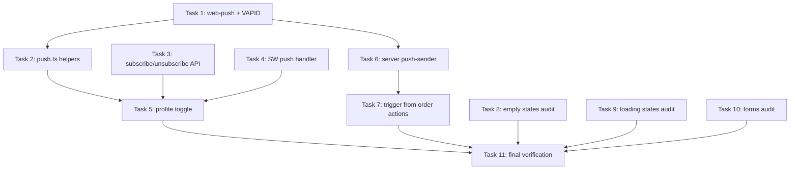

# Phase 4: Push Notifications + UX Polish — Implementation Plan

> **For agentic workers:** REQUIRED SUB-SKILL: Use superpowers:subagent-driven-development to implement this plan task-by-task.

**Goal:** Wire web push notifications for technicians (assigned, rescheduled, reassigned). Plus UX polish audits (empty states, loading states, form validation).

**Architecture:** VAPID-based web push using `web-push` library. Service worker handles push events. Backend triggers push from order action handlers. Audit pass to standardize empty/loading patterns project-wide.

**Tech Stack:** web-push library, Service Worker API, Push API, Notification API, Supabase (push_subscriptions table)

---

## Prerequisites (Phase 0–3 Deliverables Already In Place)

| Deliverable | Location | Used By |
|-------------|----------|---------|
| `push_subscriptions` table + RLS | `supabase/migrations/20260526000000_add_pending_completed_service_reports_push.sql` | Tasks 3, 6 |
| Service worker shell | `public/technician-sw.js` | Task 4 |
| SW registration component | `src/app/technician/sw-register.tsx` | Task 5 |
| Profile page + placeholder push toggle | `src/components/technician/profile-content.tsx` | Task 5 |
| Technician auth helper | `src/app/api/technician/helpers.ts` | Task 3 |
| API utils (`jsonSuccess`, `jsonError`, `handleApiError`) | `src/app/api/utils.ts` | Task 3 |
| Order actions (`assignOrdersToTechnician`, `rescheduleOrder`) | `src/lib/actions/orders.ts` | Task 7 |
| Admin Supabase client (RLS bypass) | `src/lib/supabase-admin.ts` | Task 6 |
| Logger | `src/lib/logger.ts` | Task 6 |
| `<EmptyState />` component | `src/components/ui/empty-state.tsx` | Task 8 |
| `<TableSkeleton />` component | `src/components/ui/skeleton.tsx` | Task 9 |

---

## Task 1: Install web-push library + generate VAPID keys

**Goal:** Add `web-push` Node.js library for sending push notifications. Provide a script for generating VAPID key pair so it is reproducible per environment.

### Step 1.1: Install dependencies

```bash
npm install web-push
npm install -D @types/web-push tsx
```

> `tsx` is used to run the TypeScript key-generation script directly without compiling. If `tsx` is already a project dev dependency, skip the second command's `tsx` part.

### Step 1.2: Create `scripts/generate-vapid-keys.ts`

```typescript
/**
 * VAPID key generator for web push notifications.
 *
 * Run once per environment to produce a public/private key pair.
 *
 * Usage:
 *   npx tsx scripts/generate-vapid-keys.ts
 *
 * Output: paste the printed values into `.env.local` (see README of this script
 * for the exact variable names).
 */
import webpush from 'web-push'

const keys = webpush.generateVAPIDKeys()

console.log('VAPID Keys generated successfully.')
console.log('')
console.log('Add the following to your .env.local file:')
console.log('')
console.log(`NEXT_PUBLIC_VAPID_PUBLIC_KEY=${keys.publicKey}`)
console.log(`VAPID_PRIVATE_KEY=${keys.privateKey}`)
console.log(`VAPID_SUBJECT=mailto:admin@example.com`)
console.log('')
console.log('Reminder:')
console.log('  - Keep VAPID_PRIVATE_KEY secret. Do not commit it.')
console.log('  - Update VAPID_SUBJECT to a real contact email/URL for your org.')
console.log('  - Use the same key pair across deploys; regenerating invalidates')
console.log('    all existing push subscriptions.')
```

### Step 1.3: Add npm script

Edit `package.json`, in the `"scripts"` block, add:

```json
"vapid:gen": "tsx scripts/generate-vapid-keys.ts"
```

### Step 1.4: Generate keys (once, manually) and document env vars

Run:

```bash
npm run vapid:gen
```

Copy the printed lines into `.env.local`:

```bash
# .env.local (do NOT commit)
NEXT_PUBLIC_VAPID_PUBLIC_KEY=BL...your-public-key...
VAPID_PRIVATE_KEY=...your-private-key...
VAPID_SUBJECT=mailto:admin@msnerp.example.com
```

### Step 1.5: Update `.env.example`

Append to `.env.example`:

```bash

# Web Push (VAPID) — Phase 4
# Generate via: npm run vapid:gen
NEXT_PUBLIC_VAPID_PUBLIC_KEY=replace_with_public_key
VAPID_PRIVATE_KEY=replace_with_private_key
VAPID_SUBJECT=mailto:admin@example.com
```

### Verification

```bash
ls scripts/generate-vapid-keys.ts
npm run vapid:gen
npm run type-check
```

**Expected:** Script prints three `=` lines. `type-check` passes.

**Files changed:** `package.json`, `package-lock.json`, `scripts/generate-vapid-keys.ts` (new), `.env.example`

**Files NOT committed:** `.env.local` (already gitignored)

**Commit message:** `feat(push): add web-push library and VAPID key generator script`

---

## Task 2: Push subscription helpers (browser side)

**Goal:** Provide a single, well-typed module for browser push permission, subscription, and unsubscription. No UI here — just the primitives that the profile page (Task 5) and any future caller will use.

### File: `src/lib/push.ts`

```typescript
/**
 * Browser-side helpers for Web Push notifications.
 *
 * Responsibilities:
 *  - Detect feature support
 *  - Convert VAPID public key (URL-safe base64) → Uint8Array for the Push API
 *  - Read current subscription
 *  - Subscribe / unsubscribe with the active service worker
 *
 * UI concerns (toggle, toasts, persistence to backend) live in callers.
 */

const VAPID_PUBLIC_KEY = process.env.NEXT_PUBLIC_VAPID_PUBLIC_KEY ?? ''

export type PushSupport = {
  serviceWorker: boolean
  pushManager: boolean
  notification: boolean
  /** All three present — push is usable. */
  fullySupported: boolean
}

export type PushPermissionState = 'granted' | 'denied' | 'default' | 'unsupported'

/**
 * Convert a URL-safe base64 string to a Uint8Array, as required by
 * `PushManager.subscribe({ applicationServerKey })`.
 *
 * Reference: https://developer.mozilla.org/en-US/docs/Web/API/Push_API/Using_the_Push_API
 */
export function urlBase64ToUint8Array(base64: string): Uint8Array {
  const padding = '='.repeat((4 - (base64.length % 4)) % 4)
  const normalized = (base64 + padding).replace(/-/g, '+').replace(/_/g, '/')
  const raw = atob(normalized)
  const out = new Uint8Array(raw.length)
  for (let i = 0; i < raw.length; i++) {
    out[i] = raw.charCodeAt(i)
  }
  return out
}

/** Detect what is available in the current browser. */
export function getPushSupport(): PushSupport {
  if (typeof window === 'undefined') {
    return {
      serviceWorker: false,
      pushManager: false,
      notification: false,
      fullySupported: false,
    }
  }
  const sw = 'serviceWorker' in navigator
  const pm = 'PushManager' in window
  const n = 'Notification' in window
  return {
    serviceWorker: sw,
    pushManager: pm,
    notification: n,
    fullySupported: sw && pm && n,
  }
}

/** Read the current Notification permission state. */
export function getPermissionState(): PushPermissionState {
  if (typeof window === 'undefined' || !('Notification' in window)) {
    return 'unsupported'
  }
  return Notification.permission as PushPermissionState
}

/** Get the active push subscription for this browser, if any. */
export async function getPushSubscription(): Promise<PushSubscription | null> {
  if (!getPushSupport().fullySupported) return null
  const reg = await navigator.serviceWorker.ready
  return reg.pushManager.getSubscription()
}

/**
 * Request notification permission and subscribe to push.
 * Throws if support missing, permission denied, or VAPID key missing.
 *
 * Returns the new (or existing) PushSubscription. Caller is responsible for
 * sending the subscription payload to the server.
 */
export async function subscribeToPush(): Promise<PushSubscription> {
  if (!getPushSupport().fullySupported) {
    throw new Error('Push notifications are not supported in this browser')
  }
  if (!VAPID_PUBLIC_KEY) {
    throw new Error('NEXT_PUBLIC_VAPID_PUBLIC_KEY is not configured')
  }

  // Permission flow — Notification.requestPermission must be called from a
  // user gesture (e.g., click handler) per browser policy.
  const permission = await Notification.requestPermission()
  if (permission !== 'granted') {
    throw new Error(
      permission === 'denied'
        ? 'Notification permission denied'
        : 'Notification permission was dismissed'
    )
  }

  const reg = await navigator.serviceWorker.ready

  // Reuse existing subscription if present
  const existing = await reg.pushManager.getSubscription()
  if (existing) return existing

  return reg.pushManager.subscribe({
    userVisibleOnly: true,
    applicationServerKey: urlBase64ToUint8Array(VAPID_PUBLIC_KEY),
  })
}

/**
 * Unsubscribe the active subscription, if any. Returns the old subscription
 * (so callers can send it to the server for cleanup) or null.
 */
export async function unsubscribeFromPush(): Promise<PushSubscription | null> {
  const sub = await getPushSubscription()
  if (!sub) return null
  await sub.unsubscribe()
  return sub
}

/**
 * Serialize a PushSubscription to the JSON shape the server expects.
 * Uses `subscription.toJSON()` and asserts the keys we need.
 */
export function serializeSubscription(sub: PushSubscription): {
  endpoint: string
  keys: { p256dh: string; auth: string }
} {
  const json = sub.toJSON()
  const endpoint = json.endpoint ?? sub.endpoint
  const p256dh = json.keys?.p256dh
  const auth = json.keys?.auth
  if (!endpoint || !p256dh || !auth) {
    throw new Error('PushSubscription is missing required fields')
  }
  return { endpoint, keys: { p256dh, auth } }
}
```

### Verification

```bash
npm run type-check
```

**Expected:** Zero type errors. The module is unused so far (Task 5 wires it).

**Files changed:** `src/lib/push.ts` (new)

**Commit message:** `feat(push): add browser-side push subscription helpers`

---

## Task 3: Push subscription API endpoints

**Goal:** Two REST endpoints under `/api/technician/push/*` so the browser can register and unregister its subscription against `push_subscriptions`. Authentication via the existing `authenticateTechnician()` helper.

> **Note on table semantics:** The `push_subscriptions` row is per `(user_id, endpoint)` (unique constraint in migration). Storing per endpoint — not per device — means a single user can have multiple browsers subscribed at once.

### File: `src/app/api/technician/push/subscribe/route.ts`

```typescript
import { NextRequest } from 'next/server'
import { z } from 'zod'
import { jsonSuccess, jsonError, handleApiError } from '@/app/api/utils'
import { createClient } from '@/lib/supabase-server'
import { authenticateTechnician, isTechnicianContext } from '../../helpers'
import { logger } from '@/lib/logger'

const log = logger.child('api-push-subscribe')

const subscribeSchema = z.object({
  endpoint: z.string().url(),
  keys: z.object({
    p256dh: z.string().min(1),
    auth: z.string().min(1),
  }),
  userAgent: z.string().optional(),
})

/**
 * POST /api/technician/push/subscribe
 *
 * Body: { endpoint, keys: { p256dh, auth }, userAgent? }
 *
 * Inserts (or upserts on conflict of user_id+endpoint) a row into
 * `push_subscriptions`. Authenticated technician only.
 */
export async function POST(request: NextRequest) {
  try {
    const auth = await authenticateTechnician(request)
    if (!isTechnicianContext(auth)) return auth

    const body = await request.json()
    const parsed = subscribeSchema.safeParse(body)
    if (!parsed.success) {
      return jsonError(
        `Invalid payload: ${parsed.error.issues[0]?.message ?? 'unknown'}`,
        400
      )
    }

    const { endpoint, keys, userAgent } = parsed.data
    const supabase = await createClient()

    // Upsert on (user_id, endpoint) to make this idempotent —
    // a re-subscribe should not error.
    const { error } = await supabase
      .from('push_subscriptions')
      .upsert(
        {
          user_id: auth.userId,
          endpoint,
          p256dh: keys.p256dh,
          auth: keys.auth,
          user_agent: userAgent ?? request.headers.get('user-agent') ?? null,
        },
        { onConflict: 'user_id,endpoint' }
      )

    if (error) {
      log.error('Failed to upsert subscription', error)
      throw error
    }

    return jsonSuccess({ subscribed: true }, 201)
  } catch (error) {
    return handleApiError(error)
  }
}
```

### File: `src/app/api/technician/push/unsubscribe/route.ts`

```typescript
import { NextRequest } from 'next/server'
import { z } from 'zod'
import { jsonSuccess, jsonError, handleApiError } from '@/app/api/utils'
import { createClient } from '@/lib/supabase-server'
import { authenticateTechnician, isTechnicianContext } from '../../helpers'
import { logger } from '@/lib/logger'

const log = logger.child('api-push-unsubscribe')

const unsubscribeSchema = z.object({
  endpoint: z.string().url(),
})

/**
 * DELETE /api/technician/push/unsubscribe
 *
 * Body: { endpoint }
 *
 * Removes the matching row from `push_subscriptions`. RLS scopes by user.
 * Idempotent — deleting a missing row returns success.
 */
export async function DELETE(request: NextRequest) {
  try {
    const auth = await authenticateTechnician(request)
    if (!isTechnicianContext(auth)) return auth

    const body = await request.json().catch(() => ({}))
    const parsed = unsubscribeSchema.safeParse(body)
    if (!parsed.success) {
      return jsonError(
        `Invalid payload: ${parsed.error.issues[0]?.message ?? 'unknown'}`,
        400
      )
    }

    const supabase = await createClient()
    const { error } = await supabase
      .from('push_subscriptions')
      .delete()
      .eq('user_id', auth.userId)
      .eq('endpoint', parsed.data.endpoint)

    if (error) {
      log.error('Failed to delete subscription', error)
      throw error
    }

    return jsonSuccess({ unsubscribed: true })
  } catch (error) {
    return handleApiError(error)
  }
}
```

### Verification

```bash
npm run type-check
npm run lint
```

**Manual smoke (after Task 5 wires the UI):**

```bash
# After enabling push in the profile, check the row exists:
psql "$DATABASE_URL" -c "select user_id, left(endpoint, 60) as endpoint, created_at from push_subscriptions order by created_at desc limit 5;"
```

**Files changed:**
- `src/app/api/technician/push/subscribe/route.ts` (new)
- `src/app/api/technician/push/unsubscribe/route.ts` (new)

**Commit message:** `feat(push): add subscribe/unsubscribe API endpoints for technicians`

---

## Task 4: Service worker push handler

**Goal:** Replace the placeholder `push` handler in `public/technician-sw.js` with a working notification displayer. Add `notificationclick` (focus/open) and `pushsubscriptionchange` (auto re-subscribe).

> The service worker must remain plain JavaScript because it is served as a static file. No bundler, no TypeScript.

### Updated file: `public/technician-sw.js`

```javascript
// MSN Tech Service Worker
// Phase 2: app shell + offline fallback
// Phase 4: push notifications

const CACHE_NAME = 'msn-tech-v2'

const PRECACHE_URLS = [
  '/technician',
  '/technician-manifest.json',
]

// Install: precache app shell
self.addEventListener('install', (event) => {
  event.waitUntil(
    caches.open(CACHE_NAME).then((cache) => cache.addAll(PRECACHE_URLS))
  )
  self.skipWaiting()
})

// Activate: clean old caches
self.addEventListener('activate', (event) => {
  event.waitUntil(
    caches.keys().then((names) =>
      Promise.all(
        names.filter((n) => n !== CACHE_NAME).map((n) => caches.delete(n))
      )
    )
  )
  self.clients.claim()
})

// Fetch: network-first for navigations, cache fallback
self.addEventListener('fetch', (event) => {
  if (event.request.mode !== 'navigate') return
  event.respondWith(
    fetch(event.request).catch(() =>
      caches.match(event.request).then(
        (cached) =>
          cached ||
          new Response('Offline — silakan cek koneksi internet Anda.', {
            status: 503,
            headers: { 'Content-Type': 'text/plain; charset=utf-8' },
          })
      )
    )
  )
})

// =========================================================================
// Push notifications (Phase 4)
// =========================================================================

/**
 * Push payload contract (negotiated with src/lib/server/push-sender.ts):
 *   {
 *     title: string,
 *     body: string,
 *     url?: string,         // deep link, default '/technician'
 *     tag?: string,         // collapse key
 *     orderId?: string,     // included for observability
 *   }
 *
 * Falls back to a generic notification if payload is missing/invalid so the
 * user is never silently dropped.
 */
self.addEventListener('push', (event) => {
  let payload = {}
  try {
    if (event.data) payload = event.data.json()
  } catch (err) {
    // Treat as plain text if JSON parse fails
    try {
      payload = { title: 'MSN Tech', body: event.data ? event.data.text() : '' }
    } catch (_e) {
      payload = {}
    }
  }

  const title = payload.title || 'MSN Tech'
  const options = {
    body: payload.body || 'Notifikasi baru',
    icon: '/icons/tech-icon-192.png',
    badge: '/icons/tech-icon-192.png',
    tag: payload.tag || undefined,
    renotify: Boolean(payload.tag),
    data: {
      url: payload.url || '/technician',
      orderId: payload.orderId || null,
    },
    // Vibrate pattern is best-effort; ignored on iOS Safari.
    vibrate: [120, 60, 120],
  }

  event.waitUntil(self.registration.showNotification(title, options))
})

/**
 * Notification click — focus an existing tab pointing at the URL or open a
 * new one. Always closes the notification first.
 */
self.addEventListener('notificationclick', (event) => {
  event.notification.close()

  const targetUrl = (event.notification.data && event.notification.data.url) || '/technician'

  event.waitUntil(
    self.clients
      .matchAll({ type: 'window', includeUncontrolled: true })
      .then((clients) => {
        // Try to focus an existing window already on this URL
        for (const client of clients) {
          try {
            const url = new URL(client.url)
            if (url.pathname === targetUrl || url.pathname.startsWith(targetUrl)) {
              return client.focus()
            }
          } catch (_e) {
            // ignore parse errors
          }
        }
        // Otherwise focus the first technician window and navigate it…
        for (const client of clients) {
          try {
            const url = new URL(client.url)
            if (url.pathname.startsWith('/technician')) {
              return client.focus().then((c) =>
                c && 'navigate' in c ? c.navigate(targetUrl) : null
              )
            }
          } catch (_e) {
            // ignore
          }
        }
        // …or open a brand-new window
        if (self.clients.openWindow) {
          return self.clients.openWindow(targetUrl)
        }
        return null
      })
  )
})

/**
 * Subscription change — browsers periodically rotate keys / drop subscriptions.
 * Resubscribe with the same VAPID key, then notify the server. The VAPID public
 * key is hardcoded into a fetched config so the SW does not need bundler env.
 */
self.addEventListener('pushsubscriptionchange', (event) => {
  event.waitUntil(
    (async () => {
      try {
        // Fetch current public key from a tiny config endpoint so we don't have
        // to bake it into the SW at build time.
        const res = await fetch('/api/technician/push/public-key')
        if (!res.ok) throw new Error('Failed to fetch VAPID key')
        const { publicKey } = await res.json()
        if (!publicKey) throw new Error('No VAPID public key returned')

        const sub = await self.registration.pushManager.subscribe({
          userVisibleOnly: true,
          applicationServerKey: urlBase64ToUint8Array(publicKey),
        })

        await fetch('/api/technician/push/subscribe', {
          method: 'POST',
          headers: { 'Content-Type': 'application/json' },
          body: JSON.stringify(sub.toJSON()),
        })
      } catch (err) {
        // Swallow — there is nothing else the SW can do here. The next time
        // the user opens the app, the profile page will reconcile state.
        console.warn('[SW] pushsubscriptionchange failed:', err)
      }
    })()
  )
})

// Inline copy of urlBase64ToUint8Array — duplicated from src/lib/push.ts
// because the SW cannot import from app code.
function urlBase64ToUint8Array(base64) {
  const padding = '='.repeat((4 - (base64.length % 4)) % 4)
  const normalized = (base64 + padding).replace(/-/g, '+').replace(/_/g, '/')
  const raw = atob(normalized)
  const out = new Uint8Array(raw.length)
  for (let i = 0; i < raw.length; i++) {
    out[i] = raw.charCodeAt(i)
  }
  return out
}
```

### Companion endpoint: `src/app/api/technician/push/public-key/route.ts`

`pushsubscriptionchange` fires without an authenticated user gesture — it must work even if the page is closed. Expose the public VAPID key (which is already public by design) via a small unauthenticated GET:

```typescript
import { NextResponse } from 'next/server'

/**
 * GET /api/technician/push/public-key
 *
 * Returns the VAPID public key. This is intentionally unauthenticated —
 * the public key is meant to be public; treating it as a secret would not
 * add real security. Used by the service worker on `pushsubscriptionchange`.
 */
export async function GET() {
  const publicKey = process.env.NEXT_PUBLIC_VAPID_PUBLIC_KEY ?? ''
  return NextResponse.json({ publicKey })
}
```

### Verification

```bash
npm run type-check
npm run dev
# Open http://localhost:3000/technician in Chrome devtools → Application →
# Service Workers. Confirm "msn-tech-v2" is active. Use the "Push" trigger
# in DevTools to send a test payload — a notification should appear.
```

**Files changed:**
- `public/technician-sw.js` (modified)
- `src/app/api/technician/push/public-key/route.ts` (new)

**Commit message:** `feat(push): wire push, notificationclick, and subscriptionchange handlers in service worker`

---

## Task 5: Wire profile push toggle

**Goal:** Replace the placeholder toggle in `ProfileContent` with a real subscription flow that mirrors browser state into local UI state.

State machine the toggle drives:

```
                         user toggles ON
unsupported  ──────►  default ──────────►  granted (subscribing)
                       │                        │
                       │ user toggles ON        │ POST /subscribe ok
                       │ Notification.request   ▼
                       ▼                     enabled
                     denied ◄──── user blocked
```

### Updated file: `src/components/technician/profile-content.tsx`

```tsx
'use client'

import { useEffect, useState, useCallback } from 'react'
import { useQuery } from '@tanstack/react-query'
import { useRouter } from 'next/navigation'
import { User, Phone, Mail, Bell, BellOff, LogOut, Info, AlertTriangle } from 'lucide-react'
import { Button } from '@/components/ui/button'
import { Switch } from '@/components/ui/switch'
import { useToast } from '@/hooks/use-toast'
import { createClient } from '@/lib/supabase-browser'
import {
  getPushSupport,
  getPermissionState,
  getPushSubscription,
  subscribeToPush,
  unsubscribeFromPush,
  serializeSubscription,
  type PushPermissionState,
} from '@/lib/push'

async function fetchProfile() {
  const supabase = createClient()
  const {
    data: { user },
  } = await supabase.auth.getUser()
  if (!user) throw new Error('Not authenticated')

  const { data: technician, error } = await supabase
    .from('technicians')
    .select('technician_id, technician_name, contact_number, email, specialization, company')
    .eq('auth_user_id', user.id)
    .single()
  if (error) throw new Error('Gagal memuat profil')

  return { user, technician }
}

type PushUiState =
  | { kind: 'loading' }
  | { kind: 'unsupported' }
  | { kind: 'denied' }
  | { kind: 'enabled' }
  | { kind: 'disabled'; permission: PushPermissionState }
  | { kind: 'busy' }

export function ProfileContent() {
  const router = useRouter()
  const { toast } = useToast()
  const [loggingOut, setLoggingOut] = useState(false)
  const [push, setPush] = useState<PushUiState>({ kind: 'loading' })

  const { data, isLoading, isError } = useQuery({
    queryKey: ['technician', 'profile'],
    queryFn: fetchProfile,
    staleTime: 5 * 60_000,
  })

  // ---------- Push initial state ----------
  const reconcile = useCallback(async () => {
    const support = getPushSupport()
    if (!support.fullySupported) {
      setPush({ kind: 'unsupported' })
      return
    }
    const permission = getPermissionState()
    if (permission === 'denied') {
      setPush({ kind: 'denied' })
      return
    }
    const sub = await getPushSubscription()
    setPush(sub ? { kind: 'enabled' } : { kind: 'disabled', permission })
  }, [])

  useEffect(() => {
    reconcile().catch(() => setPush({ kind: 'unsupported' }))
  }, [reconcile])

  // ---------- Subscribe ----------
  const enablePush = useCallback(async () => {
    setPush({ kind: 'busy' })
    try {
      const sub = await subscribeToPush()
      const payload = serializeSubscription(sub)
      const res = await fetch('/api/technician/push/subscribe', {
        method: 'POST',
        headers: { 'Content-Type': 'application/json' },
        body: JSON.stringify({
          endpoint: payload.endpoint,
          keys: payload.keys,
          userAgent: navigator.userAgent,
        }),
      })
      if (!res.ok) {
        // Roll back the browser subscription so state stays consistent
        await sub.unsubscribe().catch(() => undefined)
        const body = await res.json().catch(() => ({}))
        throw new Error(body?.error ?? 'Server menolak subscription')
      }
      setPush({ kind: 'enabled' })
      toast({ title: 'Notifikasi diaktifkan' })
    } catch (err) {
      const message = err instanceof Error ? err.message : 'Gagal mengaktifkan notifikasi'
      toast({ variant: 'destructive', title: 'Gagal', description: message })
      await reconcile()
    }
  }, [reconcile, toast])

  // ---------- Unsubscribe ----------
  const disablePush = useCallback(async () => {
    setPush({ kind: 'busy' })
    try {
      const sub = await getPushSubscription()
      if (sub) {
        await fetch('/api/technician/push/unsubscribe', {
          method: 'DELETE',
          headers: { 'Content-Type': 'application/json' },
          body: JSON.stringify({ endpoint: sub.endpoint }),
        }).catch(() => undefined)
        await unsubscribeFromPush()
      }
      setPush({ kind: 'disabled', permission: getPermissionState() })
      toast({ title: 'Notifikasi dimatikan' })
    } catch (err) {
      const message = err instanceof Error ? err.message : 'Gagal mematikan notifikasi'
      toast({ variant: 'destructive', title: 'Gagal', description: message })
      await reconcile()
    }
  }, [reconcile, toast])

  const onPushToggle = (next: boolean) => {
    if (push.kind === 'busy') return
    if (next) enablePush()
    else disablePush()
  }

  // ---------- Logout ----------
  const handleLogout = async () => {
    setLoggingOut(true)
    try {
      const supabase = createClient()
      await supabase.auth.signOut()
      router.push('/login')
    } catch {
      setLoggingOut(false)
    }
  }

  if (isLoading) {
    return (
      <div className="space-y-4 animate-pulse">
        <div className="rounded-xl border bg-card p-4 space-y-3">
          <div className="h-6 w-40 rounded bg-muted" />
          <div className="h-4 w-32 rounded bg-muted" />
          <div className="h-4 w-48 rounded bg-muted" />
        </div>
      </div>
    )
  }

  if (isError || !data) {
    return (
      <div className="text-center py-8">
        <p className="text-sm text-muted-foreground">Gagal memuat profil</p>
      </div>
    )
  }

  const { technician } = data
  const switchChecked = push.kind === 'enabled' || push.kind === 'busy'
  const switchDisabled =
    push.kind === 'loading' ||
    push.kind === 'unsupported' ||
    push.kind === 'denied' ||
    push.kind === 'busy'

  return (
    <div className="space-y-4">
      {/* Profile info card */}
      <div className="rounded-xl border bg-card p-4 space-y-4">
        <div className="flex items-center gap-3">
          <div className="flex h-12 w-12 items-center justify-center rounded-full bg-primary/10">
            <User className="h-6 w-6 text-primary" />
          </div>
          <div>
            <h2 className="font-semibold text-base">{technician.technician_name}</h2>
            {technician.specialization && (
              <p className="text-xs text-muted-foreground">{technician.specialization}</p>
            )}
          </div>
        </div>

        <div className="space-y-2 pt-2 border-t">
          {technician.contact_number && (
            <div className="flex items-center gap-2 text-sm">
              <Phone className="h-4 w-4 text-muted-foreground shrink-0" aria-hidden="true" />
              <span>{technician.contact_number}</span>
            </div>
          )}
          {technician.email && (
            <div className="flex items-center gap-2 text-sm">
              <Mail className="h-4 w-4 text-muted-foreground shrink-0" aria-hidden="true" />
              <span>{technician.email}</span>
            </div>
          )}
          {technician.company && (
            <div className="flex items-center gap-2 text-sm">
              <Info className="h-4 w-4 text-muted-foreground shrink-0" aria-hidden="true" />
              <span>{technician.company}</span>
            </div>
          )}
        </div>
      </div>

      {/* Settings card */}
      <div className="rounded-xl border bg-card p-4 space-y-4">
        <h3 className="font-medium text-sm text-muted-foreground uppercase tracking-wide">
          Pengaturan
        </h3>

        <div className="flex items-center justify-between">
          <div className="flex items-center gap-2">
            {push.kind === 'enabled' ? (
              <Bell className="h-4 w-4 text-primary" aria-hidden="true" />
            ) : (
              <BellOff className="h-4 w-4 text-muted-foreground" aria-hidden="true" />
            )}
            <div>
              <p className="text-sm font-medium">Notifikasi Push</p>
              <p className="text-xs text-muted-foreground">
                {pushHelpText(push)}
              </p>
            </div>
          </div>
          <Switch
            checked={switchChecked}
            disabled={switchDisabled}
            onCheckedChange={onPushToggle}
            aria-label="Toggle notifikasi push"
          />
        </div>

        {push.kind === 'denied' && (
          <div className="flex gap-2 rounded-md border border-destructive/30 bg-destructive/5 p-3 text-xs text-destructive">
            <AlertTriangle className="h-4 w-4 shrink-0 mt-0.5" aria-hidden="true" />
            <p>
              Notifikasi diblokir oleh browser. Buka pengaturan situs di
              browser kamu, izinkan notifikasi, lalu refresh halaman ini.
            </p>
          </div>
        )}
        {push.kind === 'unsupported' && (
          <div className="flex gap-2 rounded-md border bg-muted/50 p-3 text-xs text-muted-foreground">
            <Info className="h-4 w-4 shrink-0 mt-0.5" aria-hidden="true" />
            <p>
              Browser ini tidak mendukung notifikasi push. Coba pakai Chrome
              atau Safari versi terbaru.
            </p>
          </div>
        )}
      </div>

      <Button
        variant="outline"
        onClick={handleLogout}
        disabled={loggingOut}
        className="w-full h-11 text-destructive hover:text-destructive hover:bg-destructive/10"
      >
        <LogOut className="mr-2 h-4 w-4" />
        {loggingOut ? 'Keluar...' : 'Keluar'}
      </Button>

      <p className="text-center text-xs text-muted-foreground pt-4">
        MSN Tech v2.0.0-beta
      </p>
    </div>
  )
}

function pushHelpText(state: PushUiState): string {
  switch (state.kind) {
    case 'loading':
      return 'Memuat status notifikasi...'
    case 'enabled':
      return 'Aktif. Kamu akan diberi tahu saat ada job baru.'
    case 'disabled':
      return 'Aktifkan untuk menerima notifikasi job baru.'
    case 'busy':
      return 'Memproses...'
    case 'denied':
      return 'Notifikasi diblokir oleh browser.'
    case 'unsupported':
      return 'Browser ini tidak mendukung notifikasi push.'
  }
}
```

### Verification

```bash
npm run type-check
npm run lint
npm run dev
# 1. Open http://localhost:3000/technician/profile in a browser that supports
#    push (Chrome desktop, Android Chrome, iOS 16.4+ standalone PWA).
# 2. Toggle ON → permission prompt → row appears in push_subscriptions.
# 3. Toggle OFF → row removed.
# 4. In Chrome devtools, set Notification permission to "denied" → reload →
#    expect "denied" UI state and disabled toggle.
```

**Files changed:** `src/components/technician/profile-content.tsx`

**Commit message:** `feat(push): wire profile toggle to subscribe/unsubscribe flow`

---

## Task 6: Backend push notification sender

**Goal:** Server-side module that fans out a payload to every active subscription belonging to a user. Uses the admin Supabase client (RLS bypass) because the trigger runs in server-action context where the acting user is an admin, not the technician being notified. Failed subscriptions are pruned automatically.

> Why admin client? Server actions run with the *admin's* JWT. RLS on `push_subscriptions` only lets a user read their own rows. We need to read the *technician's* rows from the *admin's* session — exactly what `createAdminClient` is for.

### File: `src/lib/server/push-sender.ts`

```typescript
/**
 * Server-side push fan-out.
 *
 * Public API:
 *   - sendPushToUser(userId, payload)
 *   - sendJobAssignedNotification(orderId, technicianId)
 *   - sendJobRescheduledNotification(orderId, technicianId, newDate)
 *   - sendJobReassignedAwayNotification(orderId, technicianId)
 *
 * All four are fire-and-forget by design — push failures should never break
 * the originating action. Errors are logged via the project logger.
 */
import 'server-only'
import webpush, { type PushSubscription as WebPushSub } from 'web-push'
import { createAdminClient } from '@/lib/supabase-admin'
import { logger } from '@/lib/logger'

const log = logger.child('push-sender')

// ----------------------------------------------------------------------------
// VAPID setup (idempotent — safe to call once per cold start)
// ----------------------------------------------------------------------------
let vapidConfigured = false

function ensureVapidConfigured(): boolean {
  if (vapidConfigured) return true
  const subject = process.env.VAPID_SUBJECT
  const publicKey = process.env.NEXT_PUBLIC_VAPID_PUBLIC_KEY
  const privateKey = process.env.VAPID_PRIVATE_KEY

  if (!subject || !publicKey || !privateKey) {
    log.warn('VAPID env vars missing — push notifications disabled', {
      hasSubject: !!subject,
      hasPublic: !!publicKey,
      hasPrivate: !!privateKey,
    })
    return false
  }
  webpush.setVapidDetails(subject, publicKey, privateKey)
  vapidConfigured = true
  return true
}

// ----------------------------------------------------------------------------
// Payload contract — must match what `public/technician-sw.js` expects.
// ----------------------------------------------------------------------------
export interface PushPayload {
  title: string
  body: string
  /** Deep link relative path. Defaults to /technician on the SW side. */
  url?: string
  /** Collapse key — replaces an existing notification with the same tag. */
  tag?: string
  /** Order ID, included for analytics/debugging. */
  orderId?: string
}

// ----------------------------------------------------------------------------
// Core sender
// ----------------------------------------------------------------------------

/**
 * Send `payload` to every active subscription of `userId`.
 * Failed-permanently subscriptions (HTTP 404/410) are deleted from the DB.
 *
 * Returns counts so callers can log/observe outcomes.
 */
export async function sendPushToUser(
  userId: string,
  payload: PushPayload
): Promise<{ sent: number; pruned: number; failed: number }> {
  if (!ensureVapidConfigured()) {
    return { sent: 0, pruned: 0, failed: 0 }
  }

  const admin = createAdminClient()

  const { data: subs, error } = await admin
    .from('push_subscriptions')
    .select('subscription_id, endpoint, p256dh, auth')
    .eq('user_id', userId)

  if (error) {
    log.error('Failed to load push subscriptions', { userId, error })
    return { sent: 0, pruned: 0, failed: 0 }
  }
  if (!subs || subs.length === 0) {
    return { sent: 0, pruned: 0, failed: 0 }
  }

  const body = JSON.stringify(payload)

  const results = await Promise.allSettled(
    subs.map((s) => {
      const sub: WebPushSub = {
        endpoint: s.endpoint,
        keys: { p256dh: s.p256dh, auth: s.auth },
      }
      return webpush.sendNotification(sub, body).then(
        () => ({ kind: 'ok' as const, id: s.subscription_id }),
        (err: { statusCode?: number; body?: string }) => ({
          kind: 'err' as const,
          id: s.subscription_id,
          status: err.statusCode,
          body: err.body,
        })
      )
    })
  )

  // Find permanently-failed subs to prune. 404 = endpoint never existed,
  // 410 = "Gone" = unsubscribed at the push service.
  const toPrune: string[] = []
  let sent = 0
  let failed = 0

  for (const r of results) {
    if (r.status !== 'fulfilled') {
      failed++
      continue
    }
    const v = r.value
    if (v.kind === 'ok') {
      sent++
    } else {
      failed++
      if (v.status === 404 || v.status === 410) {
        toPrune.push(v.id)
      } else {
        log.warn('Push send failed (transient)', {
          userId,
          status: v.status,
          body: v.body,
        })
      }
    }
  }

  let pruned = 0
  if (toPrune.length > 0) {
    const { error: deleteError, count } = await admin
      .from('push_subscriptions')
      .delete({ count: 'exact' })
      .in('subscription_id', toPrune)
    if (deleteError) {
      log.error('Failed to prune dead subscriptions', { error: deleteError })
    } else {
      pruned = count ?? toPrune.length
    }
  }

  log.debug('Push fan-out complete', { userId, sent, pruned, failed })
  return { sent, pruned, failed }
}

// ----------------------------------------------------------------------------
// Helper: resolve technician's auth_user_id from technician_id.
// We push by Supabase auth user id; the order-actions caller has technician_id.
// ----------------------------------------------------------------------------
async function resolveAuthUserId(technicianId: string): Promise<string | null> {
  const admin = createAdminClient()
  const { data, error } = await admin
    .from('technicians')
    .select('auth_user_id')
    .eq('technician_id', technicianId)
    .maybeSingle()
  if (error || !data?.auth_user_id) {
    log.warn('Could not resolve auth_user_id for technician', { technicianId, error })
    return null
  }
  return data.auth_user_id
}

// ----------------------------------------------------------------------------
// Specific notification builders
// ----------------------------------------------------------------------------

/**
 * Tech was newly assigned to an order. URL deep-links to the job detail.
 */
export async function sendJobAssignedNotification(
  orderId: string,
  technicianId: string
): Promise<void> {
  const userId = await resolveAuthUserId(technicianId)
  if (!userId) return

  // Fetch a tiny snippet for a humane body
  const admin = createAdminClient()
  const { data: order } = await admin
    .from('orders')
    .select(
      `order_id, scheduled_visit_date,
       customers (customer_name)`
    )
    .eq('order_id', orderId)
    .maybeSingle()

  const customerName =
    (order?.customers as { customer_name?: string } | null)?.customer_name ?? 'pelanggan'
  const date = order?.scheduled_visit_date
    ? new Date(order.scheduled_visit_date).toLocaleDateString('id-ID', {
        weekday: 'short',
        day: 'numeric',
        month: 'short',
      })
    : null

  await sendPushToUser(userId, {
    title: 'Job baru ditugaskan',
    body: date
      ? `${customerName} • jadwal ${date}`
      : `${customerName}`,
    url: `/technician/job/${orderId}`,
    tag: `job-assigned:${orderId}`,
    orderId,
  }).catch((err) => log.error('sendJobAssignedNotification failed', err))
}

/**
 * Existing assignment was rescheduled to a new date.
 */
export async function sendJobRescheduledNotification(
  orderId: string,
  technicianId: string,
  newDate: string
): Promise<void> {
  const userId = await resolveAuthUserId(technicianId)
  if (!userId) return

  const formatted = new Date(newDate).toLocaleDateString('id-ID', {
    weekday: 'short',
    day: 'numeric',
    month: 'short',
  })

  await sendPushToUser(userId, {
    title: 'Job dijadwal ulang',
    body: `Jadwal baru: ${formatted}. Tap untuk detail.`,
    url: `/technician/job/${orderId}`,
    tag: `job-rescheduled:${orderId}`,
    orderId,
  }).catch((err) => log.error('sendJobRescheduledNotification failed', err))
}

/**
 * Notify the OLD lead technician that a job has been reassigned away.
 */
export async function sendJobReassignedAwayNotification(
  orderId: string,
  technicianId: string
): Promise<void> {
  const userId = await resolveAuthUserId(technicianId)
  if (!userId) return

  await sendPushToUser(userId, {
    title: 'Job dipindahkan ke teknisi lain',
    body: `Order ${orderId} sudah tidak ditugaskan ke kamu.`,
    url: '/technician',
    tag: `job-reassigned-away:${orderId}`,
    orderId,
  }).catch((err) => log.error('sendJobReassignedAwayNotification failed', err))
}
```

### Verification

```bash
npm run type-check
```

**Manual smoke test (after Task 7 wires triggers):**
```bash
# In one tab: open /technician/profile in Chrome, enable notifications.
# In another tab: as ADMIN, assign an order to that technician.
# Expect: notification appears within ~1s.
```

**Files changed:** `src/lib/server/push-sender.ts` (new)

**Commit message:** `feat(push): add server-side push fan-out and notification builders`

---

## Task 7: Trigger push from server actions

**Goal:** Hook the three notification builders into `src/lib/actions/orders.ts` at the right control points. Pushes are best-effort — never let a push failure roll back the underlying mutation.

### Required edits to `src/lib/actions/orders.ts`

#### 7.1: Imports

Add at the top of the file (after existing imports):

```typescript
import {
  sendJobAssignedNotification,
  sendJobRescheduledNotification,
  sendJobReassignedAwayNotification,
} from '@/lib/server/push-sender'
```

#### 7.2: `assignOrdersToTechnician` — fire on success

Find the existing `assignOrdersToTechnician` function (currently around line 296). Before its successful return, after `revalidatePath` calls, add a fan-out loop. Also, *before* the assignment write, capture each order's previous lead so we can notify them of being unassigned.

Replace the function body with:

```typescript
export async function assignOrdersToTechnician(data: {
  orderIds: string[]
  technicianId: string
  helperTechnicianIds?: string[]
  scheduledDate: string
}) {
  try {
    logger.debug('Assigning orders:', data)
    const supabase = await createClient()

    // 1. Capture previous leads BEFORE mutating, so we can notify the OLD
    //    technicians that the job has moved away.
    const { data: prevLeads } = await supabase
      .from('order_technicians')
      .select('order_id, technician_id')
      .in('order_id', data.orderIds)
      .eq('role', 'lead')

    const previousLeadByOrder = new Map<string, string>()
    for (const row of prevLeads ?? []) {
      previousLeadByOrder.set(row.order_id, row.technician_id)
    }

    // 2. Update orders
    const { error: orderError } = await supabase
      .from('orders')
      .update({
        status: 'ASSIGNED',
        assigned_technician_id: data.technicianId,
        scheduled_visit_date: data.scheduledDate,
        updated_at: new Date().toISOString(),
      })
      .in('order_id', data.orderIds)
    if (orderError) {
      logger.error('Order update error:', orderError)
      throw orderError
    }

    // 3. Replace technician assignments
    //    First, delete existing assignments for these orders
    const { error: deleteAssignError } = await supabase
      .from('order_technicians')
      .delete()
      .in('order_id', data.orderIds)
    if (deleteAssignError) {
      logger.error('Failed to clear existing assignments:', deleteAssignError)
      throw deleteAssignError
    }

    //    Then insert new lead + helpers
    const technicianAssignments: Array<{
      order_id: string
      technician_id: string
      role: 'lead' | 'helper'
      assigned_at: string
    }> = []
    for (const orderId of data.orderIds) {
      technicianAssignments.push({
        order_id: orderId,
        technician_id: data.technicianId,
        role: 'lead',
        assigned_at: new Date().toISOString(),
      })
      if (data.helperTechnicianIds && data.helperTechnicianIds.length > 0) {
        for (const helperId of data.helperTechnicianIds) {
          technicianAssignments.push({
            order_id: orderId,
            technician_id: helperId,
            role: 'helper',
            assigned_at: new Date().toISOString(),
          })
        }
      }
    }

    if (technicianAssignments.length > 0) {
      const { error: assignError } = await supabase
        .from('order_technicians')
        .insert(technicianAssignments)
      if (assignError) {
        logger.error('Technician assignment error:', assignError)
        throw assignError
      }
    }

    logger.debug('Orders assigned successfully')
    revalidatePath('/dashboard/orders')
    revalidatePath('/dashboard/operasional/assign-order')
    revalidatePath('/dashboard/operasional/monitoring-ongoing')
    revalidatePath('/dashboard')

    // 4. Fire notifications — best effort, never throws.
    //    a. Notify NEW lead per order
    //    b. If a previous DIFFERENT lead existed, notify them they were
    //       reassigned away.
    void Promise.allSettled(
      data.orderIds.flatMap((orderId) => {
        const tasks = [sendJobAssignedNotification(orderId, data.technicianId)]
        const prev = previousLeadByOrder.get(orderId)
        if (prev && prev !== data.technicianId) {
          tasks.push(sendJobReassignedAwayNotification(orderId, prev))
        }
        return tasks
      })
    )

    return {
      success: true,
      message: `Successfully assigned ${data.orderIds.length} order(s) to technician`,
    }
  } catch (error: unknown) {
    logger.error('Error assigning orders:', error)
    return {
      success: false,
      error: error instanceof Error ? error.message : 'Failed to assign orders',
    }
  }
}
```

> Note: this version also makes the assignment idempotent — re-running it on the same order replaces the previous lead/helpers cleanly. The previous code only INSERTed new rows, which silently created duplicates if called twice.

#### 7.3: `rescheduleOrder` — fire on success

Replace `rescheduleOrder` with:

```typescript
export async function rescheduleOrder(params: {
  orderId: string
  reason: string
  newScheduledDate: string
}) {
  try {
    const supabase = await createClient()

    // 1. Capture current state (for transition log + previous lead)
    const { data: currentOrder, error: fetchError } = await supabase
      .from('orders')
      .select('status')
      .eq('order_id', params.orderId)
      .single()
    if (fetchError) throw fetchError

    const { data: prevLeadRow } = await supabase
      .from('order_technicians')
      .select('technician_id')
      .eq('order_id', params.orderId)
      .eq('role', 'lead')
      .maybeSingle()
    const previousLeadId = prevLeadRow?.technician_id ?? null

    // 2. Reset to PENDING + clear assignments + set new date
    const { error: updateError } = await supabase
      .from('orders')
      .update({
        status: 'PENDING',
        assigned_technician_id: null,
        scheduled_visit_date: params.newScheduledDate,
        req_visit_date: params.newScheduledDate,
        updated_at: new Date().toISOString(),
      })
      .eq('order_id', params.orderId)
    if (updateError) throw updateError

    const { error: deleteError } = await supabase
      .from('order_technicians')
      .delete()
      .eq('order_id', params.orderId)
    if (deleteError) {
      logger.error('Error clearing technician assignments on reschedule:', deleteError)
      throw deleteError
    }

    // 3. Log transition
    await supabase.from('order_status_transitions').insert({
      order_id: params.orderId,
      from_status: currentOrder.status,
      to_status: 'PENDING',
      notes: `Reschedule: ${params.reason}`,
      transition_date: new Date().toISOString(),
    })

    revalidatePath('/dashboard/orders')
    revalidatePath('/dashboard')

    // 4. Notify previous lead (best effort) — they cared about this job
    if (previousLeadId) {
      void sendJobRescheduledNotification(
        params.orderId,
        previousLeadId,
        params.newScheduledDate
      ).catch(() => undefined)
    }

    return { success: true, message: 'Order rescheduled' }
  } catch (error: unknown) {
    logger.error('Error rescheduling order:', error)
    return {
      success: false,
      error: error instanceof Error ? error.message : 'Failed to reschedule order',
    }
  }
}
```

### Verification

```bash
npm run type-check
npm run lint
```

**Manual end-to-end smoke:**
1. Tech A enables push on phone.
2. Tech B enables push on phone.
3. Admin assigns Order X to Tech A → Tech A receives "Job baru ditugaskan".
4. Admin reassigns Order X to Tech B → Tech A receives "dipindahkan", Tech B receives "Job baru ditugaskan".
5. Admin reschedules Order X (still Tech B) → Tech B receives "dijadwal ulang".

**Files changed:** `src/lib/actions/orders.ts`

**Commit message:** `feat(push): trigger notifications on assign, reassign, and reschedule`

---

## Task 8: Empty states audit

**Goal:** Verify every primary admin and technician page renders an `<EmptyState />` (or equivalent) when its data is empty. Document the audit and fix gaps.

### Step 8.1: Create the audit document

Create `docs/superpowers/audits/2026-05-26-empty-states-audit.md`:

```markdown
# Empty States Audit — 2026-05-26

**Goal:** Confirm every primary list/table/board uses `<EmptyState />` with an
icon, title, and helpful description (and an action button when applicable).

**Reference component:** `src/components/ui/empty-state.tsx`

## Audit Matrix

| # | Page | Route | Audited | Pattern | Verdict |
|---|------|-------|---------|---------|---------|
| 1 | Orders Board | `/dashboard/orders?view=board` | ✓ | `<EmptyState />` per column (Phase 1) | OK |
| 2 | Orders List | `/dashboard/orders?view=list` | ✓ | `<EmptyState />` (Phase 1) | OK |
| 3 | Invoices List | `/dashboard/keuangan/invoices` | ✓ | TBD — see fix below | Fix |
| 4 | Customers | `/dashboard/manajemen/customer` | ✓ | TBD — see fix below | Fix |
| 5 | Technicians | `/dashboard/manajemen/teknisi` | ✓ | TBD — see fix below | Fix |
| 6 | Today's Jobs | `/technician` | ✓ | `<EmptyTodayJobs />` (Phase 2) | OK |
| 7 | History | `/technician/history` | ✓ | `<EmptyState />` (Phase 2) | OK |

## Fixes Applied (this pass)

(filled in by the implementing agent — see commit log)
```

### Step 8.2: Audit and fix each "Fix" row

For each page in the matrix flagged "Fix":

#### 8.2.a: `/dashboard/keuangan/invoices`

Open `src/app/dashboard/keuangan/invoices/page.tsx`. Find the table render block. Replace any plain "Tidak ada data" / `<TableRow><TableCell colSpan={...}>...</TableCell></TableRow>` placeholder with:

```tsx
import { EmptyState } from '@/components/ui/empty-state'
import { Receipt, Plus } from 'lucide-react'

// Inside render, when invoices.length === 0 and !isLoading:
{invoices.length === 0 && !isLoading ? (
  <div className="rounded-lg border bg-card">
    <EmptyState
      icon={Receipt}
      title="Belum ada invoice"
      description="Invoice akan muncul di sini setelah dibuat dari order yang sudah selesai."
      action={{
        label: 'Buat Invoice',
        icon: Plus,
        onClick: () => router.push('/dashboard/keuangan/invoices/create-blank'),
      }}
    />
  </div>
) : (
  // existing table render
)}
```

If the page has filter chips active, also check filtered-empty:

```tsx
import { SearchX } from 'lucide-react'

// When filtered list is empty but unfiltered would not be:
<EmptyState
  icon={SearchX}
  title="Tidak ditemukan"
  description="Coba ubah filter atau kata kunci pencarian."
/>
```

#### 8.2.b: `/dashboard/manajemen/customer`

Open `src/app/dashboard/manajemen/customer/page.tsx`. The page already uses `TableSkeleton` (line 44), so loading is fine. Add the empty state for when `customers.length === 0 && !isLoading`:

```tsx
import { EmptyState } from '@/components/ui/empty-state'
import { Users, Plus } from 'lucide-react'

// Replace the empty <TableBody> branch:
{customers.length === 0 && !isLoading ? (
  <TableRow>
    <TableCell colSpan={8} className="p-0">
      <EmptyState
        icon={Users}
        title="Belum ada pelanggan"
        description="Tambahkan pelanggan pertama untuk mulai membuat order."
        action={{
          label: 'Tambah Pelanggan',
          icon: Plus,
          onClick: () => setIsCreateOpen(true),
        }}
      />
    </TableCell>
  </TableRow>
) : (
  customers.map(/* existing render */)
)}
```

#### 8.2.c: `/dashboard/manajemen/teknisi`

Open `src/app/dashboard/manajemen/teknisi/page.tsx`. Apply the same pattern with the `Wrench` (or `HardHat`) icon:

```tsx
import { EmptyState } from '@/components/ui/empty-state'
import { Wrench, Plus } from 'lucide-react'

{technicians.length === 0 && !isLoading ? (
  <TableRow>
    <TableCell colSpan={/* same as cols */} className="p-0">
      <EmptyState
        icon={Wrench}
        title="Belum ada teknisi"
        description="Tambahkan teknisi untuk mulai menugaskan order."
        action={{
          label: 'Tambah Teknisi',
          icon: Plus,
          onClick: () => setIsCreateOpen(true),
        }}
      />
    </TableCell>
  </TableRow>
) : (
  /* existing render */
)}
```

> **If the teknisi page does not have a built-in create modal**, point the action's `onClick` to navigate to wherever the existing "Tambah" button currently lives. Goal: never have a useless empty page — always offer the next step.

### Step 8.3: Update audit document with results

After applying fixes, update the matrix in the audit document:
- Change "Fix" to "OK" for each page that was patched.
- In the "Fixes Applied" section, list the commits that touched each page.

### Verification

```bash
npm run type-check
npm run lint
# Manual:
# 1. With a fresh DB or filters that produce zero rows, visit each "Fix" page.
# 2. Confirm <EmptyState /> renders with icon + title + description.
# 3. Confirm the action button is wired (clicking opens the right modal/route).
```

**Files changed:**
- `docs/superpowers/audits/2026-05-26-empty-states-audit.md` (new)
- `src/app/dashboard/keuangan/invoices/page.tsx`
- `src/app/dashboard/manajemen/customer/page.tsx`
- `src/app/dashboard/manajemen/teknisi/page.tsx`

**Commit message:** `chore(ux): empty states audit + fix invoices/customers/technicians`

---

## Task 9: Loading states audit

**Goal:** Project-wide pages should use a *skeleton* on initial page load (matching final layout) rather than a centered `Loader2` spinner. Spinners are still appropriate inside button labels during mutation, and as overlay on async sub-content (Tier 3 in design spec §8.5).

### Step 9.1: Create the audit document

Create `docs/superpowers/audits/2026-05-26-loading-states-audit.md`:

```markdown
# Loading States Audit — 2026-05-26

Reference: design spec §8.5 (4 tiers).

| Tier | Use case | Component |
|------|----------|-----------|
| 1 | Initial page load | `<TableSkeleton />`, `<KpiCardSkeleton />`, etc. |
| 2 | Mutation in flight | inline `<Loader2 className="animate-spin" />` inside button |
| 3 | Modal / Sheet async content | `<LoadingOverlay />` |
| 4 | Optimistic | no spinner — UI updates immediately |

## Audit Matrix

| # | Page | Route | Initial-load pattern | Verdict |
|---|------|-------|---------------------|---------|
| 1 | Orders Board | `/dashboard/orders?view=board` | KanbanBoardSkeleton (Phase 1) | OK |
| 2 | Orders List | `/dashboard/orders?view=list` | TableSkeleton (Phase 1) | OK |
| 3 | Invoices List | `/dashboard/keuangan/invoices` | Loader2 spinner (line 307) | Fix |
| 4 | Invoice Detail | `/dashboard/keuangan/invoices/[id]` | Loader2 spinner (line 650) | Fix |
| 5 | Customers | `/dashboard/manajemen/customer` | TableSkeleton (line 398) | OK |
| 6 | Technicians | `/dashboard/manajemen/teknisi` | TBD (audit) | TBD |
| 7 | User Management | `/dashboard/manajemen/user` | Loader2 spinner (lines 398, 470) | Fix |
| 8 | Addons Catalog | `/dashboard/konfigurasi/addons-catalog` | Loader2 spinner (line 537) | Fix |
| 9 | Service Pricing | `/dashboard/konfigurasi/service-pricing` | Loader2 spinner (line 450) | Fix |
| 10 | Invoice Config | `/dashboard/konfigurasi/invoice-config` | Loader2 spinner (line 146) | Fix (form skeleton) |
| 11 | Profile (admin) | `/dashboard/profile` | Loader2 spinner (line 272) | Fix (form skeleton) |
| 12 | Today's Jobs | `/technician` | TodayJobsSkeleton (Phase 2) | OK |
| 13 | History | `/technician/history` | HistoryListSkeleton (Phase 2) | OK |

## Fixes Applied

(filled in by the implementing agent)
```

### Step 9.2: Pattern — replace centered spinner with skeleton

Across the "Fix" rows the pattern is the same. Find blocks like:

```tsx
{isLoading ? (
  <div className="flex justify-center py-12">
    <Loader2 className="h-8 w-8 animate-spin text-primary" />
  </div>
) : (
  /* table or content */
)}
```

Replace with the appropriate skeleton:

#### 9.2.a: Tables (`invoices`, `addons-catalog`, `service-pricing`, `user-management`)

```tsx
import { TableSkeleton } from '@/components/ui/skeleton'

{isLoading ? (
  <TableSkeleton rows={8} columns={/* match the table */} />
) : (
  /* existing table */
)}
```

For `user-management` page (`src/app/dashboard/manajemen/user/page.tsx`), there
are TWO loading spinners (lines 398 and 470) — the second one is inside a Sheet
detail panel. That second one is Tier 3, so wrap with `<LoadingOverlay>` instead:

```tsx
import { LoadingOverlay } from '@/components/ui/loading-state'

<LoadingOverlay isLoading={detailQuery.isLoading}>
  {detailQuery.data && /* existing content */}
</LoadingOverlay>
```

#### 9.2.b: Forms (`invoice-config`, `profile`)

For long forms, build a tiny inline skeleton matching the real layout:

```tsx
{isLoading ? (
  <div className="space-y-6">
    {Array.from({ length: 5 }).map((_, i) => (
      <div key={i} className="space-y-2">
        <div className="h-4 w-32 rounded bg-muted animate-pulse" />
        <div className="h-10 w-full rounded bg-muted animate-pulse" />
      </div>
    ))}
    <div className="h-10 w-32 rounded bg-muted animate-pulse" />
  </div>
) : (
  /* real form */
)}
```

This is small enough to inline without extracting a shared component. (If the
same shape recurs three+ times, lift to `<FormSkeleton fields={5} />`.)

#### 9.2.c: Detail pages (`invoices/[id]`)

`src/app/dashboard/keuangan/invoices/[id]/page.tsx` line 650 — invoice detail. Replace with a structured skeleton that matches the real layout (header + meta block + line-items table + summary):

```tsx
{isLoading ? (
  <div className="space-y-6">
    {/* header */}
    <div className="flex items-center justify-between">
      <div className="space-y-2">
        <div className="h-7 w-48 rounded bg-muted animate-pulse" />
        <div className="h-4 w-32 rounded bg-muted animate-pulse" />
      </div>
      <div className="h-10 w-32 rounded bg-muted animate-pulse" />
    </div>
    {/* meta grid */}
    <div className="grid grid-cols-2 gap-4">
      {Array.from({ length: 6 }).map((_, i) => (
        <div key={i} className="h-16 rounded-lg border bg-card p-3">
          <div className="h-3 w-20 rounded bg-muted animate-pulse mb-2" />
          <div className="h-5 w-32 rounded bg-muted animate-pulse" />
        </div>
      ))}
    </div>
    {/* line items */}
    <TableSkeleton rows={4} columns={5} />
  </div>
) : (
  /* existing detail render */
)}
```

### Step 9.3: Mutation buttons — keep `Loader2` inline

Audit confirms: spinners *inside* buttons during mutation (Tier 2) should stay
as-is. Do **not** rewrite those. Examples that are correct and should be left
alone:
- `keuangan/invoices/[id]/page.tsx` lines 731, 772, 1528, 1567 (button spinners)
- `manajemen/user/page.tsx` lines 344, 553 (modal save buttons)
- `keuangan/invoices/create*` final submit buttons

### Step 9.4: Update audit doc

After fixes, update the verdict column from "Fix" → "OK" and list the touched files in "Fixes Applied".

### Verification

```bash
npm run type-check
npm run lint
# Manual:
# Throttle network in devtools → reload each fixed page → confirm skeleton
# matches final layout (no large CLS).
```

**Files changed:**
- `docs/superpowers/audits/2026-05-26-loading-states-audit.md` (new)
- `src/app/dashboard/keuangan/invoices/page.tsx`
- `src/app/dashboard/keuangan/invoices/[id]/page.tsx`
- `src/app/dashboard/manajemen/user/page.tsx`
- `src/app/dashboard/konfigurasi/addons-catalog/page.tsx`
- `src/app/dashboard/konfigurasi/service-pricing/page.tsx`
- `src/app/dashboard/konfigurasi/invoice-config/page.tsx`
- `src/app/dashboard/profile/page.tsx`
- `src/app/dashboard/manajemen/teknisi/page.tsx` (only if audit shows spinner-only)

**Commit message:** `chore(ux): loading states audit + replace centered spinners with skeletons`

---

## Task 10: Form validation audit

**Goal:** *Document* (not fix) form patterns across the dashboard so the team can pick a consistent migration target. Some forms use React Hook Form + Zod; others use raw `useState`. The aim is a follow-up ticket, not a Phase 4 sweep — RHF rewrites of legacy forms are too risky to bundle with push notifications.

### Step 10.1: Create the audit document

Create `docs/superpowers/audits/2026-05-26-forms-audit.md`:

```markdown
# Forms Audit — 2026-05-26

**Goal:** Inventory every form in the dashboard and technician app, classify
its validation pattern, note inconsistencies, and propose a follow-up
remediation plan. **No fixes in this audit.**

## Pattern legend

| Code | Meaning |
|------|---------|
| RHF+Zod | React Hook Form + zodResolver — preferred |
| useState | Plain React state, hand-rolled validation |
| Mixed | Partly RHF, partly useState |
| Server-only | Validation lives in the server action / API route only |

## Inventory

| # | Form | File | Pattern | Notes |
|---|------|------|---------|-------|
| 1 | Login | `src/app/login/page.tsx` | RHF+Zod | Reference implementation |
| 2 | Create Order (wizard) | `src/app/dashboard/operasional/create-order/page.tsx` | useState | 1900+ lines; planned Phase 5 cleanup |
| 3 | Create Order (accordion) | `src/app/dashboard/orders/new/page.tsx` (Phase 1) | RHF+Zod | OK |
| 4 | Customer create/edit | `src/app/dashboard/manajemen/customer/page.tsx` | useState | Sheet form, simple |
| 5 | Technician create/edit | `src/app/dashboard/manajemen/teknisi/page.tsx` | useState | Sheet form |
| 6 | User management | `src/app/dashboard/manajemen/user/page.tsx` | useState | Modal |
| 7 | Service catalog | `src/app/dashboard/settings/service-catalog/page.tsx` | RHF+Zod | OK |
| 8 | Addons catalog | `src/app/dashboard/konfigurasi/addons-catalog/page.tsx` | useState | Modal |
| 9 | Invoice config | `src/app/dashboard/konfigurasi/invoice-config/page.tsx` | useState | Single big form |
| 10 | Service pricing | `src/app/dashboard/konfigurasi/service-pricing/page.tsx` | useState | Modal |
| 11 | Invoice create (blank) | `src/app/dashboard/keuangan/invoices/create-blank/page.tsx` | useState | Long form, needs RHF |
| 12 | Invoice create (from order) | `src/app/dashboard/keuangan/invoices/create/page.tsx` | useState | Wizard |
| 13 | Invoice edit | `src/app/dashboard/keuangan/invoices/[id]/page.tsx` | useState | Inline edit |
| 14 | Profile (admin) | `src/app/dashboard/profile/page.tsx` | useState | Two sections |
| 15 | Reschedule order | `src/components/orders/reschedule-dialog.tsx` (Phase 3) | RHF+Zod | OK |
| 16 | Reassign order | `src/components/orders/reassign-dialog.tsx` (Phase 3) | RHF+Zod | OK |
| 17 | Complete Job (technician) | `src/components/technician/complete-job-form.tsx` (Phase 2) | useState | Auto-save draft, complex |

## Inconsistencies & risks

1. **Server-side validation drift.** All API routes use Zod schemas in
   `src/app/api/schemas/`. Client-side useState forms re-implement those
   constraints by hand → schemas drift over time.
2. **Error UX is inconsistent.** RHF forms show inline errors via
   `<FormMessage />`; useState forms surface errors via `useToast()` only.
3. **Required-field markers.** RHF forms get the asterisk via `<FormLabel>`;
   useState forms have it inlined ad-hoc or missing.
4. **Async submit handling.** RHF forms standardize via `formState.isSubmitting`;
   useState forms duplicate `useState<boolean>` per form.

## Proposed remediation (follow-up ticket)

Pick a single zod schema source for shared shapes, then migrate forms in
priority order:

1. High-traffic, high-leverage:
   - Customer (#4), Technician (#5), User Management (#6)
   - Addons Catalog (#8), Service Pricing (#10)
2. Medium-priority (large forms):
   - Invoice Config (#9)
   - Invoice Create Blank (#11), Invoice Edit (#13)
3. Defer until specific bugs surface:
   - Profile (#14) — single user, infrequent edits
   - Complete Job (#17) — its draft autosave logic is more complex than typical
     RHF flows; revisit as a separate spec
4. Will be deleted in Phase 5:
   - Create Order legacy wizard (#2)

Estimated effort: ~1 day per high-priority form (form + tests + code review).

## No fixes applied in this audit

This is an inventory pass only. Open ticket `#forms-rhf-migration` to track.
```

### Verification

```bash
# Spot-check the file is readable, internal links resolve, file paths exist:
npm run lint
ls src/app/dashboard/manajemen/customer/page.tsx \
   src/app/dashboard/manajemen/teknisi/page.tsx \
   src/app/dashboard/manajemen/user/page.tsx \
   src/app/dashboard/konfigurasi/addons-catalog/page.tsx \
   src/app/dashboard/konfigurasi/service-pricing/page.tsx \
   src/app/dashboard/konfigurasi/invoice-config/page.tsx \
   src/app/dashboard/keuangan/invoices/create-blank/page.tsx \
   src/app/dashboard/keuangan/invoices/[id]/page.tsx
```

**Files changed:** `docs/superpowers/audits/2026-05-26-forms-audit.md` (new)

**Commit message:** `docs(ux): forms validation audit — inventory and remediation roadmap`

---

## Task 11: Final verification

**Goal:** Run the full verification suite. Update CLAUDE.md if any new conventions or env vars were introduced.

### Step 11.1: Verification commands

```bash
npm run type-check
npm run lint
npm run build
```

**Expected:** Zero type errors, zero lint errors, successful production build.

If any error surfaces, fix in the relevant file and re-run. Commit fixes individually.

### Step 11.2: Update CLAUDE.md

Append a new section under `## Key Conventions` (or extend an existing one):

```markdown
- **Push notifications.** Web push uses VAPID keys (env: `NEXT_PUBLIC_VAPID_PUBLIC_KEY`, `VAPID_PRIVATE_KEY`, `VAPID_SUBJECT`). Generate with `npm run vapid:gen`. Browser-side helpers in `src/lib/push.ts`. Server-side fan-out in `src/lib/server/push-sender.ts`. Service worker handler in `public/technician-sw.js`. Never let a push send error roll back the underlying business mutation — always wrap in `void Promise.allSettled(...)` or `.catch(() => undefined)`.
```

If you also added `tsx` as a new dev dependency, add a note under `## Stack`:

```markdown
- **tsx** — runs one-off TypeScript scripts in `scripts/` (e.g., `vapid:gen`)
```

### Step 11.3: Smoke test the full happy path

1. Tech enables push on their phone.
2. Admin assigns a job → tech sees notification within ~1s.
3. Tap notification → opens job detail screen.
4. Admin reschedules → tech sees "dijadwal ulang".
5. Admin reassigns to another tech → first tech sees "dipindahkan", second tech sees "Job baru ditugaskan".
6. Tech disables push → row disappears from `push_subscriptions`.
7. Re-trigger an assign action — first tech's phone receives nothing.

### Step 11.4: Tag

After all checks pass:

```bash
git tag phase-4-complete
```

**Commit message (final fixes if any):** `chore(phase-4): final type/lint fixes from verification pass`

---

## Self-Review

### Type / Function / Component Name Consistency Table

| Name | Type | Location | Used By |
|------|------|----------|---------|
| `urlBase64ToUint8Array` | function | `src/lib/push.ts` | Task 2; copy in `public/technician-sw.js` |
| `getPushSupport` | function | `src/lib/push.ts` | Task 5 |
| `getPermissionState` | function | `src/lib/push.ts` | Task 5 |
| `getPushSubscription` | function | `src/lib/push.ts` | Task 5 |
| `subscribeToPush` | function | `src/lib/push.ts` | Task 5 |
| `unsubscribeFromPush` | function | `src/lib/push.ts` | Task 5 |
| `serializeSubscription` | function | `src/lib/push.ts` | Task 5 |
| `PushSupport` | type | `src/lib/push.ts` | Task 2 (internal) |
| `PushPermissionState` | type | `src/lib/push.ts` | Task 5 |
| `PushUiState` | type | `src/components/technician/profile-content.tsx` | Task 5 (internal) |
| `PushPayload` | interface | `src/lib/server/push-sender.ts` | Task 6, 7 |
| `sendPushToUser` | function | `src/lib/server/push-sender.ts` | Task 6, 7 |
| `sendJobAssignedNotification` | function | `src/lib/server/push-sender.ts` | Task 7 |
| `sendJobRescheduledNotification` | function | `src/lib/server/push-sender.ts` | Task 7 |
| `sendJobReassignedAwayNotification` | function | `src/lib/server/push-sender.ts` | Task 7 |
| `ensureVapidConfigured` | function | `src/lib/server/push-sender.ts` | Task 6 (internal) |
| `resolveAuthUserId` | function | `src/lib/server/push-sender.ts` | Task 6 (internal) |
| `subscribeSchema` | const (Zod) | `src/app/api/technician/push/subscribe/route.ts` | Task 3 |
| `unsubscribeSchema` | const (Zod) | `src/app/api/technician/push/unsubscribe/route.ts` | Task 3 |
| `authenticateTechnician` | function | `src/app/api/technician/helpers.ts` (existing) | Task 3 |
| `isTechnicianContext` | function | `src/app/api/technician/helpers.ts` (existing) | Task 3 |
| `EmptyState` | component | `src/components/ui/empty-state.tsx` (existing) | Task 8 |
| `TableSkeleton` | component | `src/components/ui/skeleton.tsx` (existing) | Task 9 |
| `LoadingOverlay` | component | `src/components/ui/loading-state.tsx` (existing) | Task 9 |

### Spec Coverage Check

| Requirement | Source | Covered By Task |
|-------------|--------|-----------------|
| **Push notifications (PWA), Web Push** | Design §7.6, §9 Phase 4 | Tasks 1–7 |
| VAPID keys generation + env setup | Design §7.6 / Phase 4 | Task 1 |
| `push_subscriptions` API endpoints | Design §7.8 | Task 3 |
| Service worker push handler | Design §7.6 / Phase 4 | Task 4 |
| Trigger push on backend events (new assigned, rescheduled, reassigned away) | Design §7.6 | Task 7 |
| Profile page push toggle (subscribe/unsubscribe) | Design §7.6 / Phase 4 | Task 5 |
| Permission flow asked on first toggle | Design §7.6 | Task 5 |
| Tap notification → deep link to job detail | Design §7.6 | Task 4 (notificationclick) + Task 6 (URL) |
| Audit empty states across all pages | Phase 4 plan | Task 8 |
| Audit loading states across all pages (skeleton vs spinner) | Phase 4 plan | Task 9 |
| Audit form validation patterns (RHF + Zod consistency) | Phase 4 plan | Task 10 |
| Permission rejected → fallback ok (in-app realtime, not blocker) | Risks §10 | Task 5 (denied state UI) + push is best-effort in Task 7 |

### Files Created (New)

| File | Task |
|------|------|
| `scripts/generate-vapid-keys.ts` | 1 |
| `src/lib/push.ts` | 2 |
| `src/app/api/technician/push/subscribe/route.ts` | 3 |
| `src/app/api/technician/push/unsubscribe/route.ts` | 3 |
| `src/app/api/technician/push/public-key/route.ts` | 4 |
| `src/lib/server/push-sender.ts` | 6 |
| `docs/superpowers/audits/2026-05-26-empty-states-audit.md` | 8 |
| `docs/superpowers/audits/2026-05-26-loading-states-audit.md` | 9 |
| `docs/superpowers/audits/2026-05-26-forms-audit.md` | 10 |

### Files Modified (Existing)

| File | Task | Change |
|------|------|--------|
| `package.json` | 1 | Add `web-push`, `@types/web-push`, `tsx` deps; add `vapid:gen` script |
| `.env.example` | 1 | Document VAPID env vars |
| `public/technician-sw.js` | 4 | Real push, notificationclick, pushsubscriptionchange handlers |
| `src/components/technician/profile-content.tsx` | 5 | Wire toggle to real subscription flow |
| `src/lib/actions/orders.ts` | 7 | Trigger push on assign / reassign / reschedule; capture previous lead |
| `src/app/dashboard/keuangan/invoices/page.tsx` | 8, 9 | EmptyState + TableSkeleton |
| `src/app/dashboard/keuangan/invoices/[id]/page.tsx` | 9 | Detail skeleton replaces spinner |
| `src/app/dashboard/manajemen/customer/page.tsx` | 8 | EmptyState in empty TableBody |
| `src/app/dashboard/manajemen/teknisi/page.tsx` | 8, 9 | EmptyState + skeleton (if needed) |
| `src/app/dashboard/manajemen/user/page.tsx` | 9 | TableSkeleton + LoadingOverlay |
| `src/app/dashboard/konfigurasi/addons-catalog/page.tsx` | 9 | TableSkeleton |
| `src/app/dashboard/konfigurasi/service-pricing/page.tsx` | 9 | TableSkeleton |
| `src/app/dashboard/konfigurasi/invoice-config/page.tsx` | 9 | Form skeleton |
| `src/app/dashboard/profile/page.tsx` | 9 | Form skeleton |
| `CLAUDE.md` | 11 | Push notification convention + tsx note |

### Dependency Graph



**Critical path:** T1 → T2 → T3/T4 (parallel) → T5 → T6 → T7 → T11

**Parallelizable groups:**
- T3 and T4 are independent (API vs SW).
- T8, T9, T10 are independent of the push work — can run in parallel with T1–T7 if a second contributor is available.
- Within T8 and T9, each page is independent.

### Known Gaps / Out of Scope

| Gap | Reason / Deferral |
|-----|-------------------|
| iOS Safari push outside standalone PWA | Browser limitation — only works when site is "Add to Home Screen". Documented in profile help text. |
| Push notifications for admins / finance | Out of scope — Phase 4 is technician-facing only per design §7.6. |
| Notification grouping / message center inside the app | Out of scope. Realtime in-app toast already exists from Phase 1. |
| Per-event preferences (mute reschedule but keep assign) | Out of scope. Single on/off toggle. |
| Push analytics (delivery rate, click-through) | Future telemetry ticket — `web-push` returns success/fail per send; aggregating is non-trivial. |
| RHF migration of `useState` forms | Documented in Task 10 audit; tracked separately. |
| Lighthouse / bundle-size audit (mentioned in design §9 Phase 4) | Optional follow-up — not required to claim Phase 4 done. Can be its own ticket if regressions are observed. |

### Risk Register (Phase 4 specific)

| Risk | Likelihood | Impact | Mitigation |
|------|-----------|--------|-----------|
| VAPID private key leaked into commit | Low | High | `.env.local` gitignored; `.env.example` only has placeholders; pre-commit grep optional |
| Push send fails silently in production | Medium | Medium | Logger.error inside `sendPushToUser`; failed subs auto-pruned; never throws to action |
| User enables push, then revokes browser permission externally — UI desyncs | Medium | Low | `reconcile()` in profile re-reads state on every mount; permission change does not reach JS otherwise |
| Service worker stuck on old version after deploy | Low | Medium | `skipWaiting()` + `clients.claim()` already present; CACHE_NAME bumped to `v2` to force activate |
| Notifications spam tech with multiple `tag`-less pushes | Low | Low | Each builder sets a `tag` keyed by event-type+orderId so duplicates collapse |
| `pushsubscriptionchange` race after long offline period | Low | Medium | SW resubscribes via `/api/technician/push/public-key`; failure is logged and reconciles on next profile mount |

### Anti-Pattern Watchlist

When implementing this plan, watch for these and *don't* do them:

1. **Awaiting `sendPushTo*` from inside the order action.** Always `void` it or wrap in `Promise.allSettled`. Push send is best-effort and slow (300–800ms per endpoint). Awaiting it blocks the user-facing response.
2. **Reading `push_subscriptions` from the server-side admin Supabase client *with* the user's JWT.** That defeats RLS bypass — use `createAdminClient()` exactly as the helpers do.
3. **Storing the VAPID *public* key as a server-only env (`VAPID_PUBLIC_KEY`).** It must be `NEXT_PUBLIC_VAPID_PUBLIC_KEY` so the browser can read it.
4. **Calling `Notification.requestPermission()` outside a user gesture.** Will throw / resolve `default` on most browsers. Always behind a click handler.
5. **Hard-coding the public key into `public/technician-sw.js`.** It is fetched from `/api/technician/push/public-key` so rotation does not require redeploying the SW with a bumped CACHE_NAME.
6. **Letting the SW try to reach a Supabase admin client directly.** It cannot — service workers don't share auth state with the page beyond cookies, and `createAdminClient` requires server env. The SW only ever talks to your own API routes.
7. **Skipping `userVisibleOnly: true`.** Some browsers reject silent push subscriptions — always set this flag.

### Done Criteria

Phase 4 is complete when:

- [ ] `npm run vapid:gen` produces valid keys; `.env.local` populated.
- [ ] Toggling the profile push switch creates / removes a row in `push_subscriptions`.
- [ ] Admin assign on order → assigned tech receives notification within 2s.
- [ ] Admin reassign → old tech receives "dipindahkan", new tech receives "Job baru ditugaskan".
- [ ] Admin reschedule → previously-assigned tech receives "dijadwal ulang".
- [ ] Tapping a notification opens the correct job detail page (or focuses an existing tab).
- [ ] All audit documents exist under `docs/superpowers/audits/`.
- [ ] All "Fix" rows in the empty-states and loading-states audits are resolved.
- [ ] `npm run type-check`, `npm run lint`, `npm run build` all pass.
- [ ] CLAUDE.md updated with the push convention.
- [ ] `phase-4-complete` git tag exists.
