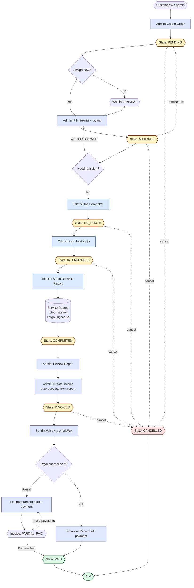
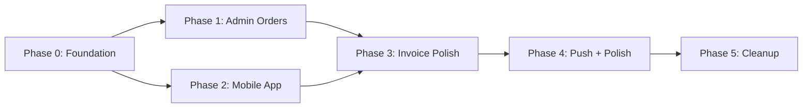

# Design Spec — MSN ERP v2: Order Management & Technician Mobile App

> **Status**: Draft
> **Date**: 2026-05-26
> **Related**: `2026-05-26-msn-erp-v2-prd.md` (product requirements)
> **Replaces**: `docs/plan-restructure-v2.md`

---

## 1. Architecture Overview

### Approach: Parallel Build with State Mapping Layer

Refactor in-place (tidak pakai `/v2/` route prefix) dengan **state mapper sebagai shim selama transisi**. Order existing dengan legacy state (`NEW`, `ACCEPTED`, `DONE`, `CLOSED`, dll.) tetap kompatibel via runtime mapping. Database enum di-extend dengan state baru tanpa drop legacy values dulu.

### Why this approach

- Production system jalan, downtime tidak acceptable.
- Bikin route `/dashboard/v2/` = maintain 2 navigation system + 2 sidebar = pemborosan untuk tim kecil.
- State mapper hanya ~50 lines code, simpler than parallel routes.
- Drop legacy enum values dilakukan di Phase 5 setelah data migration script jalan.

### Migration Layers

```
┌─────────────────────────────────────────────────┐
│ UI Layer (admin pages, technician app)          │
│ → Hanya bicara pakai 8 state baru               │
└─────────────────────────────────────────────────┘
                  ▲
                  │
┌─────────────────────────────────────────────────┐
│ Status Mapper (src/lib/order-status.ts)         │
│ → toCanonical(): NEW→PENDING, DONE→COMPLETED    │
│ → getNextStates(status, role)                   │
│ → status color tokens                           │
└─────────────────────────────────────────────────┘
                  ▲
                  │
┌─────────────────────────────────────────────────┐
│ Database                                         │
│ → Phase 0: enum punya semua state (old + new)   │
│ → Phase 5: drop legacy enum values              │
└─────────────────────────────────────────────────┘
```

### File Organization

| Path | Purpose |
|------|---------|
| `src/lib/order-status.ts` | Status mapper, transition validator, color tokens (single source of truth) |
| `src/lib/status-colors.ts` | Invoice + service type color tokens |
| `src/components/orders/` | Order-specific components (StatusBadge, OrderCard, OrderDetailPanel, KanbanBoard) |
| `src/components/ui/empty-state.tsx` | Reusable empty state (new) |
| `src/hooks/use-order-mutation.ts` | Standardized order mutations dengan optimistic updates |
| `src/hooks/use-invoice-mutation.ts` | Standardized invoice mutations |
| `src/app/dashboard/orders/` | New consolidated route (replace `operasional/*`) |
| `src/app/technician/` | Mobile app route group (new) |
| `src/app/api/technician/` | REST endpoints untuk mobile (extend existing infra) |

---

## 2. End-to-End Flow Diagram



---

## 3. Order State Machine

### 8 States

| State | Meaning | Triggered By | Allowed Next States |
|-------|---------|--------------|---------------------|
| `PENDING` | Order created, belum di-assign | Admin (create order, atau reschedule) | ASSIGNED, CANCELLED |
| `ASSIGNED` | Teknisi assigned + jadwal set | Admin | EN_ROUTE, PENDING (reschedule), CANCELLED |
| `EN_ROUTE` | Teknisi dalam perjalanan | Technician | IN_PROGRESS, PENDING (reschedule), CANCELLED |
| `IN_PROGRESS` | Teknisi sedang kerja di lokasi | Technician | COMPLETED, CANCELLED |
| `COMPLETED` | Service selesai, report submitted | Technician (auto pada submit report) | INVOICED |
| `INVOICED` | Invoice sudah dibuat | Admin/Finance | PAID, INVOICED (revise), CANCELLED |
| `PAID` | Invoice fully paid | Finance | — (end state) |
| `CANCELLED` | Order dibatalkan | Admin | — (end state) |

### Side Transitions

- **Reschedule** (action, bukan state): dari `ASSIGNED` atau `EN_ROUTE` → reset ke `PENDING`. Hapus `order_technicians` entries, set `scheduled_visit_date` baru, log alasan di `order_status_transitions`.
- **Reassign** (action): allowed hanya saat status `ASSIGNED`. Replace lead di `order_technicians`, log audit. Tidak ganti state.
- **Cancel**: dari state apapun sebelum `COMPLETED`. Set linked AC units (status PENDING) jadi INACTIVE.

### Removed States

| Old State | Reason | Migration |
|-----------|--------|-----------|
| `NEW` | Merged with PENDING | runtime map; data migrate Phase 5 |
| `ACCEPTED` | Merged with PENDING | runtime map; data migrate Phase 5 |
| `ARRIVED` | Merged with IN_PROGRESS | runtime map; data migrate Phase 5 |
| `DONE` | Renamed to COMPLETED | runtime map; data migrate Phase 5 |
| `CLOSED` | Removed (PAID is end state) | runtime map → PAID; data migrate Phase 5 |
| `RESCHEDULE` | Action, not state | already handled in code; remove from enum |
| `TO_WORKSHOP`, `IN_WORKSHOP`, `READY_TO_RETURN`, `DELIVERED` | No workshop flow | archive any data to notes; drop |

---

## 4. Database Changes

### 4.1 Enum `order_status`

```sql
-- Phase 0: ADD new values (non-breaking)
ALTER TYPE order_status ADD VALUE IF NOT EXISTS 'PENDING';
ALTER TYPE order_status ADD VALUE IF NOT EXISTS 'COMPLETED';

-- Phase 5: cleanup (recreate enum)
CREATE TYPE order_status_new AS ENUM (
  'PENDING', 'ASSIGNED', 'EN_ROUTE', 'IN_PROGRESS',
  'COMPLETED', 'INVOICED', 'PAID', 'CANCELLED'
);
ALTER TABLE orders ALTER COLUMN status TYPE order_status_new
  USING (CASE
    WHEN status::text IN ('NEW', 'ACCEPTED') THEN 'PENDING'::order_status_new
    WHEN status::text = 'ARRIVED' THEN 'IN_PROGRESS'::order_status_new
    WHEN status::text = 'DONE' THEN 'COMPLETED'::order_status_new
    WHEN status::text = 'CLOSED' THEN 'PAID'::order_status_new
    ELSE status::text::order_status_new
  END);
DROP TYPE order_status;
ALTER TYPE order_status_new RENAME TO order_status;
```

### 4.2 New Table: `service_reports`

```sql
CREATE TABLE service_reports (
  report_id UUID PRIMARY KEY DEFAULT gen_random_uuid(),
  order_id TEXT NOT NULL REFERENCES orders(order_id),
  technician_id UUID NOT NULL REFERENCES technicians(technician_id),

  -- Photos (Supabase Storage URLs)
  photos_before TEXT[] DEFAULT '{}',
  photos_after TEXT[] DEFAULT '{}',

  -- Materials JSONB array
  materials JSONB DEFAULT '[]',
  -- Schema: [{ addon_id?: uuid, name: string, qty: number, unit_price: number, total: number }]

  -- Pricing
  actual_total_price NUMERIC(12,2) NOT NULL,

  -- Customer sign-off
  customer_signature_url TEXT,
  customer_name_signed TEXT,
  signed_at TIMESTAMPTZ,

  -- Notes
  notes TEXT,

  -- Timing
  work_started_at TIMESTAMPTZ,
  work_completed_at TIMESTAMPTZ,
  submitted_at TIMESTAMPTZ DEFAULT NOW(),

  -- Soft delete (consistent dengan project convention)
  deleted_at TIMESTAMPTZ,

  created_at TIMESTAMPTZ DEFAULT NOW(),
  updated_at TIMESTAMPTZ DEFAULT NOW()
);

CREATE INDEX idx_service_reports_order ON service_reports(order_id) WHERE deleted_at IS NULL;
CREATE INDEX idx_service_reports_technician ON service_reports(technician_id) WHERE deleted_at IS NULL;
CREATE INDEX idx_service_reports_submitted ON service_reports(submitted_at DESC) WHERE deleted_at IS NULL;
```

**RLS Policies:**

```sql
-- TECHNICIAN can INSERT report for their assigned orders
CREATE POLICY "tech_insert_own_report" ON service_reports
  FOR INSERT TO authenticated
  WITH CHECK (
    technician_id = (SELECT technician_id FROM technicians WHERE auth_user_id = auth.uid())
    AND EXISTS (
      SELECT 1 FROM order_technicians
      WHERE order_id = service_reports.order_id
        AND technician_id = service_reports.technician_id
        AND role = 'lead'
    )
  );

-- TECHNICIAN can SELECT own reports (history)
CREATE POLICY "tech_select_own_reports" ON service_reports
  FOR SELECT TO authenticated
  USING (
    technician_id = (SELECT technician_id FROM technicians WHERE auth_user_id = auth.uid())
  );

-- ADMIN/SUPERADMIN/FINANCE can SELECT all reports
CREATE POLICY "admin_select_all_reports" ON service_reports
  FOR SELECT TO authenticated
  USING (
    (SELECT role FROM user_management WHERE user_id = auth.uid())
    IN ('ADMIN', 'SUPERADMIN', 'FINANCE')
  );
```

### 4.3 New Table: `push_subscriptions`

```sql
CREATE TABLE push_subscriptions (
  subscription_id UUID PRIMARY KEY DEFAULT gen_random_uuid(),
  user_id UUID NOT NULL REFERENCES auth.users(id) ON DELETE CASCADE,
  endpoint TEXT NOT NULL,
  p256dh TEXT NOT NULL,
  auth TEXT NOT NULL,
  user_agent TEXT,
  created_at TIMESTAMPTZ DEFAULT NOW(),
  UNIQUE(user_id, endpoint)
);

CREATE INDEX idx_push_subs_user ON push_subscriptions(user_id);
```

### 4.4 Storage Buckets

- `service-photos` — public read (signed URLs in invoice PDF), authenticated write, max 5MB per file.
- `signatures` — private only, signed URL on demand (PII protection), max 1MB per file.

### 4.5 Columns to Drop (Phase 5)

| Table | Column | Reason | Migration |
|-------|--------|--------|-----------|
| `orders` | `assigned_technician_id` | Use `order_technicians` join | UPDATE order_technicians from this column first |
| `orders` | `req_visit_date` | Duplicate of `scheduled_visit_date` | Coalesce values to scheduled_visit_date |
| `orders` | `order_type` | Info lives in `order_items.service_type` | Drop after verify |

### 4.6 Tables Deprecated

| Table | Reason | Action |
|-------|--------|--------|
| `service_pricing` | Replaced by `service_catalog` | Mark deprecated in code; keep table for backward compat; no schema change |
| `service_records` | Replaced by `service_reports` | Migrate any existing data to `service_reports` di Phase 5; no drop yet |

---

## 5. Role-Based Access Matrix

| Capability | SUPERADMIN | ADMIN | FINANCE | TECHNICIAN |
|------------|:----------:|:-----:|:-------:|:----------:|
| **Orders** | | | | |
| View Order Board / List | ✓ | ✓ | ✓ | ✗ |
| Create Order | ✓ | ✓ | ✗ | ✗ |
| Assign / Reassign Technician | ✓ | ✓ | ✗ | ✗ |
| Cancel / Reschedule | ✓ | ✓ | ✗ | ✗ |
| View Service Report | ✓ | ✓ | ✓ | own |
| **Invoices & Payments** | | | | |
| View Invoices | ✓ | ✓ | ✓ | ✗ |
| Create / Edit Invoice | ✓ | ✓ | ✓ | ✗ |
| Send Invoice | ✓ | ✓ | ✓ | ✗ |
| Record Payment | ✓ | ✓ | ✓ | ✗ |
| **Master Data** | | | | |
| Customers / Locations / AC Units | ✓ | ✓ | read | ✗ |
| Technicians | ✓ | ✓ | ✗ | ✗ |
| **Settings** | | | | |
| Service Catalog & Pricing | ✓ | ✓ | read | ✗ |
| Addons Catalog | ✓ | ✓ | ✗ | ✗ |
| Invoice Settings | ✓ | ✓ | ✓ | ✗ |
| User Management | ✓ | ✗ | ✗ | ✗ |
| API Docs | ✓ | ✗ | ✗ | ✗ |
| **Technician Mobile App** | | | | |
| Today's Jobs & Detail | ✗ | ✗ | ✗ | ✓ |
| Update Status | ✗ | ✗ | ✗ | ✓ |
| Submit Service Report | ✗ | ✗ | ✗ | ✓ |
| View Own History | ✗ | ✗ | ✗ | ✓ |

---

## 6. Admin Dashboard UI

### 6.1 Navigation Restructure

**Old (12 items, 5 groups):**
```
Dashboard | Operasional (5 items) | Manajemen (5 items) | Konfigurasi (5 items) | Keuangan (1 item) | Admin (1 item)
```

**New (5 top-level + Settings group):**
```
Dashboard            ← KPI overview
Orders               ← NEW (replace operasional/* 5 pages)
Invoices             ← existing keuangan/invoices
Customers            ← + locations + AC units as inline tabs
Technicians          ← existing manajemen/teknisi
─────
Settings (group)
  Service Catalog    ← merge service-pricing + service-config
  Addons             ← existing addons-catalog
  Invoice Settings   ← existing invoice-config + sla-service merged
  Users              ← SUPERADMIN only
  API Docs           ← SUPERADMIN only
```

### 6.2 Orders Page — Dual View

URL state: `/dashboard/orders?view=board` (default) atau `?view=list`. Filter state survives across views via query params.

#### Board View (Kanban)

6 columns (compromise dari 7: gabung `EN_ROUTE` + `IN_PROGRESS` jadi "Active"):

| Column | States | Drag actions allowed |
|--------|--------|---------------------|
| Pending | PENDING | drag → Assigned (open assign modal) |
| Assigned | ASSIGNED | drag → Pending (reschedule with reason modal) |
| Active | EN_ROUTE, IN_PROGRESS | **read-only** — only technician can change |
| Completed | COMPLETED | drag → Invoiced (open invoice creation) |
| Invoiced | INVOICED, PARTIAL_PAID | drag → Paid (open payment modal) |
| Paid | PAID | terminal, collapsed by default (show last 5) |

**Card design** (`<OrderCard />`):
- Customer name (bold)
- Service type + scheduled date
- Technician name (if assigned)
- Color border = urgency: red (overdue), orange (today), green (future), grey (terminal)

**Filters bar** above board:
- Date range, technician, service type, urgency, search (customer/order ID/location)

**Implementation:**
- Library: `@dnd-kit/core` + `@dnd-kit/sortable`
- Optimistic mutation pattern (TanStack Query `onMutate` + rollback `onError`)
- Realtime subscription via `subscribeOrders` (existing infra)

#### List View

- TanStack Table v8 (existing)
- Same filters, more dense, sortable columns
- Bulk actions: assign multiple, cancel multiple
- Skeleton loading: `<TableSkeleton rows={10} columns={6} />`

### 6.3 Order Detail — Slide-over Panel

Click order card/row → `<Sheet />` slide-in dari kanan (component already exists). 4 tabs:

1. **Detail** — customer, location, AC units, schedule, notes
2. **Technician Report** — read-only view: foto gallery, material list, signature image, actual price. Empty state if not submitted.
3. **Invoice** — linked invoice info + quick action "Create Invoice" (if state = COMPLETED) or "View Invoice"
4. **History** — timeline from `order_status_transitions` + reschedule/reassign log

**Footer primary action** changes by state:
- PENDING → "Assign Technician"
- ASSIGNED → "Reassign" / "Reschedule" / "Cancel"
- ACTIVE states (EN_ROUTE, IN_PROGRESS) → "View Live Updates" (no action, monitoring)
- COMPLETED → "Create Invoice"
- INVOICED → "Record Payment" / "Send Reminder"
- PAID → "View Invoice"

### 6.4 Create Order — Single-Page with Sections

**Decision**: Tidak pakai 4-step wizard. Pakai single-page form dengan accordion sections.

**Reasoning**: Admin biasa input data lengkap dari WA chat dalam satu sesi. Wizard nambah clicks untuk task yang linear. Accordion sections (collapsed sections show summary) lebih efisien.

**Sections:**
1. Customer (search by phone/name, or create new)
2. Service Items (location + AC units + service type + auto-fill pricing)
3. Schedule & Assignment (date + technician, optional)
4. Review (summary of all sections)

**Optional**: Checkbox "Buat Proforma Invoice" di review section.

### 6.5 Page Mapping (Old → New)

| Old page | New location |
|----------|--------------|
| `operasional/create-order` | `orders/new` (or modal from board) |
| `operasional/accept-order` | **Removed** (admin create = accepted) |
| `operasional/assign-order` | Drag-drop or action button in Board/Detail panel |
| `operasional/monitoring-ongoing` | Active column in Board |
| `operasional/monitoring-history` | Filter `?status=PAID,CANCELLED` in List view |
| `manajemen/lokasi` | Tab in Customer detail page |
| `manajemen/ac-units` | Tab in Customer detail page |
| `konfigurasi/service-pricing` + `service-config` | Merged → `settings/service-catalog` |
| `konfigurasi/sla-service` | Field in service catalog entry |
| `konfigurasi/invoice-config` | `settings/invoice-settings` |

---

## 7. Technician Mobile App

### 7.1 Routes

```
/technician                        ← Today's Jobs (default)
/technician/job/[orderId]          ← Job Detail (state-aware)
/technician/job/[orderId]/complete ← Complete Job Form
/technician/history                ← Full history (paginated)
/technician/profile                ← Profile + logout + push toggle
```

Layout terpisah dari `/dashboard`. Mobile-first: `max-w-md mx-auto`. Bottom tab bar: Today, History, Profile.

### 7.2 Auth Flow

- Same Supabase auth.
- Login page shared (`/login`).
- Middleware check role:
  - `TECHNICIAN` → redirect ke `/technician`
  - lainnya → `/dashboard`
- Session persistence: Supabase default (cookie-based), works for PWA standalone mode.

### 7.3 State Transitions per Screen

| Screen | Action | Status change | Side effects |
|--------|--------|---------------|--------------|
| Job Detail (ASSIGNED) | Tap "Berangkat" | → EN_ROUTE | Log timestamp, broadcast realtime |
| Job Detail (EN_ROUTE) | Tap "Mulai Kerja" | → IN_PROGRESS | Start client timer, log `work_started_at` |
| In Progress | Tap "Selesai Kerja" | → opens Complete form | (no status change yet) |
| Complete Form | Submit | → COMPLETED | INSERT `service_reports`, log `work_completed_at`, broadcast realtime |

### 7.4 Complete Job Form

**Photos (before/after):**
- Direct upload to Supabase Storage `service-photos` bucket
- Compress client-side: target ~500KB per photo, JPEG q=0.7
- Upload progress indicator per slot
- Min 1 per category, max 5

**Materials:**
- Search dropdown dari `addons_catalog` (auto-fill price)
- Custom entry: free-text name + qty + unit price
- Live total calculation

**Actual price:**
- Pre-filled = estimated price + sum(materials)
- Editable (teknisi bisa adjust kalau ada negotiation di lapangan)

**Signature:**
- Library: `signature_pad` (HTML5 Canvas, ~5KB gzipped)
- Save sebagai base64 PNG → upload ke `signatures` bucket
- Signed URL untuk admin viewing (PII protection)
- Field `customer_name_signed` (text input below pad)

**Auto-save draft:**
- localStorage key: `draft-{orderId}`
- Save on every field change (debounced 500ms)
- Restore on page mount if exists
- Clear on successful submit

### 7.5 Offline Handling (Minimal)

- Banner warning if `navigator.onLine === false`
- Submit button disabled when offline
- Existing draft tetap bisa di-edit, hanya submit blocked
- **Not** offline-first — no service worker sync queue

### 7.6 Push Notifications (PWA)

- Service worker: `/technician/sw.js`
- VAPID keys di env vars: `VAPID_PUBLIC_KEY`, `VAPID_PRIVATE_KEY`
- Library: `web-push` (Node.js), `serwist` atau native `Notification API` (client)
- Permission flow: ask once on first login, manage di profile page
- Trigger events:
  - New job assigned to this technician
  - Job rescheduled (date changed)
  - Job reassigned away (no longer assigned)
- Tap notification → deep link to job detail

### 7.7 PWA Manifest

```json
{
  "name": "MSN ERP - Technician",
  "short_name": "MSN Tech",
  "start_url": "/technician",
  "display": "standalone",
  "theme_color": "hsl(221, 83%, 53%)",
  "background_color": "hsl(0, 0%, 100%)",
  "icons": [...]
}
```

### 7.8 API Endpoints (Mobile-only)

```
GET    /api/technician/jobs/today           → today's assigned jobs
GET    /api/technician/jobs/[id]            → single job detail
POST   /api/technician/jobs/[id]/transition → status change (server-validated)
POST   /api/technician/jobs/[id]/report     → submit service report
GET    /api/technician/history              → past jobs (paginated, ?cursor=)
POST   /api/technician/push/subscribe       → register push subscription
DELETE /api/technician/push/subscribe       → unregister
```

REST karena predictable untuk service worker, kalau ada native wrapper di future. Server actions tetap dipakai untuk admin dashboard.

---

## 8. UI/UX Design System

### 8.1 Existing Foundation (Keep)

- **App name**: MSN ERP
- **Brand color**: blue-600 (`hsl(221 83% 53%)`) — set di `globals.css`, jangan diganti
- **Theme system**: shadcn "new-york" + zinc base + CSS variables — keep
- **Font**: Inter via `next/font/google` (sudah loaded di root layout) — no Fira Code
- **Icon library**: Lucide (sudah set di `components.json`)
- **Border radius**: `0.75rem` via `--radius` CSS var

### 8.2 New Tokens (Add to globals.css)

```css
:root {
  /* Status badge tokens (semantic, dark-mode aware) */
  --status-pending: 38 92% 50%;       /* amber */
  --status-assigned: 221 83% 53%;     /* blue, alias dari --primary */
  --status-en-route: 234 89% 64%;     /* indigo */
  --status-in-progress: 270 91% 65%;  /* violet */
  --status-completed: 142 71% 45%;    /* green */
  --status-invoiced: 188 92% 43%;     /* cyan */
  --status-paid: 142 76% 36%;         /* darker green */
  --status-cancelled: 0 84% 60%;      /* alias --destructive */
}

.dark {
  --status-pending: 38 92% 60%;
  --status-assigned: 221 83% 63%;
  --status-en-route: 234 89% 74%;
  --status-in-progress: 270 91% 75%;
  --status-completed: 142 71% 55%;
  --status-invoiced: 188 92% 53%;
  --status-paid: 142 76% 46%;
  --status-cancelled: 0 84% 70%;
}
```

### 8.3 New Components

| Component | Purpose | Location |
|-----------|---------|----------|
| `StatusBadge` | Order status display (8 states) | `src/components/orders/status-badge.tsx` |
| `InvoiceStatusBadge` | Invoice status (DRAFT/SENT/PARTIAL_PAID/PAID/OVERDUE) | `src/components/invoices/status-badge.tsx` |
| `ServiceTypeBadge` | Service type color coding | `src/components/orders/service-type-badge.tsx` |
| `EmptyState` | Reusable empty state placeholder | `src/components/ui/empty-state.tsx` |
| `OrderCard` | Card di Kanban board | `src/components/orders/order-card.tsx` |
| `OrderDetailPanel` | Slide-over panel content | `src/components/orders/order-detail-panel.tsx` |
| `KanbanBoard` | Drag-drop board wrapper | `src/components/orders/kanban-board.tsx` |
| `SignaturePad` | Signature input wrapper | `src/components/technician/signature-pad.tsx` |

### 8.4 Anti-Patterns to Fix

**Hover scale (causes layout shift):**

```css
/* ❌ REMOVE from globals.css */
.crud-button:hover {
  @apply scale-105 shadow-md;
}
.crud-button:active {
  @apply scale-95;
}

/* ✅ REPLACE WITH */
.crud-button:hover {
  @apply shadow-md brightness-95;
}
.crud-button:active {
  @apply brightness-90;
}
```

**Hard-coded colors (97 occurrences):**

Migrate semua usage `bg-blue-500`, `bg-green-100`, dst untuk status display ke semantic badge components. Keep utility colors (`bg-blue-50` for info banners, dst) jika non-semantic.

### 8.5 Loading State Rules (4 Tiers)

**Tier 1: Initial Page Load**
```tsx
if (isLoading) return <TableSkeleton rows={10} columns={6} />
// or: KpiCardSkeleton, ChartSkeleton, FormSkeleton, ListSkeleton
```

**Tier 2: Mutation In-Flight**
```tsx
<Button disabled={mutation.isPending}>
  {mutation.isPending && <Loader2 className="mr-2 h-4 w-4 animate-spin" />}
  Save
</Button>
```

**Tier 3: Modal/Sheet Async Content**
```tsx
<LoadingOverlay isLoading={detailQuery.isLoading}>
  <OrderDetailContent data={detailQuery.data} />
</LoadingOverlay>
```

**Tier 4: Optimistic (drag-drop, quick actions)**
```tsx
useMutation({
  onMutate: async (vars) => {
    await queryClient.cancelQueries({ queryKey: ['orders'] })
    const prev = queryClient.getQueryData(['orders'])
    queryClient.setQueryData(['orders'], updateLocally(vars))
    return { prev }
  },
  onError: (_err, _vars, ctx) => {
    queryClient.setQueryData(['orders'], ctx?.prev)
    toast({ variant: 'destructive', title: 'Gagal update' })
  },
  onSettled: () => queryClient.invalidateQueries({ queryKey: ['orders'] }),
})
```

### 8.6 Empty States

Required di:
- Order Board kolom kosong: icon `Inbox`, "Tidak ada order [status]"
- List view kosong setelah filter: icon `SearchX`, "Tidak ditemukan", "Coba ubah filter"
- Customer/Technician table kosong: icon + action button "+ Tambah"
- Technician History kosong: "Belum ada riwayat pekerjaan"
- Service Report tab kalau belum submit: "Teknisi belum submit laporan"

### 8.7 Realtime Wiring

Order Board page **must** subscribe:

```tsx
useEffect(() => {
  const unsub = subscribeOrders(queryClient, (payload) => {
    if (payload.eventType === 'UPDATE'
        && payload.new.status !== payload.old.status) {
      toast({ title: `${payload.new.order_id} → ${payload.new.status}` })
    }
  })
  return unsub
}, [queryClient])
```

### 8.8 Mutation Hooks (Standardize)

Extract mutation patterns ke hooks:

```ts
// src/hooks/use-order-mutation.ts
export function useTransitionOrder() { /* optimistic */ }
export function useAssignTechnician() { /* optimistic */ }
export function useReschedule() { /* with reason modal */ }
export function useCancelOrder() { /* with confirm */ }
```

### 8.9 Error Boundaries

- `src/app/error.tsx` — global
- `src/app/dashboard/error.tsx` — dashboard-specific
- `src/app/technician/error.tsx` — mobile-specific

Show fallback UI dengan "Try again" button + log error.

### 8.10 Accessibility Floor

- Color contrast 4.5:1 (text), 3:1 (UI elements)
- Focus visible everywhere (default shadcn)
- `prefers-reduced-motion` respected
- Drag-drop di Kanban: keyboard alternative — context menu "Move to..."
- Status: text + color (color tidak satu-satunya indicator)
- Modal/Sheet: focus trap (Radix handles)
- Touch target: min 44px (`h-11`) di mobile app
- Form inputs: error messages associated via `aria-describedby` (RHF + shadcn)

---

## 9. Phased Implementation

### Phase 0 — Foundation & Cleanup (3-5 hari)

**Goal**: Setup landasan tanpa visible UI change.

- [ ] DB migration: `ALTER TYPE order_status ADD VALUE 'PENDING', 'COMPLETED'`
- [ ] DB migration: create `service_reports` table + RLS policies
- [ ] DB migration: create `push_subscriptions` table
- [ ] Storage buckets: `service-photos` (public read), `signatures` (private)
- [ ] Create `src/lib/order-status.ts` (mapper, validator, color tokens)
- [ ] Create `src/lib/status-colors.ts` (invoice + service type colors)
- [ ] Update `src/types/create-order.ts` `OrderStatus` to 8 states
- [ ] Add CSS variable status tokens di `globals.css`
- [ ] Fix `.crud-button:hover { scale-105 }` anti-pattern
- [ ] Create components: `StatusBadge`, `InvoiceStatusBadge`, `ServiceTypeBadge`, `EmptyState`
- [ ] Create hooks: `useOrderMutation`, `useInvoiceMutation`
- [ ] Add shadcn `command` component (only one not yet installed)
- [ ] Add `error.tsx` boundaries (`/dashboard`, `/technician` (placeholder), root)
- [ ] **Migrate 97 hard-coded color usages to badge components** (incremental, page-by-page)
- [ ] Refactor `assign-order/success/page.tsx` numbered queries → batch `useQueries`

**Deliverable**: No visible UI change, foundation siap untuk Phase 1+.

### Phase 1 — Admin Orders Page (Week 1-2)

**Goal**: Replace 5 operasional pages dengan 1 Orders page.

- [ ] Install `@dnd-kit/core` + `@dnd-kit/sortable`
- [ ] New route `/dashboard/orders` dengan `?view=board|list`
- [ ] `KanbanBoard` component (6 columns)
- [ ] `OrderCard` dengan urgency color border
- [ ] Drag actions: PENDING→ASSIGNED (modal), ASSIGNED→PENDING (reschedule), COMPLETED→INVOICED, INVOICED→PAID
- [ ] List view (TanStack Table) dengan filters
- [ ] `OrderDetailPanel` (Sheet) dengan 4 tabs
- [ ] Footer actions per state
- [ ] Skeleton loading: `TableSkeleton` for list, custom card skeleton for board
- [ ] Empty states per column + filtered list
- [ ] Realtime subscription via `subscribeOrders`
- [ ] Optimistic mutations untuk semua drag actions
- [ ] Refactor `Create Order` page jadi single-page accordion (replace wizard)
- [ ] Update sidebar: collapse 5 operasional menus → 1 "Orders"
- [ ] Sidebar reorganize: Customers/Technicians top-level
- [ ] Settings group merge: service-pricing + service-config → service-catalog
- [ ] **Soft launch**: old pages tetap accessible via direct URL (no link), monitoring 1 minggu

**Deliverable**: Admin sehari-hari pakai Orders page baru.

### Phase 2 — Technician Mobile App (Week 2-3)

**Goal**: Teknisi punya app, replace WA workflow.

- [ ] Route group `/technician/` dengan mobile-first layout
- [ ] Update `middleware.ts`: role-based redirect
- [ ] Today's Jobs page (`/technician`)
- [ ] Job Detail page (state-aware UI)
- [ ] Status update buttons (Berangkat → Mulai → Selesai)
- [ ] Complete Job Form: photos, materials, price, signature, notes
- [ ] Install `signature_pad` library
- [ ] Photos: client-side compression + upload to Supabase Storage
- [ ] Auto-save draft to localStorage
- [ ] History page (paginated)
- [ ] Profile page (logout + push toggle placeholder)
- [ ] REST API endpoints `/api/technician/*`
- [ ] PWA manifest + basic service worker (no push handler yet)
- [ ] Bottom tab bar component
- [ ] Empty states: no jobs today, no history

**Deliverable**: Teknisi pilot bisa pakai app, admin mulai phase out WA.

### Phase 3 — Invoice Flow Polish (Week 3-4)

**Goal**: Connect technician report → invoice flow.

- [ ] "Create Invoice from Order" auto-populate dari `service_reports`
- [ ] Line items: service + materials, actual price
- [ ] Optional: include foto sebagai attachment di PDF (toggle)
- [ ] Order Detail Panel — Technician Report tab (read-only view)
- [ ] Reschedule UI dari Order Board (modal dengan reason)
- [ ] Reassign UI (action button on detail panel)
- [ ] Partial payment UI improvements (existing infra)
- [ ] Invoice PDF: improve layout, currency formatting

**Deliverable**: End-to-end flow jalan: admin create → teknisi work → admin invoice → customer pay.

### Phase 4 — Push Notifications + Polish (Week 4-5)

**Goal**: Real-time alerts + UX polish.

- [ ] VAPID keys generation + env setup
- [ ] Service worker push handler
- [ ] `push_subscriptions` API endpoints
- [ ] Trigger notifications on backend events
- [ ] Profile page push toggle (subscribe/unsubscribe)
- [ ] Audit empty states across all pages
- [ ] Audit loading states across all pages (skeleton vs spinner)
- [ ] Audit form validation patterns (RHF + Zod consistency)
- [ ] Print-friendly invoice PDF improvements
- [ ] Performance audit (Lighthouse, bundle size)

**Deliverable**: Real-time alerts active, UX polish complete.

### Phase 5 — Cleanup & Final Migration (Week 5-6)

**Goal**: Drop legacy code, finalize.

- [ ] Data migration script: convert all existing orders ke 8 state baru
- [ ] Drop legacy enum values (recreate enum)
- [ ] Drop columns: `assigned_technician_id`, `req_visit_date`, `order_type`
- [ ] Migrate `service_records` → `service_reports` (kalau ada data)
- [ ] Mark `service_pricing` deprecated di code comments
- [ ] Delete legacy pages: `accept-order/`, `assign-order/`, `monitoring-ongoing/`, `monitoring-history/`, `manajemen/lokasi/`, `manajemen/ac-units/`, `konfigurasi/service-pricing/`
- [ ] Remove status mapper shim dari runtime
- [ ] Remove status mapper from `src/lib/order-status.ts` (keep only canonical types)
- [ ] Update `CLAUDE.md` dengan workflow baru
- [ ] Update `docs/api.md` kalau ada perubahan endpoints

**Deliverable**: Codebase bersih, ready untuk maintenance mode.

### Phase Dependencies



Phase 1 dan Phase 2 bisa **parallel** kalau ada dua orang. Solo: Phase 1 dulu (lebih banyak pengguna sekarang adalah admin).

---

## 10. Risks & Mitigations

| Risk | Likelihood | Impact | Mitigation |
|------|-----------|--------|-----------|
| State machine migration breaks existing in-flight orders | Medium | High | Dual-state mapping di Phase 0; data migration di Phase 5 setelah verified |
| Existing 97 hard-coded color usages cause regression | High | Medium | Gradual page-by-page migration; visual diff per page sebelum merge |
| Teknisi tidak adopsi mobile app | Medium | High | Soft launch 1-2 teknisi dulu, training session, monitor adoption |
| Photo upload gagal di koneksi lemah | High | Low | Retry exponential backoff; offline banner; auto-save draft |
| Push notification permission rejected | Medium | Low | Fallback ke realtime in-app + manual refresh; tidak hard-blocker |
| Signature pad UX jelek di small screen | Low | Medium | Test multiple devices Phase 2; min size + clear/redo button |
| Drag-drop conflict dengan realtime updates | Medium | Medium | Optimistic mutation pattern + rollback on conflict; tested di Phase 1 |

---

## 11. Open Questions (Resolved)

| Question | Decision | Rationale |
|----------|----------|-----------|
| Approval flow setelah teknisi submit | Auto-approve | Customer signature = approval natural; YAGNI |
| Reassign teknisi setelah ASSIGNED | Allowed selama ASSIGNED only | Cover 90% use case tanpa over-complicate |
| Partial payment | Supported (PARTIAL_PAID status) | Existing infra ada; B2B reality |
| Technician history | Full history tab | Berguna untuk referensi customer Q&A |
| Push notifications | Web push (PWA) Phase 4 | User explicit pilih opsi B |
| Primary admin view | Board + List equally important | Pagi cek board, kerja dari list |
| Migration strategy | Parallel build with state mapping | Zero downtime, safer rollback |

---

## 12. Success Criteria

- [ ] All 8 order states implemented dan validated server-side
- [ ] Admin Orders page dengan Board + List view, both functional
- [ ] Drag-drop dengan optimistic updates working tanpa visual glitch
- [ ] Realtime sync: teknisi update status → admin board refresh tanpa reload
- [ ] Technician mobile app: 5 screens, complete flow dari Today's Jobs → Submit Report
- [ ] Service report submission dengan photo upload, signature, materials
- [ ] Invoice auto-populate dari service report
- [ ] Push notifications working pada Chrome/Safari mobile
- [ ] Zero hard-coded color classes untuk status display
- [ ] All loading states pakai skeleton (tidak spinner-only)
- [ ] All empty states informative dengan action button kalau aplikabel
- [ ] Existing in-flight orders tidak rusak (manual QA per state)
- [ ] Lighthouse score: Performance > 80, Accessibility > 90 untuk admin dashboard dan technician app
